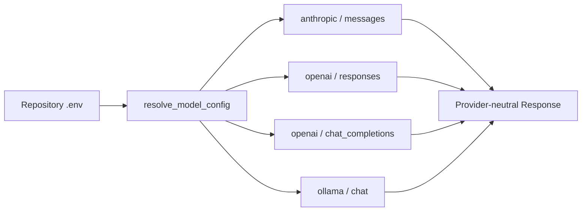

# Pico

Pico 是一个面向代码仓库的本地 coding agent。它从当前仓库建立受边界约束的上下文，让模型读取、修改并验证代码，
同时把 Session、Run、Checkpoint、Memory 与恢复证据保存在本地 `.pico/` 中。

Pico 1.0 的产品边界很明确：一个 `pico` CLI、一个行内 TUI、三个用户可见 Provider，以及一个可选的 Docker
filtered-staging Sandbox。TUI 只引入 `prompt-toolkit` 这一项直接运行时依赖。Host 模式不是 OS sandbox；Sandbox
模式不会在失败时静默降级为 Host。

## 能力概览

| 能力 | 1.0 状态 | 说明 |
| --- | --- | --- |
| Anthropic | 支持 | Anthropic Messages |
| OpenAI | 支持 | Responses 或 Chat Completions |
| Ollama | 支持 | 本地 Ollama Chat，无 Key 也可运行 |
| 交互 TUI | 支持 | 裸 `pico` 或 `pico repl`；非交互终端自动使用纯文本 REPL |
| Host 执行 | 支持 | Python 3.11+；不是 OS sandbox |
| Docker Sandbox | 有限支持 | macOS arm64、Docker Desktop、已存在的 exact `linux/arm64` image |
| Session / Recovery / Memory | 支持 | 本地私有、可审查、可恢复 |
| 自动协议探测或 Provider fallback | 不支持 | 所有路由都由 `.env` 显式决定 |

## 安装

需要 Python 3.11 或 3.12。

```bash
python -m pip install pico==1.0.0
pico --version
pico --help
```

从源码开发时使用锁定环境：

```bash
git clone https://github.com/xiawiie/pico.git
cd pico
uv sync --frozen --dev
uv run pico --version
```

如果 `pico` 不在 PATH，使用 `uv run pico ...` 或检查当前虚拟环境。详见
[CLI 安装与更新](docs/cli-installation-and-updates.md)。

## 五分钟开始

在需要操作的 Git 仓库根目录运行：

```bash
pico init
pico config show
pico doctor
pico
pico run "inspect the failing tests and make the smallest safe fix"
```

`pico init` 只校验输入并以私有权限原子写入仓库根目录 `.env`，不会联网。普通 `doctor` 同样不联网；只有
`pico doctor --check-api` 会发送最小的文本、工具调用和 tool-result 续接请求，可能产生 API 费用。

## 进入 TUI

完成 `.env` 配置后，在目标仓库根目录直接运行：

```bash
pico
```

从源码工作区运行时使用：

```bash
uv run pico
```

`pico` 与 `pico repl` 是同一个交互入口；保留 `repl` 是为了脚本、文档和排障时能显式表达意图。一次性执行仍使用
`pico run "<prompt>"`，不会把未知子命令或裸自然语言悄悄当作 prompt。

```text
             ⣶⡄⣷⣄           ███   ██  █  █ █  █   ███  ██  ███  ████
            ⣼⣿⣿⣿⣻⣦⣀         ███   ██  █  █ █  █   ███  ██  ███  ████
           ⣾⠿⣿⣿⣿⣷⣿⣤⣤⣄       █  █ █  █ ██ █  ██   █    █  █ █  █ █
          ⠛⠃ ⣿⣿⣿⣿⣿⣿⣿⣿⣿⣿⣿⣦   ███  █  █ ████   █   █    █  █ █  █ ███
             ⣿⣿⣿⠿⠛⣿⣿⣿⡇      █    █  █ █ ██   █   █    █  █ █  █ █
            ⣼⣿⠃    ⢸⣿⣆      █     ██  █  █   █    ███  ██  ███  ████
            ⠛⠁     ⠛⠃       █     ██  █  █   █    ███  ██  ███  ████
```

马形轮廓参考
[SuperHermes 的 `logo-horse.svg`](https://github.com/xiawiie/SuperHermes/blob/main/frontend/logo-horse.svg)
重新绘制为终端 Unicode，不把 SVG 或 Web 前端资产打进 Pico。小马与像素 `PONY CODE` 始终横向排列，并随终端宽度
同步切换为 5、7 或 11 行版本；版本、产品介绍和当前模型各占一行。Logo、快捷键提示与输入框使用终端默认前景和
中性灰，不强制品牌色；error、warning、success 的语义颜色保持独立。`PONY CODE` 是 TUI 字标，产品名和命令仍为
Pico / `pico`。交互沿用 Claude Code/Pi 易发现的操作习惯，但不复制 Pico 没有安全语义支撑的功能：

| 操作 | 行为 |
| --- | --- |
| `/` | 打开并过滤当前 Pico 斜杠命令菜单 |
| `Enter` | 提交当前 prompt |
| `\` + `Enter` / `Esc` + `Enter` | 插入换行 |
| `Up` / `Down`、`Ctrl+R` | 浏览或搜索当前交互历史 |
| `Ctrl+C` | 中断/清空当前输入；短时间内再次按下则退出 |
| `Ctrl+D` | 在空输入时退出 |

当 stdin/stdout 不是 TTY、`TERM=dumb` 或终端窄于 40 列时，Pico 自动回退到无装饰的纯文本 REPL。一次性
`pico run` 也只输出执行结果。`--no-color` 与 `NO_COLOR` 只禁用颜色，不改变命令或安全行为。

## `.env` 是唯一 Provider 配置入口

Pico 只读取当前 lexical repository root 的 `.env`，不向父目录搜索。项目 `.env` 高于进程环境；不会读取
`OPENAI_API_KEY`、`ANTHROPIC_API_KEY`、`PICO_DEEPSEEK_API_KEY` 等厂商或旧版变量。

| 变量 | 必填 | 含义 |
| --- | --- | --- |
| `PICO_PROVIDER` | 是 | `anthropic`、`openai` 或 `ollama` |
| `PICO_MODEL` | 是 | Provider 侧的精确模型名 |
| `PICO_API_URL` | 是 | 已包含版本前缀的精确 API root |
| `PICO_API_KEY` | 云 Provider 是 | 唯一通用凭证；仅 Ollama `auth=none` 可为空 |
| `PICO_API_VARIANT` | 建议 | `auto` 或 Provider 支持的显式变体 |
| `PICO_AUTH_MODE` | 建议 | `auto`、`x-api-key`、`bearer` 或 `none` |

复制 [`.env.example`](.env.example) 即可手工切换。三个标准配置如下。

### Anthropic

```dotenv
PICO_PROVIDER=anthropic
PICO_MODEL=claude-sonnet-4-6
PICO_API_URL=https://api.anthropic.com/v1
PICO_API_KEY=your-anthropic-api-key
PICO_API_VARIANT=auto
PICO_AUTH_MODE=auto
```

### OpenAI Responses

```dotenv
PICO_PROVIDER=openai
PICO_MODEL=gpt-5.4
PICO_API_URL=https://api.openai.com/v1
PICO_API_KEY=your-openai-api-key
PICO_API_VARIANT=responses
PICO_AUTH_MODE=bearer
```

OpenAI-compatible 网关如果只实现 Chat Completions，将 `PICO_API_VARIANT` 改为 `chat_completions`，并把模型、URL
和认证方式改成网关实际值。Pico 不按域名猜测兼容模式。

### Ollama

```dotenv
PICO_PROVIDER=ollama
PICO_MODEL=qwen3:8b
PICO_API_URL=http://127.0.0.1:11434
PICO_API_KEY=
PICO_API_VARIANT=auto
PICO_AUTH_MODE=none
```

Pico 不启动 Ollama，也不自动拉取模型。除 loopback 外，API URL 必须使用 HTTPS；URL 中的 userinfo、query、
fragment 和凭证会被拒绝。

## Provider 与内部 Transport

用户选择 Provider，运行时再解析成一个精确 Transport：



| Provider | API Variant | 内部协议 | 客户端追加路径 | 默认认证 |
| --- | --- | --- | --- | --- |
| `anthropic` | `messages` | `anthropic_messages` | `/messages` | `x-api-key` |
| `openai` | `responses` | `openai_responses` | `/responses` | `bearer` |
| `openai` | `chat_completions` | `openai_chat_completions` | `/chat/completions` | `bearer` |
| `ollama` | `chat` | `ollama_chat` | `/api/chat` | `none` |

## 常用命令

```bash
pico
pico run "review the repository structure"
pico repl
pico status
pico doctor
pico doctor --check-api
pico sessions list
pico runs summary latest
pico checkpoints pending
pico memory search "release decision"
```

裸 `pico` 和 `repl` 是交互会话，`run` 是一次性任务。Session Tree 使用 append-only JSONL 保存 Canonical Messages、
工具交换、compaction 和 task checkpoint。恢复工作区变更是独立操作，不会与会话 rewind 混在一起。

## Sandbox

Pico 1.0 的 Sandbox 是严格的本地产品能力：macOS arm64 + Docker Desktop + package manifest 中已经存在且身份匹配的
`linux/arm64` image。它不联网 pull/build/repair；Linux、amd64、远程 Docker 和多租户隔离不在 1.0 支持范围内。

```bash
pico sandbox status
pico sandbox prepare
pico --sandbox run "inspect and fix the failing test"
pico sandbox diff <sandbox-id>
pico sandbox apply <sandbox-id>
```

模型可见的 Context、文件工具和 shell 只操作 filtered Execution Root，Source Root 不挂载到容器。运行结束后先生成
immutable redacted diff；只有用户审查并批准同一 exact digest 后才允许 Source Apply。完整边界见
[本地 Sandbox](docs/local-stable-execution.md)和[安全](docs/security.md)。

## 开发与验收

```bash
./scripts/check.sh
uv run python scripts/evaluation/evaluate.py --suite core-functional
uv build --clear
uv run python scripts/release/verify_distribution.py --install-smoke --offline-bundle-smoke
```

wheel 只包含 `pico/**`、Sandbox JSON 与安装 metadata，并声明 `prompt-toolkit` 运行时依赖；sdist 另含构建所需的
标准根文件。`tests/`、`benchmarks/`、`scripts/`、`docs/` 和 `.github/` 均不进入分发包。发布由
`v<project-version>` tag 触发，先重复完整离线门禁，再通过 PyPI Trusted Publishing 和 GitHub Release 发布相同构建
产物。真实 Provider 测试须单独授权费用。

## 维护文档

- [Agent 工作约定](AGENTS.md)
- [领域语言与模块边界](docs/domain-model.md)
- [架构](docs/architecture.md)
- [CLI 安装与更新](docs/cli-installation-and-updates.md)
- [安全](docs/security.md)
- [验证与发布](docs/verification.md)
- [Context 与 Session](docs/context-and-sessions.md)
- [Memory](docs/memory.md)
- [恢复](docs/recovery.md)
- [ADR-0040：Docker filtered staging](docs/adr/0040-docker-filtered-staging.md)
- [ADR-0042：sealed local authorization](docs/adr/0042-sealed-local-authorization.md)

Pico 使用 [MIT License](LICENSE)。
