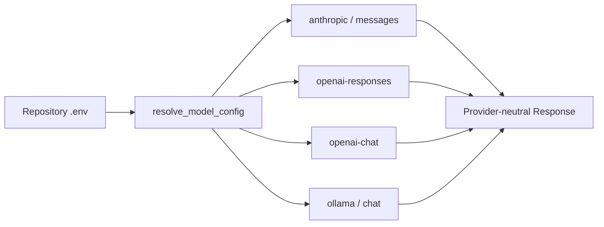

# pony-code

Pony 是一个面向代码仓库的本地 coding agent。它从当前仓库建立受边界约束的上下文，让模型读取、修改并验证代码，
同时把 Session、Run、Checkpoint、Memory 与恢复证据保存在本地 `.pony/` 中。

Pony 1.0 的产品边界很明确：一个 `pony` CLI、一个行内 TUI、三个用户可见 Provider，以及直接在受信仓库中执行的
Host 工具。TUI 只引入 `prompt-toolkit` 这一项直接运行时依赖。Host 执行不是 OS sandbox；Pony 依靠 project trust、
permission、path/secret 校验、可信 executable、mutation lock 和真实 effect observation 约束工具调用。

## 能力概览

| 能力 | 1.0 状态 | 说明 |
| --- | --- | --- |
| Anthropic | 支持 | Anthropic Messages |
| OpenAI | 支持 | Responses 或 Chat Completions |
| Ollama | 支持 | 本地 Ollama Chat，无 Key 也可运行 |
| 交互 TUI | 支持 | 裸 `pony` 或 `pony repl`；非交互终端自动使用纯文本 REPL |
| Host 执行 | 支持 | Python 3.11+；不是 OS sandbox |
| Session / Legacy inspection / Memory | 支持 | Session 可分支/rewind；旧 Checkpoint 只读检查 |
| Permission / Plan | 支持 | 六种权限模式、Session 规则、append-only Plan、Resume/Rewind |
| Provider 自动解析 | 支持 | init 可持久化；doctor 只读；run/repl 仅当前进程；真实任务失败不 fallback |

## 安装

需要 Python 3.11 或 3.12。

`v1.0.0` tag 与对应 package 发布后可使用：

```bash
python -m pip install pony-code==1.0.0
pony --version
pony --help
```

在 tag 发布前，请使用下方的源码安装流程。

如果希望在任意终端直接使用 `pony`，将当前源码工作区安装为用户级 CLI：

```bash
cd /path/to/pony-code
uv tool install --editable .
uv tool update-shell
exec zsh
pony --version
```

全局安装只提供命令，不会替目标仓库创建配置。运行交互会话时，当前目录就是目标仓库时可以直接执行；如果不想
先 `cd`，使用 `--cwd` 显式指定目标仓库，Pony 会从该目录读取 `.env` 并将其作为 workspace：

```bash
cd /path/to/your/repository
pony init
pony

# 不进入目标仓库也可以运行
pony --cwd /path/to/your/repository
```

裸 `pony` 不会猜测全局默认仓库：从家目录或其他目录启动时，它使用当前目录作为 workspace。这样可以避免把
请求发送到错误仓库或读取错误的 `.env`；需要切换仓库时，请使用 `--cwd` 或进入对应目录。

从源码开发时使用锁定环境：

```bash
git clone https://github.com/xiawiie/pony-code.git
cd pony-code
uv sync --frozen --dev
uv run pony --version
```

如果 `pony` 不在 PATH，使用 `uv run pony ...` 或检查当前虚拟环境。详见
[CLI 安装与更新](docs/cli-installation-and-updates.md)。

## 五分钟开始

在需要操作的 Git 仓库根目录运行：

```bash
pony init
pony config show
pony doctor
pony
pony run "inspect the failing tests and make the smallest safe fix"
pony --permission-mode plan run "inspect the repository and produce a plan"
```

`pony init` 对强制 Provider 只做本地校验并以私有权限原子写入仓库根目录 `.env`；`auto` 或 `openai` family 会先执行
固定 synthetic probe，因此可能产生 API 费用。普通 `doctor` 不联网；`pony doctor --check-api` 同样会发送最小的文本、
工具调用和 tool-result 续接请求。

## 进入 TUI

完成 `.env` 配置后，在目标仓库根目录直接运行：

```bash
pony
```

从源码工作区运行时使用：

```bash
uv run pony
```

`pony` 与 `pony repl` 是同一个交互入口；保留 `repl` 是为了脚本、文档和排障时能显式表达意图。一次性执行仍使用
`pony run "<prompt>"`，不会把未知子命令或裸自然语言悄悄当作 prompt。

```text
             ⣶⡄⣷⣄           ███   ██  █  █ █  █   ███  ██  ███  ████
            ⣼⣿⣿⣿⣻⣦⣀         ███   ██  █  █ █  █   ███  ██  ███  ████
           ⣾⠿⣿⣿⣿⣷⣿⣤⣤⣄       █  █ █  █ ██ █  ██   █    █  █ █  █ █
          ⠛⠃ ⣿⣿⣿⣿⣿⣿⣿⣿⣿⣿⣿⣦   ███  █  █ ████   █   █    █  █ █  █ ███
             ⣿⣿⣿⠿⠛⣿⣿⣿⡇      █    █  █ █ ██   █   █    █  █ █  █ █
            ⣼⣿⠃    ⢸⣿⣆      █     ██  █  █   █    ███  ██  ███  ████
            ⠛⠁     ⠛⠃       █     ██  █  █   █    ███  ██  ███  ████

                                    v1.0.0
                Local coding agent for repository-grounded work
                     Using anthropic/claude · auto
              / commands · esc+enter newline · ctrl+c twice exit

  帮我检查失败的测试

Working…
› read pyproject.toml
› $ pytest -q

测试失败来自一个过期断言，已完成最小修复。

────────────────────────────────────────────────────
  继续检查测试_
────────────────────────────────────────────────────
host · pony-code (main)             auto · anthropic/claude
```

除显式 `--quiet` 外，完整 TUI 每次启动都会先显示随 40/80/120 列终端宽度适配的马形 `PONY CODE` 欢迎页，随后进入
以对话为中心的界面。用户消息使用低对比消息块，Assistant 回复通过内置 renderer 排版标题、列表、代码块和表格。
`Working…` 只在等待响应时短暂出现；成功 Tool 每次只显示一行摘要，自动 checkpoint 不占用对话区。失败、中断和
一次性 permission prompt 仍会明确显示，手动 `/checkpoint` 仍返回 checkpoint ID。footer 只保留仓库/分支、执行环境、
permission mode 与 Provider/model；窄终端优先保留安全和模型信息。Pony 不展示 Provider reasoning，也不提供
streaming 输出。

fresh Session 默认使用 `auto`。`pony run` 与 `pony repl` 可通过 `--permission-mode` 选择六种公开模式；`manual`
在 Session 内部存为 `default`，但 CLI、TUI 和文档只使用公开名称：

| Permission mode | 行为 |
| --- | --- |
| `manual` | 读操作直接执行；没有规则覆盖的变更在本次 Tool 调用前询问 |
| `auto` | 使用本地确定性安全分类器自动执行内置编辑、明确授权的 Memory 保存和可证明安全的 shell；不确定时拒绝 |
| `acceptEdits` | 自动接受内置文件编辑；其他变更仍按规则决定或询问 |
| `bypassPermissions` | 绕过普通 Tool 提示；不绕过项目 trust、显式 deny、schema、路径、secret 或可信 executable 边界 |
| `dontAsk` | 不显示 Tool 授权提示；需要询问的变更直接拒绝，显式 allow 规则仍可执行 |
| `plan` | 只向模型公开只读工具与 `read_plan`、`write_plan`、`exit_plan_mode`，离开前展示精确 Plan 请求一次确认 |

`auto` 与 Claude Code 使用相同的用户模式名称，但 Pony 当前使用本地确定性分类器，不声称复刻 Claude 的内部模型分类器。
`/permissions` 可连续管理当前 Session 的 exact tool-name `allow`、`ask`、`deny` 规则并切换 mode；
`/allowed-tools` 是同一入口的别名。one-shot/REPL 启动时也可用 Claude 风格的 `--allowed-tools` 与
`--disallowed-tools` 写入同一种 Session 规则。
一次性 `Approve once?` 只授权当前调用，不会自动写成规则。

`/plan [description|open|share]` 进入或查看 Plan。首次使用 description 会把任务提交给模型。`open`/`share` 从其他
mode 调用时先进入 Plan；artifact 为空时只启用 Plan，不打开 editor 或 share。已有 artifact 时，`open` 通过
`$VISUAL`/`$EDITOR` 编辑并按原 revision CAS 保存；本地 runtime 的 `share` 会明确返回不可用。模型通过 append-only
`plan_artifact` 保存 Plan；
`exit_plan_mode` 只有在 Plan 非空且用户确认精确 revision 后才恢复进入 Plan 前的 permission mode，同一请求随后可以
继续实现。

仓库可在 `.claude/skills/<name>/SKILL.md` 提供一个 Claude 风格的只读 Skill。文档必须带严格的 `name` 和
`description` frontmatter，名称与目录一致；输入 `/name [prompt]` 只为当前 turn 注入该 Skill。Pony 不读取 HOME、
插件或 `.agents/skills`，也不执行脚本、安装或持久化 Skill；任何不安全、超限、含已知 secret 或格式错误的条目都会让
本次目录不加载。

`bypassPermissions` 必须显式获得本次进程的危险 capability；这些参数只适用于 `run/repl`：

```bash
pony --permission-mode bypassPermissions \
  --allow-dangerously-skip-permissions run "apply the requested change"
pony --dangerously-skip-permissions run "apply the requested change"
```

`--allow-dangerously-skip-permissions` 本身不切换 mode；它允许本进程通过 `/permissions` 选择 bypass，也允许恢复已经
持久化为 bypass 的 Session。`--dangerously-skip-permissions` 直接为当前 Session 选择 bypass。普通 resume 必须重新提供
capability；显式用 `--permission-mode` 改回其他 mode 不需要危险 flag。capability 只存在于当前 RuntimeOptions，不写入
Session；公共 runtime 构造、resume、mode setter 和 Executor 都会重复检查。

显式交互 `--resume` 会在首个 prompt 前显示一次 permission、checkpoint、resume state 与 Provider/model 摘要；
`pony run` 和 JSON/管理命令不显示该卡片。Session v5 历史只从当前 active Canonical Messages 重建，不保留 slash 命令
或已放弃分支的输入。

| 操作 | 行为 |
| --- | --- |
| `/` | 打开并过滤当前 Pony 斜杠命令菜单 |
| `Enter` | 提交当前 prompt |
| `\` + `Enter` / `Esc` + `Enter` | 插入换行 |
| `Up` / `Down`、`Ctrl+R` | 浏览或搜索当前交互历史 |
| `Ctrl+C` | 中断/清空当前输入；短时间内再次按下则退出 |
| `Ctrl+D` | 在空输入时退出 |

当 stdin/stdout 不是 TTY、`TERM=dumb` 或终端窄于 40 列时，Pony 自动回退到无装饰的纯文本 REPL。一次性
`pony run` 也只输出执行结果。`--no-color` 与 `NO_COLOR` 会移除颜色和背景，但保留缩进、边框及错误前缀，不改变
命令或安全行为。TUI 继续只依赖 `prompt-toolkit`，不引入第三方 Markdown 或全屏 UI 框架。

## `.env` 是唯一 Provider 配置入口

Pony 只读取当前 lexical repository root 的 `.env`，不向父目录搜索。项目 `.env` 高于进程环境；不会读取
`OPENAI_API_KEY`、`ANTHROPIC_API_KEY`、`PONY_DEEPSEEK_API_KEY` 等厂商或旧版变量。

| 变量 | 必填 | 含义 |
| --- | --- | --- |
| `PONY_PROVIDER` | 否 | missing/`auto` 自动解析；`openai` 为家族；强制值见下表 |
| `PONY_API_BASE` | 是 | 已包含版本前缀的精确 API root |
| `PONY_API_KEY` | 云 Provider 是 | 唯一通用凭证；本地 Ollama 可为空 |
| `PONY_MODEL` | 是 | Provider 侧的精确模型名 |

复制 [`.env.example`](.env.example) 即可手工切换。常见配置如下。

### 自动解析（省略 Provider）

```dotenv
PONY_API_BASE=https://gateway.example/v1
PONY_API_KEY=your-gateway-api-key
PONY_MODEL=your-model-name
```

该形式与 `PONY_PROVIDER=auto` 等价。如果 endpoint 不是 known origin 且没有可复用的 Session binding，
run/repl 会在用户任务前对 OpenAI Chat/Responses 做有界 probe；Anthropic-compatible 自定义网关需要显式设置
`PONY_PROVIDER=anthropic`。要避免之后的新 Session 重复 probe，运行 `pony init`。

### Anthropic

```dotenv
PONY_PROVIDER=anthropic
PONY_API_BASE=https://api.anthropic.com/v1
PONY_API_KEY=your-anthropic-api-key
PONY_MODEL=claude-sonnet-4-6
```

### OpenAI Responses（强制）

```dotenv
PONY_PROVIDER=openai-responses
PONY_API_BASE=https://api.openai.com/v1
PONY_API_KEY=your-openai-api-key
PONY_MODEL=gpt-5.4
```

自定义 Chat gateway 可使用 `PONY_PROVIDER=openai-chat`。`PONY_PROVIDER=openai` 会在 Chat/Responses 家族内解析；
完全省略 Provider 或设置 `auto` 会先复用 known origin 或匹配的 Session binding，仍无法确定时才运行
bounded synthetic probe。

### Ollama

```dotenv
PONY_PROVIDER=ollama
PONY_API_BASE=http://127.0.0.1:11434
PONY_API_KEY=
PONY_MODEL=qwen3:8b
```

Pony 不启动 Ollama，也不自动拉取模型。除 loopback 外，API Base 必须使用 HTTPS；URL 中的 userinfo、query、
fragment 和凭证会被拒绝。

## Provider 与内部 Transport

强制 Provider 静态路由；missing/auto/OpenAI family 在发送用户任务前解析。真实用户请求失败后不 fallback：



| Provider | API Variant | 内部协议 | 客户端追加路径 | 默认认证 |
| --- | --- | --- | --- | --- |
| `anthropic` | `messages` | `anthropic_messages` | `/messages` | `x-api-key` |
| `openai-responses` | `responses` | `openai_responses` | `/responses` | `bearer` |
| `openai-chat` | `chat_completions` | `openai_chat_completions` | `/chat/completions` | `bearer` |
| `ollama` | `chat` | `ollama_chat` | `/api/chat` | `none` |

`anthropic` 使用 Messages，`ollama` 使用 Ollama Chat；`openai` 是 Chat/Responses family selector。`pony init` 在
auto/family probe 通过后写 resolved 强制值；`doctor --check-api` 始终只读，run/repl 的自动结果不写 `.env`。

| 入口 | 联网与持久化责任 |
| --- | --- |
| `pony init` | auto/OpenAI family 执行 probe；成功后原子写入 resolved 四变量 |
| `pony doctor --check-api` | 执行同一 probe；不修改 `.env` 或 Session |
| `pony run` / `pony repl` | 仅在 protocol unresolved 时 probe；结果只属于当前进程 |
| 普通 benchmark | 要求 resolved target；未解析时 fail closed，先运行 `pony init` |
| 收费 live harness | workload 前使用共享 resolver；probe 与 workload 调用分别记账，不另建 detection 路径 |

Provider 失败不再折叠为 `agent runtime failed`。文本和 JSON 都只输出稳定 code、stage、protocol、
reason 与可选 HTTP status，不输出 Key、prompt、raw response 或完整 endpoint。

## 常用命令

```bash
pony
pony run "review the repository structure"
pony repl
pony status
pony doctor
pony doctor --check-api
pony sessions list
pony runs summary latest
pony checkpoints pending
pony memory search "release decision"
```

裸 `pony` 和 `repl` 是交互会话，`run` 是一次性任务。Session Tree 使用 append-only JSONL 保存 Canonical Messages、
工具交换、compaction 和 task checkpoint。`/rewind` 只创建新的 Session branch，不恢复或改写 workspace 文件。

## 执行与旧恢复数据

Pony 当前只提供 Host 执行。已删除 `--sandbox`、`pony sandbox ...`、Source Apply 和 workspace restore 用户入口；
升级后不会自动删除旧 `.pony/checkpoints` 或 Sandbox artifact。旧 Sandbox-bound Session 在 resume 时稳定拒绝，绝不
静默切到 Host。Checkpoint CLI 只提供 bounded、fail-closed 的检查：

```bash
pony checkpoints list
pony checkpoints show <checkpoint-id>
pony checkpoints pending
```

`preview-restore`、`restore`、`resolve-pending`、`prune`、`/rewind --workspace` 和 `--yes` 不再是公开命令。需要恢复
旧工作区时使用 Git 或外部备份；不要直接编辑 legacy store JSON。完整边界见[安全](docs/security.md)和
[恢复](docs/recovery.md)。

## 开发与验收

```bash
./scripts/check.sh
```

wheel 只包含 `pony/**` 与安装 metadata，并声明 `prompt-toolkit` 运行时依赖；sdist 另含构建所需的
标准根文件。`tests/`、`benchmarks/`、`scripts/`、`docs/` 和 `.github/` 均不进入分发包。发布由
`v<project-version>` tag 触发，先重复完整离线门禁，再有意重建固定 `dist/` 并重新验证实际待发布归档，最后通过
PyPI Trusted Publishing 和 GitHub Release 发布。真实 Provider 测试须单独授权费用。

## 维护文档

- [Agent 工作约定](AGENTS.md)
- [领域语言与模块边界](docs/domain-model.md)
- [架构](docs/architecture.md)
- [CLI 安装与更新](docs/cli-installation-and-updates.md)
- [安全](docs/security.md)
- [验证与发布](docs/verification.md)
- [Context 与 Session](docs/context-and-sessions.md)
- [Memory](docs/memory.md)
- [恢复](docs/recovery.md)
- [ADR-0040：Docker filtered staging（已取代）](docs/adr/0040-docker-filtered-staging.md)
- [ADR-0042：sealed local authorization（已取代）](docs/adr/0042-sealed-local-authorization.md)
- [ADR-0044：Provider auto resolution](docs/adr/0044-provider-auto-resolution.md)

Pony 使用 [MIT License](LICENSE)。
