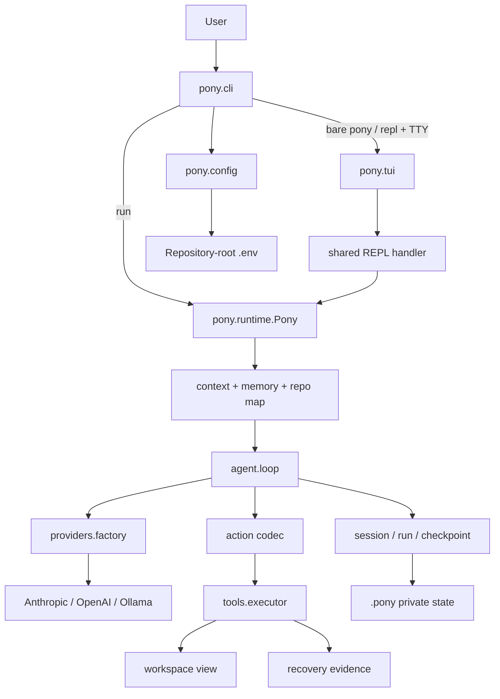
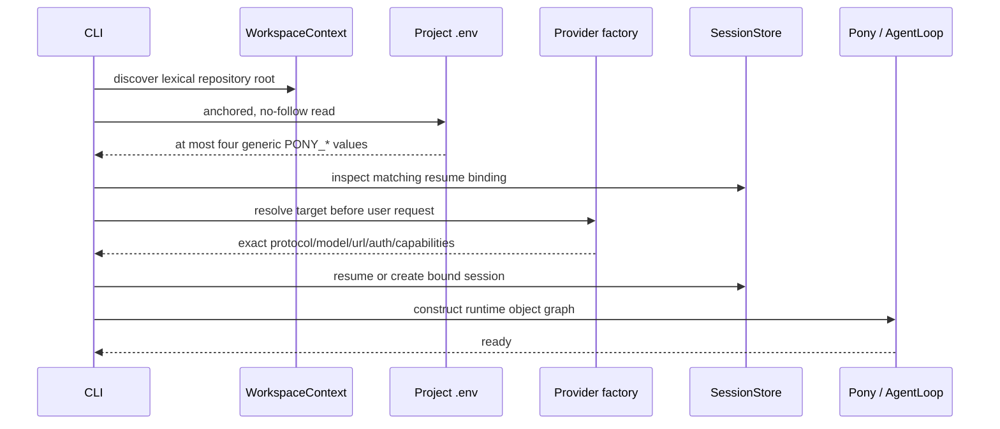
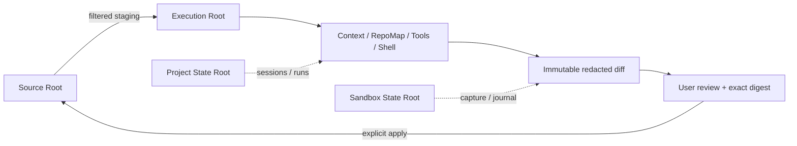
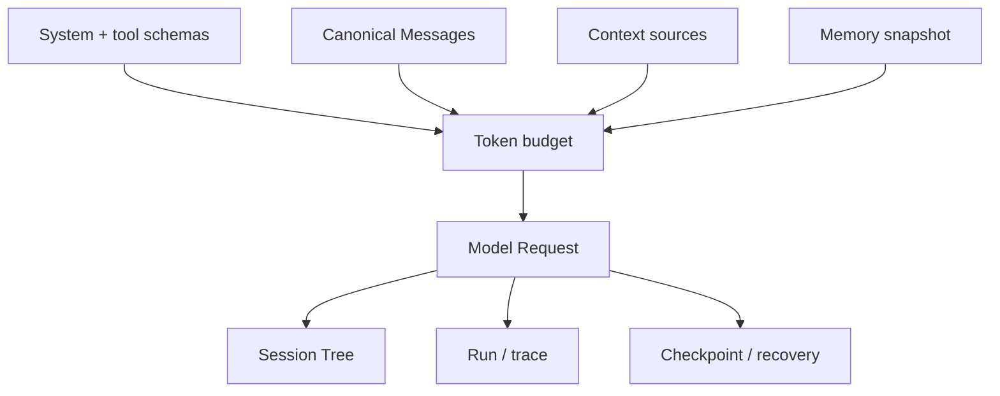

# Pony 1.0 架构

本文描述 1.0 产品代码的真实结构。领域术语以 [`domain-model.md`](domain-model.md) 为准；安全和恢复细节分别见
[安全](security.md)与[恢复](recovery.md)。

## 1. 系统全景



Pony 是一个分层的本地控制循环，不是 Provider SDK 的薄包装。Provider 只负责 wire protocol；Agent Loop 决定一次
响应能否成为 Tool、Final 或 Retry Action；工具层负责 policy、approval、effect 与恢复证据。

## 2. 产品目录

`pony/` 顶层只保留两个标准入口文件，其余实现按领域归位：

```text
pony/
├── __init__.py        # 仅公开 Pony
├── __main__.py        # python -m pony
├── agent/             # loop、action、message、compaction、预算、观测
├── cli/               # app、arguments、assembly、commands、doctor、REPL
├── config/            # environment、Provider model、pony.toml
├── context/           # source、chunk、render、digest、escaping
├── memory/            # notes、recall、retrieval、repo map
├── providers/         # 三 Provider、四 Transport、probe、factory
├── recovery/          # checkpoint writer、manager、migration、policy
├── runtime/            # Pony 装配、options、reporting、rewind、working memory
├── sandbox/           # Docker、identity、session、diff/apply、resources
├── security/          # private/workspace file、path、redaction
├── state/             # session/run/checkpoint store、task state、file lock
├── tui/               # 行内 prompt、命令菜单、Markdown 与状态渲染
├── tools/             # tool registry、executor、effect recorder、subprocess
└── workspace/         # root discovery、snapshot、observer
```

仓库级开发资产不进入产品 package：

| 路径 | 责任 |
| --- | --- |
| `tests/` | 产品、契约、安全、durability 与回归测试 |
| `benchmarks/evaluation/` | 离线评估与 Provider benchmark |
| `benchmarks/live_e2e/` | 显式授权的真实 Provider harness 与离线 assertions |
| `scripts/evaluation/` | 评估入口 |
| `scripts/sandbox/` | 本地镜像构建和 runtime 验证 |
| `scripts/release/` | distribution 内容和 clean-install 验证 |
| `.github/workflows/` | CI 与 tag-bound release |

## 3. 启动与配置

`pony.cli.app:main` 是唯一 console entry。裸 `pony` 分派到 `repl`；`pony repl` 是显式同义入口；`pony run` 保持
一次性执行。未知首个 token 始终按未知命令处理，不会静默变成 prompt。只读命令如 `status`、`config show` 和普通
`doctor` 不构造 Agent，也不发送网络请求。`run` / `repl` 的装配顺序为：



配置解析只接受 `PONY_PROVIDER`、`PONY_API_BASE`、`PONY_API_KEY` 和 `PONY_MODEL`。项目 `.env` 高于进程环境；
强制 Provider 静态选择 Transport 与认证，missing/auto/OpenAI family 通过 known origin、匹配的 Session
binding 或 bounded synthetic probe 解析。旧变量和厂商变量不会回退生效。

### TUI 是 presentation adapter

`pony.tui` 不拥有第二套 Agent Loop、Session 或斜杠命令状态机。TTY 可用时，`run_repl` 把同一个输入处理器交给
prompt-toolkit；非 TTY、`TERM=dumb` 或窄终端使用原来的纯文本循环。两种模式共用 ask、Session 命令、finalize 与错误
语义。

TUI 只通过两个私有、可恢复的 runtime seam 观察执行：durable trace 写入成功后通知 renderer；`ask` approval 使用
一次性 UI prompt。renderer 异常不能破坏 durable trace，approval renderer 异常必须拒绝授权。离开 TUI 时两个 hook
恢复原值。Tool 摘要需要的已脱敏参数与失败结果只附加到 listener 的内存副本，不进入低敏 `trace.jsonl`。

TUI 使用原生 terminal scrollback，不维护全屏 transcript 副本。启动区只有单行 `PONY CODE · v<version>`；用户消息
使用低对比块且不显示角色标签，Assistant 回复由内置轻量 renderer 处理标题、强调、列表、引用、链接、代码块和
pipe table。renderer 按终端显示宽度处理 CJK 与 emoji；表格过宽时降级为逐行记录，非法 Markdown 保留原文，输出前
剥离 ESC 与 C0/C1 控制字符。

运行事件只投影为必要信息：`model_requested` 显示可清除的 `Working…`；Tool 开始时替换为一条脱敏的语义摘要，成功
结束不重复输出，失败或中断补充限长原因；自动 `checkpoint_created` 静默，手动 `/checkpoint` 仍显示 ID。正式答案、
错误、approval 和退出都会先清理瞬态状态。footer 只保留仓库/分支、execution plane、WorkflowMode/approval 与 Provider/model，窄终端先
保留安全和模型信息，不输出绝对路径、Session ID、API Base 或 checkpoint ID。

显式交互 resume 的一次性卡片由 `pony.runtime.resume` 的纯投影生成，Plan 与 checkpoint 事实分别标注来源；one-shot、
JSON 和管理命令不显示。prompt history 每次输入后从 active Canonical Messages 重建，只包含 bounded top-level user text，
因此 slash 命令、原始 secret 输入和 abandoned branch 不成为第二套 history。

TUI 不展示或持久化 Provider reasoning，也不引入 streaming、定时 spinner、后台线程、alternate screen、主题系统或
第二套 UI 状态机。纯文本 fallback 和 `pony run` 不渲染装饰性 banner；`NO_COLOR`、`--no-color` 和终端能力检测由
交互边界统一处理。唯一直接运行时依赖仍是 `prompt-toolkit`。

### Provider 路由

| 用户 Provider | Resolution | 内部协议 | 适配器 |
| --- | --- | --- | --- |
| `anthropic` | forced | `anthropic_messages` | `AnthropicMessagesModelClient` |
| `openai-responses` | forced | `openai_responses` | `OpenAIResponsesModelClient` |
| `openai-chat` | forced | `openai_chat_completions` | `OpenAIChatCompletionsModelClient` |
| `ollama` | forced | `ollama_chat` | `OllamaChatModelClient` |
| missing/`auto`/`openai` | known origin, Session binding or synthetic probe | one protocol above | corresponding adapter |

Provider resolution 在 Agent 创建和用户请求之前完成。它只使用 fixed `pony_probe` tool/continuation，最多三个候选、
六个 Transport Attempt，并保持 configured origin。Factory 仍只接收已解析的内部协议；adapter 不互相选择，真实用户请求
失败后不更换路径。每种 adapter 返回统一的 `Response`。`pony init` 可持久化 resolved Provider；doctor 只读，run/repl
只使用当前进程结果。Generic gateway 使用 conservative Capability Profile。成功 detection 只追加一条
bounded `provider_resolved` trace。Probe client 只使用 detection timeout；识别成功后按 exact target 和用户请求 timeout
新建 production client，真实任务不复用 probe client。收费 live harness 复用同一 resolver；普通 benchmark 仍要求
resolved target，二者都不建立另一套 detection 调度器。

## 4. 一个 Turn 的控制流


关键不变量：

- 一个 Model Attempt 最多一次 Provider HTTP request；明确可重试失败由 Agent Loop 产生新的 Model Attempt。
- 一个成功响应只允许一个 Tool、Final 或 Retry Action；多工具调用不部分执行。
- 同一 top-level turn 的 retry 与 tool follow-up 复用同一不可变注入快照。
- 同一 turn 的 WorkflowMode、Active Plan context 与模型可见 tool schemas 冻结；`update_plan` 的新 Plan 从下一个
  top-level turn 才进入 working set。
- 工具调用先校验 policy 与当前授权，再进入 mutation lock；实际 effect 由 observer 复核。
- Session 持久化失败时不继续向 Provider 发送后续请求。
- Mode ceiling 在 approval 前执行，只能收窄能力；Executor 对隐藏工具仍做最终拒绝。
- 参数 schema 或 unsafe workspace entry 被拒绝后，下一次请求最多收到一条非持久化修正提示；同一
  `(tool, rejection code)` 再次出现即停止，避免形成模型付费循环。

## 5. Workspace 与 Sandbox

Host 模式中 Execution Root 等于 Source Root。Sandbox 模式把二者严格分开：



Source Root、Project State Root、Sandbox State Root、host HOME 与 Docker socket 都不挂载进容器。Sandbox 的 local
authorization 每次从当前安装树与 packaged image manifest 重算；状态不一致即 fail closed。1.0 不包含远程签名、
candidate、product enablement、registry pull 或运行时下载链路。

Project State 中的 sidecar 允许同一 Pony Session 保留多个终态 Sandbox 历史，但最多只能有一个非终态 staging。
显式 resume 原样复用唯一 `ready` staging；完整 `applied/discarded` 历史不改写，而是以当前 Source Root 创建新 staging。
新 staging 沿用 Canonical Messages、Mode、Plan 与 Provider binding，但追加清除旧 workspace recovery/freshness/runtime
identity 的 task checkpoint。`pending_review`、`review_required`、`cleanup_pending` 或多个非终态 sidecar 都 fail closed。

## 6. Context、Memory 与状态

`ContextManager` 统一管理 system、tools、Canonical Messages、Context Sources、Memory recall 和 token budget。
历史只通过 compaction 从 active request 退出，append-only Session Tree 中的旧 entry 不删除。

固定 system prefix 不维护工具清单；当前请求的 native schemas 是模型唯一可见能力表。`task_working_set` 的首个 required
chunk 包含 WorkflowMode、Plan goal/current/progress，checkpoint 是独立 required chunk，pending Plan items 与文件详情
是 optional。request metadata 只记录 Mode、Plan counts 与 visible-tool count，不记录 Plan 文本。



Session 的 Model Binding 固化 `protocol_family`、`model` 和 `endpoint_hash`。恢复时任一字段变化都会返回
`model_session_mismatch`，避免跨 Provider 或跨 endpoint 重放 opaque provider state。

Session v3 active path 同时投影 `workflow_mode` 与 `active_plan`。Mode/Plan control entries 和成功的原子
`update_plan` tool exchange 是唯一 writer；Run、trace、checkpoint 和 Resume 卡都只是消费者。v1/v2 inspection 零写，
只有显式 resume 可在锁下通过 backup/candidate/identity/digest 复验迁移到 v3。

Memory 分为用户维护的 User Notes 和 agent 追加的 Agent Notes。`memory_save` 只接受当前用户请求中的明确授权；
历史授权不继承，delegate 不能写。被召回的 Memory 会进入模型请求，因此远程 Provider 能看到相关文本。

## 7. 安全与失败语义

Pony 的安全设计采用可组合的不变量：anchored/no-follow 文件访问、bounded I/O、原子写入、CAS、可信 executable、
secret snapshot、结构化脱敏、稳定错误码和显式批准。外部输入无法确认时默认拒绝，不通过猜测继续运行。

Host 模式依然可以执行本地命令和修改仓库，不能被描述为隔离执行。Sandbox 是本机 Docker 边界，不是 hostile
multi-tenant 或 microVM 安全边界。

## 8. 打包与发布边界

wheel 只包含 `pony/**`、Sandbox JSON 与安装 metadata；sdist 另含 `pyproject.toml`、README、LICENSE、`.gitignore` 和
源码 metadata。两者都不包含 tests、benchmarks、scripts、docs、截图、缓存、`.env`、`.planning` 或 Fake Provider。

唯一直接运行时依赖是 `prompt-toolkit`，用于行内 TUI；`wcwidth` 是其锁定的传递依赖。distribution verifier 将 Git
tracked 产品文件与 archive 精确比对，并在新建虚拟环境中离线解析锁定依赖、安装 wheel、检查入口、版本、TUI import、
资源、离线 Sandbox 状态和 doctor。Tag 发布工作流要求 `v<pyproject version>` 精确匹配，通过全部离线门禁后才调用
PyPI Trusted Publishing 与 GitHub Release。
