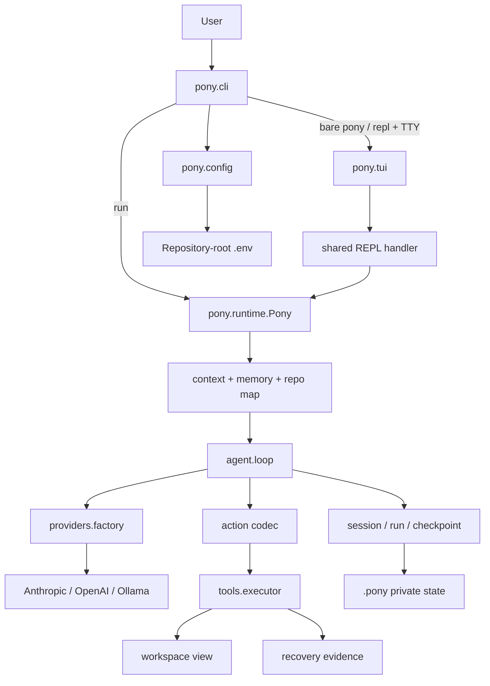
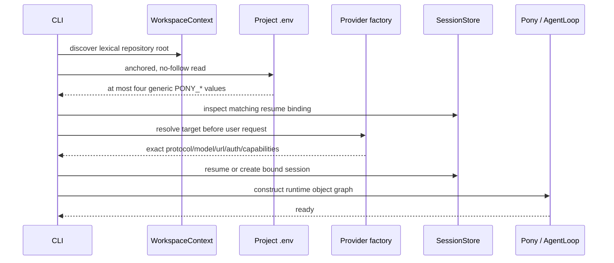
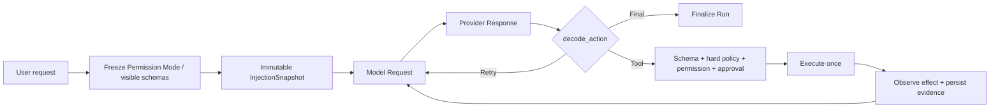
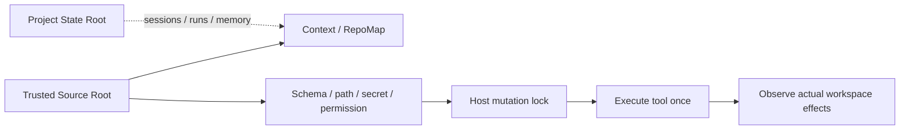
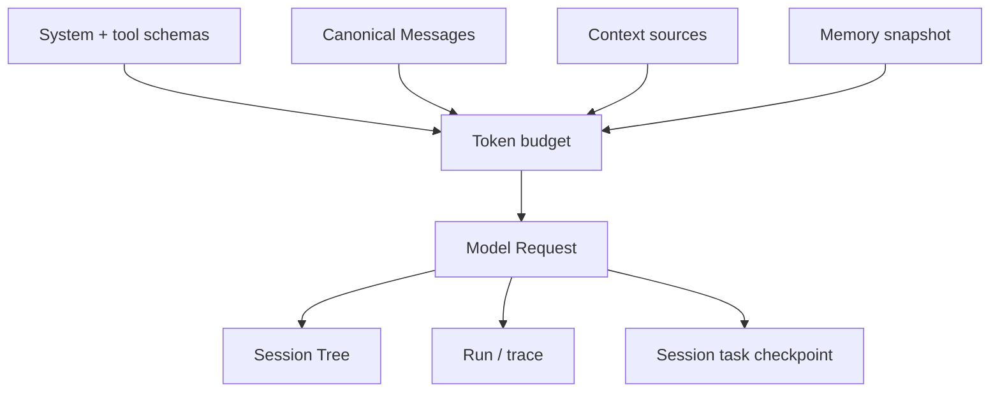

# Pony 1.0 架构

本文描述 1.0 产品代码的真实结构。领域术语以 [`domain-model.md`](domain-model.md) 为准；安全和恢复细节分别见
[安全](security.md)与[恢复](recovery.md)。

## 1. 系统全景



Pony 是一个分层的本地控制循环，不是 Provider SDK 的薄包装。Provider 只负责 wire protocol；Agent Loop 决定一次
响应能否成为 Tool、Final 或 Retry Action；工具层负责 schema、permission、approval、effect 与恢复证据。

## 2. 产品目录

`pony/` 顶层只保留两个标准入口文件，其余实现按领域归位：

```text
pony/
├── __init__.py        # 仅公开 Pony
├── __main__.py        # python -m pony
├── agent/             # loop、action、message、compaction、预算、观测
├── cli/               # app、arguments、assembly、commands、doctor、REPL
├── config/            # environment、Provider model、pony.toml
├── context/           # source、chunk、render、digest、escaping
├── memory/            # notes、recall、retrieval、repo map
├── providers/         # 三 Provider、四 Transport、probe、factory
├── recovery/          # command policy、legacy reader/migration、待删除旧 writer
├── runtime/            # Pony 装配、options、reporting、rewind、working memory
├── sandbox/           # legacy Sandbox binding/inspection；不在 active runtime
├── security/          # private/workspace file、path、redaction
├── state/             # session/run/checkpoint store、task state、file lock
├── tui/               # 行内 prompt、命令菜单、Markdown 与状态渲染
├── tools/             # tool registry、executor、effect recorder、subprocess
└── workspace/         # root discovery、snapshot、observer
```

仓库级开发资产不进入产品 package：

| 路径 | 责任 |
| --- | --- |
| `tests/` | 产品、契约、安全、durability 与回归测试 |
| `benchmarks/evaluation/` | 离线评估与 Provider benchmark |
| `benchmarks/live_e2e/` | 显式授权的真实 Provider harness 与离线 assertions |
| `scripts/evaluation/` | 评估入口 |
| `scripts/sandbox/` | 已退役 Sandbox 的历史维护脚本；不属于公开产品入口 |
| `scripts/release/` | distribution 内容和 clean-install 验证 |
| `.github/workflows/` | CI 与 tag-bound release |

## 3. 启动与配置

`pony.cli.app:main` 是唯一 console entry。裸 `pony` 分派到 `repl`；`pony repl` 是显式同义入口；`pony run` 保持
一次性执行。未知首个 token 始终按未知命令处理，不会静默变成 prompt。只读命令如 `status`、`config show` 和普通
`doctor` 不构造 Agent，也不发送网络请求。`run` / `repl` 的装配顺序为：



配置解析只接受 `PONY_PROVIDER`、`PONY_API_BASE`、`PONY_API_KEY` 和 `PONY_MODEL`。项目 `.env` 高于进程环境；
强制 Provider 静态选择 Transport 与认证，missing/auto/OpenAI family 通过 known origin、匹配的 Session
binding 或 bounded synthetic probe 解析。旧变量和厂商变量不会回退生效。

### TUI 是 presentation adapter

`pony.tui` 不拥有第二套 Agent Loop、Session 或斜杠命令状态机。TTY 可用时，`run_repl` 把同一个输入处理器交给
prompt-toolkit；非 TTY、`TERM=dumb` 或窄终端使用原来的纯文本循环。两种模式共用 ask、Session 命令、finalize 与错误
语义。

TUI 只通过两个私有、可恢复的 runtime seam 观察执行：durable trace 写入成功后通知 renderer；`ask` approval 使用
一次性 UI prompt。renderer 异常不能破坏 durable trace，approval renderer 异常必须拒绝授权。离开 TUI 时两个 hook
恢复原值。Tool 摘要需要的已脱敏参数与失败结果只附加到 listener 的内存副本，不进入低敏 `trace.jsonl`。

TUI 使用原生 terminal scrollback，不维护全屏 transcript 副本。除显式 `--quiet` 外，启动区固定显示随终端宽度适配的
马形 `PONY CODE` 欢迎页，不得退化为单行启动头；用户消息使用低对比块且不显示角色标签，Assistant 回复由内置轻量
renderer 处理标题、强调、列表、引用、链接、代码块和 pipe table。renderer 按终端显示宽度处理 CJK 与 emoji；表格
过宽时降级为逐行记录，非法 Markdown 保留原文，输出前
剥离 ESC 与 C0/C1 控制字符。

运行事件只投影为必要信息：`model_requested` 显示可清除的 `Working…`；Tool 开始时替换为一条脱敏的语义摘要，成功
结束不重复输出，失败或中断补充限长原因；自动 `checkpoint_created` 静默，手动 `/checkpoint` 仍显示 ID。正式答案、
错误、approval 和退出都会先清理瞬态状态。footer 只保留仓库/分支、execution plane、Permission Mode 与
Provider/model，窄终端先保留安全和模型信息，不输出绝对路径、Session ID、API Base 或 checkpoint ID。

显式交互 resume 的一次性卡片由 `pony.runtime.resume` 的纯投影生成，只显示 Permission Mode、checkpoint、resume 与
model binding 的有限事实；one-shot、JSON 和管理命令不显示。prompt history 每次输入后从 active Canonical Messages
重建，只包含 bounded top-level user text，因此 slash 命令、原始 secret 输入和 abandoned branch 不成为第二套 history。

TUI 不展示或持久化 Provider reasoning，也不引入 streaming、定时 spinner、后台线程、alternate screen、主题系统或
第二套 UI 状态机。纯文本 fallback 和 `pony run` 不渲染装饰性 banner；`NO_COLOR`、`--no-color` 和终端能力检测由
交互边界统一处理。唯一直接运行时依赖仍是 `prompt-toolkit`。

### Provider 路由

| 用户 Provider | Resolution | 内部协议 | 适配器 |
| --- | --- | --- | --- |
| `anthropic` | forced | `anthropic_messages` | `AnthropicMessagesModelClient` |
| `openai-responses` | forced | `openai_responses` | `OpenAIResponsesModelClient` |
| `openai-chat` | forced | `openai_chat_completions` | `OpenAIChatCompletionsModelClient` |
| `ollama` | forced | `ollama_chat` | `OllamaChatModelClient` |
| missing/`auto`/`openai` | known origin, Session binding or synthetic probe | one protocol above | corresponding adapter |

Provider resolution 在 Agent 创建和用户请求之前完成。它只使用 fixed `pony_probe` tool/continuation，最多三个候选、
六个 Transport Attempt，并保持 configured origin。Factory 仍只接收已解析的内部协议；adapter 不互相选择，真实用户请求
失败后不更换路径。每种 adapter 返回统一的 `Response`。`pony init` 可持久化 resolved Provider；doctor 只读，run/repl
只使用当前进程结果。Generic gateway 使用 conservative Capability Profile。成功 detection 只追加一条
bounded `provider_resolved` trace。Probe client 只使用 detection timeout；识别成功后按 exact target 和用户请求 timeout
新建 production client，真实任务不复用 probe client。收费 live harness 复用同一 resolver；普通 benchmark 仍要求
resolved target，二者都不建立另一套 detection 调度器。

## 4. 一个 Turn 的控制流



关键不变量：

- 一个 Model Attempt 最多一次 Provider HTTP request；明确可重试失败由 Agent Loop 产生新的 Model Attempt。
- 一个成功响应只允许一个 Tool、Final 或 Retry Action；多工具调用不部分执行。
- 同一 top-level turn 的 retry 与 tool follow-up 复用同一不可变注入快照。
- 同一 turn 的 Permission Mode 与模型可见 tool schemas 冻结；唯一例外是批准 `exit_plan_mode` 后，当前 turn 受控刷新到
  恢复后的 mode/schema 并继续执行。
- 工具调用先校验 availability、schema、硬安全边界、exact-tool rule 与 Permission Mode，再进行必要 approval 并进入
  mutation lock；实际 effect 由 observer 复核。
- Session 持久化失败时不继续向 Provider 发送后续请求。
- Plan 的 schema 隐藏不是唯一防线；Executor 对模型不可见的 mutation 仍执行至少 ASK 的二次 gate，显式 allow rule
  也不能绕过该 floor。
- 参数 schema 或 unsafe workspace entry 被拒绝后，下一次请求最多收到一条非持久化修正提示；同一
  `(tool, rejection code)` 再次出现即停止，避免形成模型付费循环。

### Permission Mode 与 Plan

Pony 对用户公开六个 Permission Mode；新 Runtime Session 默认 `auto`。`manual` 在输入和 UI 中公开，但持久化前规范化为
内部值 `default`：

| 公开模式 | Session 值 | 无 exact-tool rule 时的行为 |
| --- | --- | --- |
| `manual` | `default` | 只读工具直接执行，mutation 请求 approval |
| `acceptEdits` | `acceptEdits` | 内置 `write_file` / `patch_file` 直接执行，其他 mutation 请求 approval |
| `auto` | `auto` | 本地 deterministic classifier 只放行内置编辑、满足独立授权的 `memory_save` 和可证明只读的 shell；其余 mutation 拒绝 |
| `bypassPermissions` | `bypassPermissions` | 无 rule 的 mutation 不弹 prompt；exact `ask` 仍询问，且不绕过硬安全边界 |
| `dontAsk` | `dontAsk` | 不弹 prompt；未显式 allow 的 mutation 拒绝，显式 ask 也转为拒绝 |
| `plan` | `plan` | 模型只看到非 shell 只读工具和三个 Plan 工具；`write_plan` 可写 Plan，其余 mutation 至少请求 approval |

Pony 的 `auto` 提供与 Claude Code 相同的用户模式名称和本地自动决策目标，但实现是确定性的本地分类器，不是 Claude
Code 的模型分类器，也不宣称两者内部等价。`--allow-dangerously-skip-permissions` 是本进程的 transient capability：
它本身不切 mode，但允许 `/permissions` 选择或 resume 已持久化的 `bypassPermissions`。初始 mode 也可同时显式指定
`--permission-mode bypassPermissions`；`--dangerously-skip-permissions` 则直接选择 bypass，并与其他 mode 冲突。
普通 bypass resume 必须重新提供 capability；显式改为其他 mode 不需要 dangerous flag。
Capability 是冻结的 RuntimeOptions 输入，不写入 Session；直接构造、`from_session()`、mode setter 和 Executor 均重复
验证，不能只依赖 CLI adapter。

`permission_rules` 只匹配完整 tool name；`/permissions`、`/allowed-tools`、`--allowed-tools` 与
`--disallowed-tools` 共用锁内原子的 `SessionStore.set_permission_rules()`；一次 flags/picker 提交只追加一个 rule state entry。
Picker 的 mode 操作仍写 `permission_mode_change`。
判决顺序为：

1. tool availability、allowlist、schema 和 shell hard reject 先行；
2. project trust、`read_only`、未知 effect 与 exact `deny` 均 fail closed；
3. Plan mutation floor 先于 exact `allow`，只有 `write_plan` 是 Plan 内的自动写入；
4. 其余 exact `allow` / `ask` 先于 mode 默认值，`dontAsk` 把 ASK 变为 DENY；
5. ASK 才进入 approval，批准后重校验参数，随后只执行一次。

`bypassPermissions` 只把无 exact rule 的 mode 默认判定变为 ALLOW；exact `ask` 仍进入第 5 步。它不会跳过 trust、
exact deny、`read_only`、schema、path/secret、shell hard reject、`memory_save` 当轮明确授权、mutation lock 或真实 effect
observation。

Plan 是 Session 内的 bounded Markdown artifact，不是 task checkpoint。模型在 `plan` mode 中用 `read_plan` 读取、用
`write_plan` 完整替换；写入前拒绝超过 12 KiB UTF-8 或包含已知 secret 的文本。成功写入追加
`plan_artifact {text, revision}`，revision 单调递增。`exit_plan_mode` 要求已有非空 artifact，并把 exact text/revision
交给用户批准；批准后、执行前再次比较参数、artifact text 和 revision，CAS-style 校验不一致即保持 Plan。成功后恢复
`pre_plan_mode`（缺失时为 `auto`），刷新当前 turn 的 schemas，并允许同一请求继续实现。
`/plan open|share` 从非 Plan mode 调用时先追加 mode entry；artifact 为空时只启用 Plan，不打开 editor 或 share。

## 5. Workspace 与 Host 执行

当前产品只有 Host 执行，Execution Root 与 Source Root 相同：



Host 不是 OS sandbox。Pony 不隔离恶意命令、依赖、编译器插件或测试进程；用户应只在受信仓库中运行。mutation 工具在
approval 与参数复核后获取 `.pony/.workspace-mutation.lock`，持锁覆盖 before snapshot、runner 和 after snapshot。
已删除 `--sandbox`、`pony sandbox`、Source Apply 和 workspace restore。旧 Sandbox-bound Session 只做 bounded binding
检查并稳定拒绝 Host resume；内部 legacy reader 暂保留，等待独立删除波次。

## 6. Context、Memory 与状态

`ContextManager` 统一管理 system、tools、Canonical Messages、Context Sources、Memory recall 和 token budget。
历史只通过 compaction 从 active request 退出，append-only Session Tree 中的旧 entry 不删除。

固定 system prefix 不维护工具清单；当前请求的 native schemas 是模型唯一可见能力表。`task_working_set` 的首个 required
chunk 只投影当前 task checkpoint，文件详情是 optional。Plan mode 通过固定 system reminder 告知模型使用 Plan 工具；
artifact 文本留在 Session，由 `read_plan` 按需读取，不复制进 system prefix 或 request metadata。metadata 只记录
Permission Mode 与 visible-tool count。



Session 的 Model Binding 固化 `protocol_family`、`model` 和 `endpoint_hash`。恢复时任一字段变化都会返回
`model_session_mismatch`，避免跨 Provider 或跨 endpoint 重放 opaque provider state。

Session v4 active path 投影 `permission_mode`、`permission_rules`、`plan_text`、`plan_revision` 与 `pre_plan_mode`。
`permission_mode_change` 和 `plan_artifact` 是专用 control entry；exact-tool rules 通过 bounded `session_info` state update
写入。普通 `save` 不得偷偷修改这些字段。完整决策见
[ADR-0045](adr/0045-permission-modes-session-v4-and-plan-artifacts.md)。

v1 JSON、v2 JSONL 与 v3 JSONL inspection 都保持零写；普通 writer 返回 `session_migration_required`。只有显式 resume
在 Session lock 下执行迁移：稳定读取源、创建或复验 digest backup、完整解析 candidate/projection、复验源 identity 与
digest，再 atomic replace 为 v4。v1/v2 进入内部 `default` 和空 rule/Plan；v3 `act` 映射 `default`，其他旧 WorkflowMode
映射 `plan`。旧结构化 Active Plan 不冒充新的 Markdown artifact：旧 `plan_update` control data 转成 migration audit，
旧 `update_plan` tool exchange 只作为历史消息保留。

Memory 分为用户维护的 User Notes 和 agent 追加的 Agent Notes。`memory_save` 只接受当前用户请求中的明确授权；
历史授权不继承，delegate 不能写。被召回的 Memory 会进入模型请求，因此远程 Provider 能看到相关文本。

## 7. 安全与失败语义

Pony 的安全设计采用可组合的不变量：anchored/no-follow 文件访问、bounded I/O、原子写入、CAS、可信 executable、
secret snapshot、结构化脱敏、稳定错误码和显式批准。外部输入无法确认时默认拒绝，不通过猜测继续运行。

Host 可以执行本地命令和修改仓库，不能被描述为隔离执行。旧 Docker Sandbox 代码不在 active runtime，也不能作为
当前安全保证或 fallback。

## 8. 打包与发布边界

wheel 只包含 `pony/**` 与安装 metadata；sdist 另含 `pyproject.toml`、README、LICENSE、`.gitignore` 和
源码 metadata。两者都不包含 tests、benchmarks、scripts、docs、截图、缓存、`.env`、`.planning` 或 Fake Provider。

唯一直接运行时依赖是 `prompt-toolkit`，用于行内 TUI；`wcwidth` 是其锁定的传递依赖。distribution verifier 将 Git
tracked 产品文件与 archive 精确比对，并在新建虚拟环境中离线解析锁定依赖、安装 wheel、检查入口、版本、TUI import、
资源和 doctor。Tag 发布工作流要求 `v<pyproject version>` 精确匹配，通过全部离线门禁后才调用
PyPI Trusted Publishing 与 GitHub Release。
