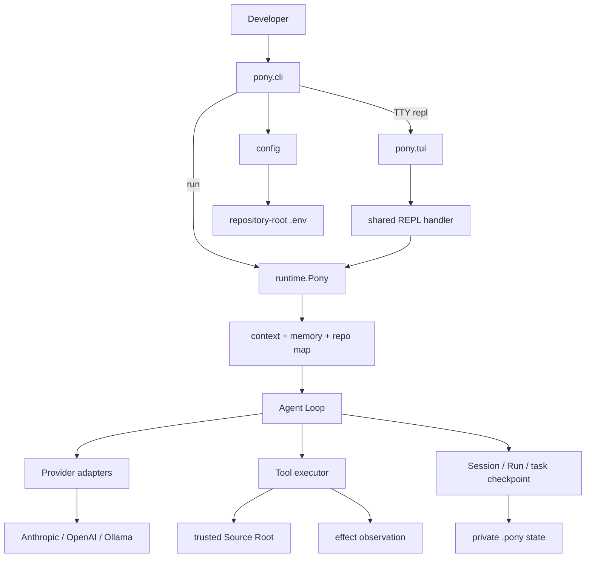
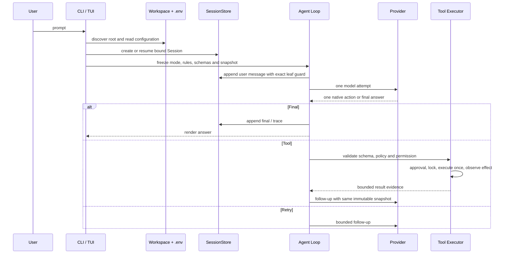
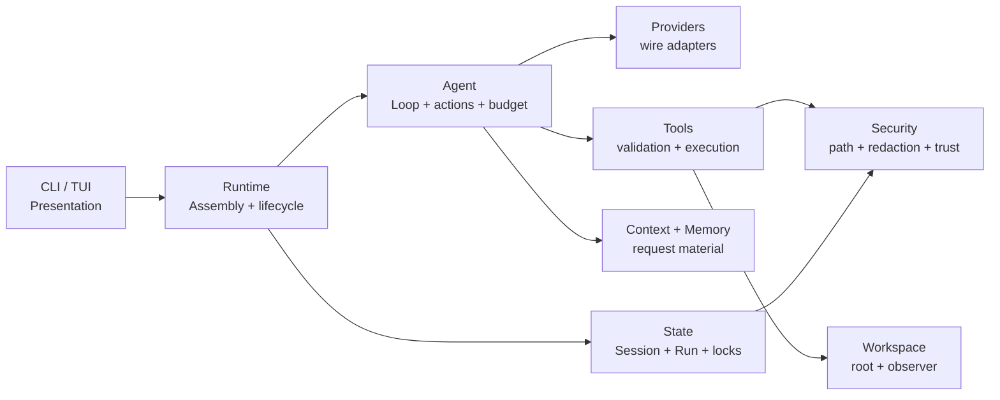
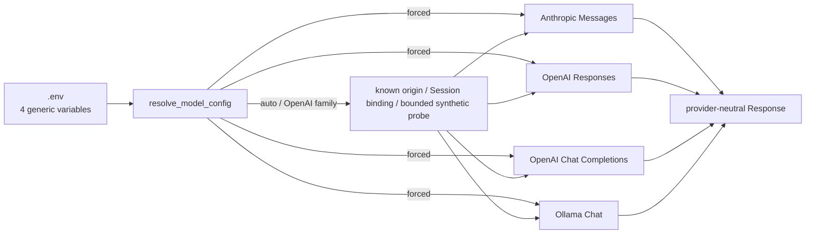
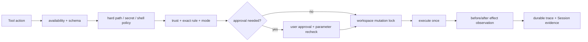
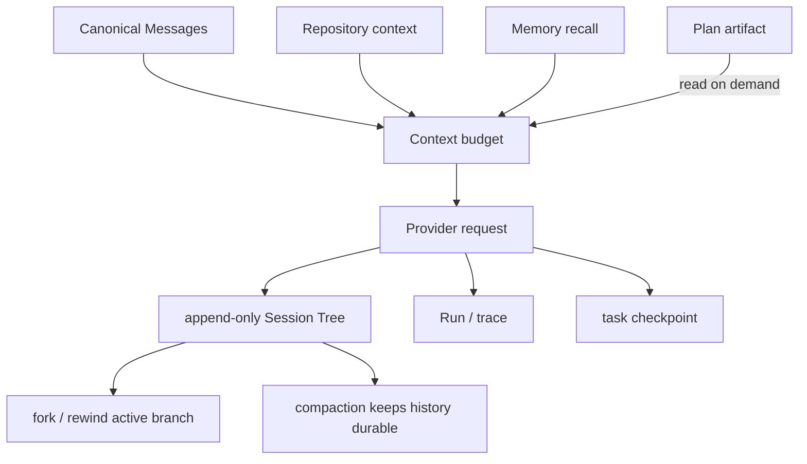
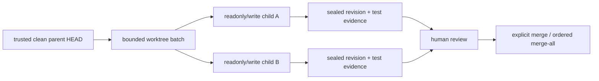
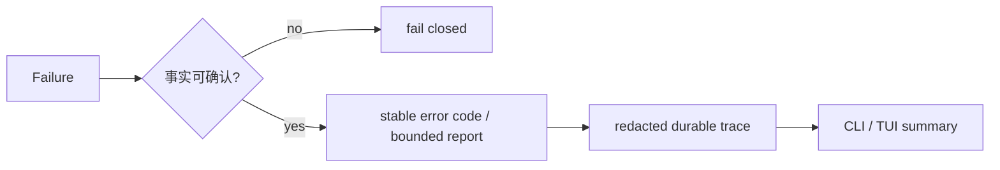

# Pony 1.0 架构

本文解释当前产品的运行结构、数据边界与失败语义。术语以[领域模型](domain-model.md)为准；安全、恢复、安装和验证的
细节分别在[安全](security.md)、[恢复](recovery.md)、[CLI 安装与更新](cli-installation-and-updates.md)和
[验证与发布](verification.md)中维护。

## 系统全景

Pony 不是 Provider SDK 的薄包装。Provider adapter 只处理 wire protocol；Agent Loop 决定响应是否能成为 Tool、Final 或
Retry Action；工具层负责 schema、policy、permission、approval、effect 与持久化证据。

## 运行路径

一个 Model Attempt 最多一次 HTTP 请求；成功响应最多产生一个 Tool、Final 或 Retry。Session leaf 与 Provider binding
在 user append、请求与响应 append 时 CAS 保护；并发 Session/model 变化会使旧请求 fail closed，不会把 stale response
接到新的对话树。

## 分层与所有权

| 层 | 主要职责 | 不能做什么 |
| --- | --- | --- |
| `cli/`、`tui/` | 参数、命令、交互、展示 | 不维护第二套 Agent/Session 状态机 |
| `runtime/` | 装配、Session 生命周期、reporting、worktree child 调度 | 不让 child 自动 merge parent |
| `agent/` | Canonical Messages、动作解码、预算、compaction、attempt 语义 | 不绕过 Tool policy |
| `tools/` | schema、permission、approval、lock、effect、subprocess | 不信任模型声明的 effect |
| `providers/` | 四个 Transport 的请求/响应适配 | 不动态切换 adapter 或真实任务 fallback |
| `state/` | Session/Run、CAS、lock、legacy reader | 不把 release version 当 record format |
| `security/` | anchored file I/O、redaction、trust、command policy | 不以降级方式放开不安全事实 |

## Provider 解析与绑定

配置只读取项目根目录 `.env` 的 `PONY_PROVIDER`、`PONY_API_BASE`、`PONY_API_KEY`、`PONY_MODEL`；项目值高于进程环境。
Provider、protocol、model 与 endpoint hash 会写入 Session binding。`auto`/OpenAI family 可在用户任务前做 bounded synthetic
resolution；真实任务失败不 fallback，也不会跨协议重放 Session。

## Permission 与 Host 执行

六种公开 Permission Mode 为 `manual`、`auto`、`acceptEdits`、`bypassPermissions`、`dontAsk`、`plan`。Plan mode 只公开
非 shell 只读工具及 Plan 工具；退出时确认精确 Plan 文本/revision。`bypassPermissions` 需要显式危险 capability，且不会
绕过 trust、deny rule、schema、路径、secret、可信 executable、mutation lock 或 effect observation。

当前产品只执行 Host 工具。Host 不是 OS sandbox，不能隔离恶意命令、依赖、编译器插件或测试进程；请只在受信仓库中运行。
Windows 不在 1.0 支持范围，当前安全文件和锁模型依赖 POSIX 原语。

## 状态、上下文与恢复

Session Tree 是 append-only JSONL；fork 和 rewind 选择或创建新的会话分支，不恢复或改写 workspace 文件。Compaction 只压缩
活动请求上下文，历史 entry 不删除。Memory 保存需要当前请求的明确授权；delegate 不可写 Durable Memory。

旧 Sandbox/Checkpoint artifact 只保留 bounded、只读 inspection。公开 Sandbox、Source Apply、workspace restore 与
`/rewind --workspace` 已删除；旧 Sandbox-bound Session resume 稳定返回 `legacy_sandbox_session_unsupported`，绝不静默切到 Host。

## 并行 Worktree Agent

每个 child 都有独立 branch、worktree、client、Session 与 Run。模型工具不自动 merge；`merge`/`merge-all` 在 parent mutation
lock 中复核 clean parent、project trust、sealed revision、sensitive path 与完整冲突预检。未合入 child 只能显式 discard cleanup。

## 失败与可观测性

Pony 优先保留 primary failure：cleanup、observer 或 finalizer 的次生失败不能覆盖它。trace、doctor、Provider 报错和 UI
只投影稳定 code 与低敏事实，不保存 API Key、完整 endpoint、prompt、raw response 或 Provider reasoning。

## 分发与发布边界

`wheel` 只包含 `pony/**` 与安装 metadata；`sdist` 另含构建必需根文件。tests、benchmarks、scripts、docs、截图、
`.env`、`.planning` 与 cache 不进入分发包。唯一直接运行时依赖为 `prompt-toolkit`。

`./scripts/check.sh` 在 clean exact HEAD 验证 lock、Ruff、全量 pytest、评估、分发内容和 clean-install。真实 Provider live
验收是单独授权的收费 G8；每个账号/endpoint/model 组合独立记录，不能互相外推。Tag 发布要求精确 `v<project.version>`，
并在新 runner 上重复门禁后才可使用 Trusted Publishing 和 GitHub Release。
