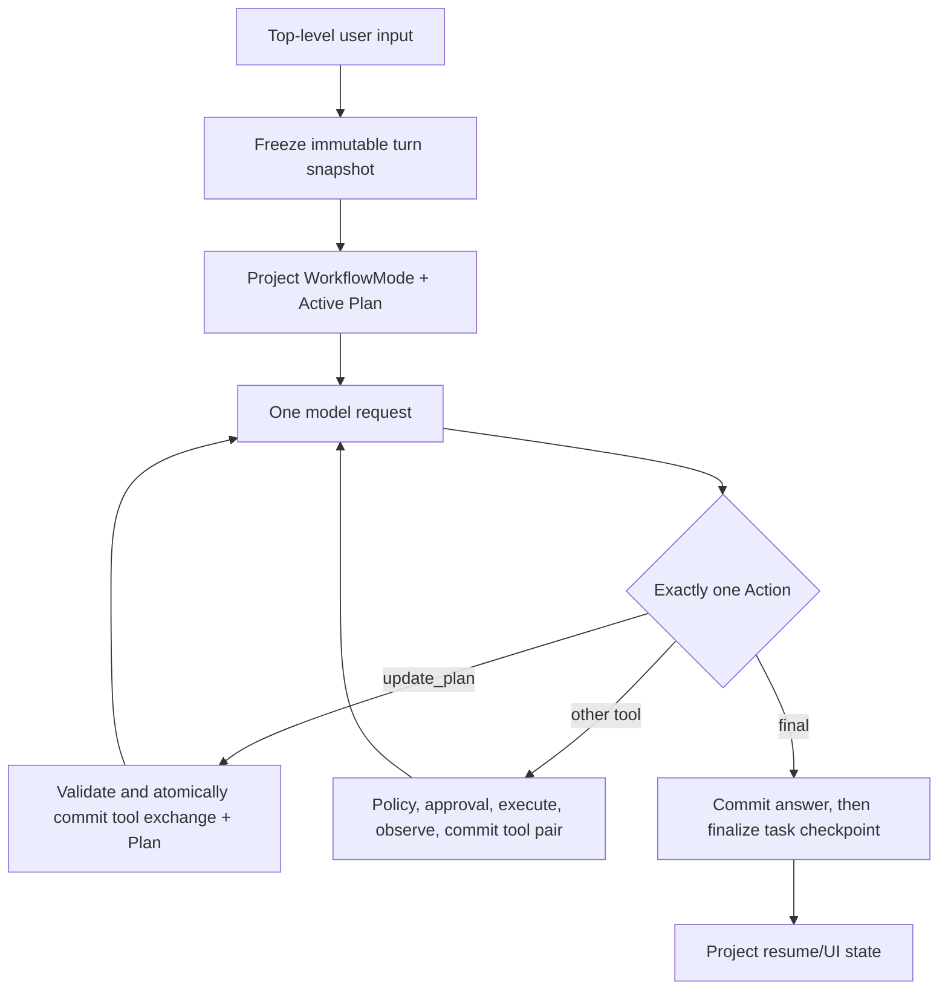
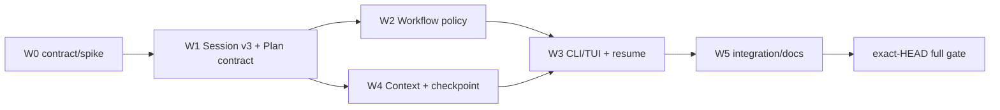

# Pony Coding Agent 工作流实施方案

> 文档性质：基于当前代码的实施路线，不声明尚未实现的能力
> 基线：2026-07-18，`main@88c23a0ff961ff540ad3dbb4d5412b24c7f9daea`
> 当前结论：先交付单 Provider 的 Workflow Mode、Active Plan 与 Resume 可见性；其余能力经过独立门槛后再做

本文对 Mode、Plan/Todo、Resume/Rewind、Model Target、持续交互、只读子任务、Skills、过程可见性与后续 IDE 接口
进行可行性分析，并给出可实际执行的 worktree 与集成方案。当前产品合同仍以[领域模型](domain-model.md)、
[架构](architecture.md)、[Session](context-and-sessions.md)、[恢复](recovery.md)、[安全](security.md)和
[验证](verification.md)为准；本文不能自行修改这些合同来批准尚未决策的能力。

## 1. 执行结论

原方案方向正确，但把四类风险不同的工作绑定成了一个 P0：

1. Workflow Mode 与 Plan 是 Agent Core 的单会话能力，可以近期做。
2. Resume 卡与 TUI 投影是上述状态的消费者，可以在状态合同稳定后做。
3. 多 Model Target 会改写唯一 `.env` 配置面和 Session Model Binding，必须先有产品/安全 ADR，不能阻塞近期闭环。
4. 输入队列、并行 delegate 与 Skills 分别涉及 TUI 并发、client 隔离和 Sandbox 信任边界，必须先做有退出条件的 spike。

因此采用以下路线：

| 层级 | 能力 | 结论 | 原因 |
| --- | --- | --- | --- |
| P0 | `plan/act/review` Workflow Mode | 做 | 可复用现有 Tool policy、approval、Session active path |
| P0 | Active Plan 与 `/plan` | 做 | 自动 checkpoint 不能表达 turn 内的显式多步骤进度 |
| P0 | `/mode` 与显式 `--mode` | 做 | 同时覆盖交互和 one-shot，不形成配置默认值 |
| P0 | Resume 卡、prompt history、状态投影 | 做 | 可从已有 Session/checkpoint 派生，不需新 Store |
| P0 | `/todo` | 不做别名 | `/plan` 已覆盖；第二名称增加命令和文档面，没有独立价值 |
| Gate M | 命名 Model Target 与 `/model` | 先 ADR，默认不做 | 与四变量配置和 immutable Session Binding 合同冲突 |
| Gate Q | 忙碌时持久化输入队列 | 先 spike | 当前 TUI/Agent 是同步调用，approval 与退出语义尚未解决 |
| Gate D | 批量并行 delegate | 先隔离再评估并行 | child 当前共享 model client，Host 下还共享 Store |
| Gate S | 仓库 Skills | 先威胁模型 | `.agents/` 当前会进入 Sandbox staging，信任边界未定义 |
| P2+ | JSONL/IDE/MCP adapter | 有真实 consumer 再做 | 无 consumer 时协议只会形成第二维护面 |

近期成功标准不是“拥有完整 AI IDE”，而是：用户能在同一 Provider、同一 Session 中可靠执行
`Plan -> Act -> Review -> Resume/Rewind`，状态只有一个真源，安全能力不会被 Mode 或 approval 绕过。

## 2. 当前实现事实与纠偏

### 2.1 可以直接复用的能力

- Session v2 是 append-only JSONL tree，active path 已支持 fork、rewind、compaction 与 task checkpoint。
- Canonical Messages 是唯一 transcript；`ContextManager` 从 active Session view 构造请求。
- `ToolExecutor` 已集中处理 schema、allowlist、shell assessment、approval、mutation lock、effect observation 与 recovery。
- `assess_command()` 已能证明一小组 shell 命令只读，并将测试等解释器命令判为需要 approval 的外部 effect。
- REPL 与 TUI 共用 `pony.cli.start._process_repl_input`；斜杠菜单来自 `pony.cli.help.SLASH_COMMANDS`。
- Run trace 在 durable append 成功后才向 TUI listener 发送脱敏副本。
- `task_checkpoint` 已保存 goal、status、blocker、next steps、key files、freshness 与 runtime identity，可生成 Resume 事实。
- `RuntimeOptions` 是冻结的可选设置对象；`Pony` 公共构造合同无需改变。

### 2.2 不能按表面现状假设的能力

- Session `ENTRY_TYPES` 虽包含 `model_change`，但生产代码没有写入、校验其 data 或把它投影到 active state；它只是死占位，
  不是 Model Target 切换基础。
- `TaskState` 只描述一次 `ask()`；自动 checkpoint 在 turn 结束时推导，不能替代模型主动维护的 Active Plan。
- `read_only=True` 会拒绝所有 `run_shell`；它不能直接表示允许“已证明只读 shell”的 `plan/review`。
- 当前工具 schema 简写只可靠表达 string/integer，不能直接声明 object/array。P0 可用严格、bounded 的 JSON string
  承载 Plan；batch delegate 若继续推进，仍必须先补 provider-neutral schema 能力。
- 当前 delegate 在 Host 下共享父 `SessionStore`/`RunStore`，并直接共享同一个 `model_client`；不得并行使用。
- 当前 TUI 同步执行 `session.prompt() -> agent.ask()`；Provider 使用阻塞式 `urllib` 且没有 cancel API，输入队列不是小改动。
- `.agents/` 不在 Sandbox 的 agent-control 排除集合中，会进入 filtered staging 与 diff capture。
- 当前 TUI 仍渲染多行 responsive banner，toolbar 还包含绝对 cwd 和 Session ID，与现行 UI 合同冲突；W3 已触碰同一 UI
  owner，因此把它列为
  独立验收项一并恢复，但不能把这项基线修复包装成 Workflow 新能力。

### 2.3 责任模块纠偏

仓库没有 `pony/cli/repl.py`、`pony/tools/approval.py` 或 `pony/tools/shell_assessment.py`。真实 owner 是：

| 责任 | 当前 owner |
| --- | --- |
| Session format、active projection、migration、fork/rewind/clone | `pony/state/session_store.py` |
| Runtime state、reload/reset、delegate 装配 | `pony/runtime/application.py`、`pony/runtime/options.py` |
| REPL handler 与斜杠命令执行 | `pony/cli/start.py` |
| 斜杠命令 catalog | `pony/cli/help.py` |
| TUI prompt、completion、history、runtime hooks | `pony/tui/app.py` |
| TUI 状态与事件渲染 | `pony/tui/render.py` |
| Tool schema/registry | `pony/tools/registry.py`、`pony/tools/validation.py` |
| Mode、approval、shell policy 的最终执行边界 | `pony/tools/executor.py`、`pony/recovery/policy.py` |
| Context source 与 token allocation | `pony/context/sources.py`、`pony/agent/context_manager.py` |
| Trace schema、durable writer/listener 顺序 | `pony/agent/observability.py`、`pony/runtime/application.py` |
| Provider 配置与装配 | `pony/config/model.py`、`pony/config/environment.py`、`pony/cli/assembly.py` |

## 3. 近期目标架构

### 3.1 状态所有权

近期只新增两个 active Session state；它们可由三类 entry 投影，但不产生第二个 Store：

```text
Session active path
├── workflow_mode_change            -> active_workflow_mode
├── plan_update                     -> active_plan（human/reset/clone control）
└── successful update_plan exchange -> active_plan（从原子 tool pair 投影）
```

- `WorkflowMode` 是内部精确名称，值为 `plan`、`act`、`review`；UI 命令仍可用 `/mode`。
- `Plan` 是一个 bounded value object；TUI/CLI 只投影它，不创建 Todo Store 或 history 文件。
- checkpoint 不复制 Plan，也不新增 Plan writer；Resume renderer 在读取时组合 checkpoint 与 Active Plan 投影。
- Run/Trace 记录事件事实，不成为 Mode/Plan 的恢复真源。
- 通用 `session_info` 不得写 Mode/Plan。reset/clone 若需建立新 branch/session，必须追加上述显式 control entry，不能形成隐藏 writer。
- 新 Session 的格式默认值固定为 `act`；`/mode` 与只适用于 `run/repl` 的显式 `--mode` 追加同一种 control entry。
  Mode 不进入 `RuntimeOptions`、环境变量或 `pony.toml`；未显式指定时只从 active path 恢复。

### 3.2 控制流



仍保持：一个 Model Attempt 至多一次真实 request；成功 response 只产生一个 Tool、Final 或 Retry；同一 top-level turn 的
retry/follow-up 复用 immutable snapshot。Mode 只在 top-level turn 边界由用户命令修改，模型无权切换。

### 3.3 WorkflowMode 与 approval 正交

`WorkflowMode` 决定能力上限；`approval=ask|auto|never` 只决定上限内是否需要人工确认。计算顺序固定为：

```text
schema/path/sensitive checks
-> WorkflowMode ceiling
-> existing tool/shell policy
-> current-request Memory authority
-> approval
-> mutation lock and execution
```

| WorkflowMode | read-only tools | `update_plan` | workspace tools | `memory_save` | `run_shell` |
| --- | --- | --- | --- | --- | --- |
| `plan` | 允许 | 允许 | 拒绝 | 拒绝 | 仅 `risk_class=read_only`，之后仍走现有 approval |
| `act` | 允许 | 允许 | 走现有 policy/approval | 仍须当前请求明确授权 | 走现有 policy/approval |
| `review` | 允许 | 允许 | 拒绝 | 拒绝 | 只允许 `read_only` 或 `external_effect`；后者仅 `ask` 可确认 |

补充不变量：

- WorkflowMode 只能缩小能力，不能把现有 shell policy 的 `ask/reject` 提升为 `allow`。
- 既有 `RuntimeOptions.read_only=True` 是更强的内部上限：继续拒绝全部 `run_shell`、`session_state` 和写工具，任何 Mode 都不能放宽。
- `auto` 不能突破 `plan/review` 的 workspace 或 Durable Memory 禁令，也不能自动执行 `external_effect`。
- `never` 保持当前语义：所有 `run_shell` 都拒绝；不要借 WorkflowMode 放宽。
- `review + ask` 可确认测试等外部 effect，但执行后如 observer 发现 workspace change，必须按现有 Tool Change/Recovery 记录，
  并将该次行为标为 policy violation/review required；Mode 不能成为“不记录副作用”的借口。
- destructive、sensitive path、workspace-write shell 在 `plan/review` 直接拒绝，approval 无权提权。
- delegate 继续使用现有 `read_only=True + approval=never`，不继承父 WorkflowMode 的更高权限。
- Mode ceiling 约束模型发起的 Tool。用户显式输入的 `/remember`、`/checkpoint`、`/rewind`、`/clone` 等本地管理命令继续代表
  human authority 并保持既有确认/恢复语义；模型不能把它们作为文本输出触发，也不能借 Tool 间接调用。

实现上只在共享 `ToolExecutor` 根部增加一张静态 policy table；不增加 DSL、策略插件或第二 executor。
每个 top-level turn 同时冻结 Mode 对应的模型可见 Tool Schema；固定 prefix 不再列举静态工具名。隐藏不是授权边界，
Executor 必须继续对所有调用执行同一 Mode ceiling。

### 3.4 Active Plan 合同

不提供 `/todo` 别名。用户通过 `/plan` 查看或清空，模型通过 `update_plan` 完整替换同一 Active Plan：

```json
{
  "goal": "完成 Workflow Mode",
  "items": [
    {"id": "1", "text": "持久化 Mode", "status": "completed"},
    {"id": "2", "text": "执行 policy 矩阵", "status": "in_progress"}
  ]
}
```

约束在 Session 地基切片中锁定为常量并测试：

- canonical empty Plan 固定为 `{"goal":"","items":[]}`；除此之外，`goal` 必须 trim 后 1–300 chars，且必须有
  1–12 items。空 goal 与非空 items 的混合形态一律拒绝。
- canonical JSON 的 UTF-8 编码最多 12 KiB；大小限制在 decode 前后都检查，避免压缩/转义差异绕过上限。
- canonical serialization 固定字段顺序、UTF-8 与无多余空白；Plan digest 是该字节串的 SHA-256。
- `id`：`[A-Za-z0-9][A-Za-z0-9._-]{0,31}`，Plan 内唯一。
- `text`：trim 后 1–300 chars；`status` 只允许 `pending|in_progress|completed`。
- 同时最多一个 `in_progress`；未知字段、重复 JSON key、C0/DEL 控制字符和非字符串字段均拒绝。
- 更新是完整替换，不做 patch/merge、依赖图、负责人、优先级、截止时间或 blocker 子模型。
- 先做结构/输入上限检查，再走现有 sensitive-content gate；若 artifact redaction 会改变任一 Plan string，整次更新以
  `sensitive_content_block` 拒绝并保持旧 Plan，不为该工具放宽通用 action sanitizer。通过后再 canonicalize/revalidate；tool result
  只返回从 exact persisted Plan 派生的 bounded count/current-item-ID/`sha256:<64hex>`，不回显原始文本或持久化前对象。
- `/plan` 显示；`/plan clear` 追加 canonical empty `plan_update`，不删除历史；模型用 `update_plan` tool 完整替换。
- `/reset` 在新 active branch 清空消息、current checkpoint selection 与 Active Plan，但保留历史 checkpoint entries 和用户选择的
  WorkflowMode；fork/rewind 从目标 active path 恢复二者。
- `clone --to-worktree` 复制 Active Plan 和 WorkflowMode，但清除 workspace-bound freshness/recovery，保持现有 clone 边界。

P0 的 `update_plan` 只接受一个 `plan_json: str`，在工具边界执行 bounded、duplicate-key-aware strict decode；这复用当前
string tool schema，不为一个调用方重写 schema 系统。验证和 sensitive-content gate 成功后，Session v3 从成功的原子
tool call/result 直接投影 Plan，不在 `tool_exchange.data` 再保存一份副本。只有 Gate D 获批、出现第二个真实
object/array tool 后，才评估
把所有工具统一迁移到 provider-neutral JSON Schema；届时删除 `plan_json`，不长期保留两套表示。

`update_plan` runner 只返回 validated Plan payload，不先修改 `agent.session`。Agent Loop 把该 payload 交给 SessionStore 原子提交，成功后才
adopt 新 projection；这样 append 前失败不需要补偿写或通用事务框架。
它按普通成功 Tool 消耗一个现有 step，并受 repeated-identical-call 与总 step limit 约束，不建立第二个 Plan loop/budget。

### 3.5 Session v3 与迁移

Mode/Plan 都需要 active-path projection，必须在同一个 worktree 中一次完成 Session v3；不要让两个分支分别修改
`session_store.py`。

迁移合同：

1. 所有只读 surface（`pony sessions list/show`、`pony session inspect/tree`）对 legacy v1 JSON 与 v2 JSONL 都不得写盘；
   `show/inspect/tree` 报告 source version 与 `migration required`，且任何 surface 都不得创建目录、backup、candidate 或改变
   inode/mtime。
2. 只有显式 runtime resume（CLI `--resume` 或公共 `Pony.from_session` 路径）允许迁移。compact/checkpoint/fork/rewind/label/clone
   等 Session writer 遇到旧格式返回稳定 `session_migration_required`，要求先 resume；不要扩大隐式 migration writer 数量。
   v2 `tail-repair --yes` 是例外：它只按 v2 validator 修复不完整尾行，不升级版本，修复后仍需显式 resume。
3. 在 Session lock 下读取并严格验证完整源文件。v1 沿用当前 projection-to-tree 迁移语义并直接产出 v3；v2 走结构保持的
   JSONL rewrite，不先发布中间 v2/v3 文件。
4. backup 写入 owner-only 私有子目录并以 source digest 命名；candidate 与目标文件位于同一 filesystem。任何 symlink、hardlink、
   special file、identity drift 或超限输入都 fail closed。
5. v2 candidate 只改变 header/entry `format_version`，保留所有 entry 的 ID、parent、顺序、timestamp、type 与 data；v3 base
   projection 为旧会话提供 `act` 与 canonical empty Plan，不重排 Session Tree。若旧 artifact 含从未被生产 writer 支持的
   `model_change`，返回稳定 `unsupported_legacy_entry`，不猜测其语义或静默丢弃。
6. `fsync` candidate 后按 v3 完整重读：逐 entry 比较除版本号外的结构，并比较 Canonical Messages、active leaf、checkpoint、
   provider binding、worktree identity、compaction/branch projection 与新 Mode/Plan 默认值。
7. 原子发布并 `fsync` parent；失败保留原文件，重复 resume 可幂等重试，不保留双 writer。迁移成功但后续 runtime 装配失败时，
   v3 仍是唯一 canonical artifact，不回滚成旧格式。遗留 candidate 不是恢复真源：重试必须重新验证 source identity/digest 后
   重建或逐字节复验，不能仅因 candidate 存在就发布。

默认 Mode 采用 `act`，保持旧 Session 行为。Session v3 不改变 Canonical Message、Run、Checkpoint Store、Recovery 或 Sandbox
record format；迁移本身不创建 Provider request、不恢复 workspace、不更改 Model Binding。

### 3.6 Resume 与可见性

Resume 卡完全派生，不增加 Store：

```text
Resuming session
Goal: ...
Plan: 2/5 completed; current: ...
Blocker: ...
Next: ...
Workspace: no-checkpoint | full-valid | partial-stale | workspace-mismatch
Workflow: act
Model: <current provider>/<model>
```

- 交互式 `--resume` 在第一个 prompt 前显示一次：TUI 放在 header 后，纯文本 fallback 放在会话开头；两者使用同一份 renderer data。
  `pony run`、JSON inspection 和其他非交互管理命令不增加装饰性文本。
- Goal 的派生优先级固定为 Active Plan goal -> current task checkpoint goal -> omit；Blocker/Next 只来自 current checkpoint，
  Plan 进度只来自 Active Plan。空字段省略，不从 working-memory cache 反推事实。
- TUI `InMemoryHistory` 从 active Canonical Messages 中最近的纯 top-level user messages 初始化；排除 tool_result、runtime terminal
  与当前队列概念，最多 100 条、总计 64 KiB、单条最多 16 KiB；只收完整条目并保持时间顺序，不写 history 文件。
- `/rewind` 或 `/fork` 后立即 reload active projection，footer、`/mode`、`/plan` 与下个 request 必须一致。
- 自动 checkpoint 继续不进入对话区；卡片不显示 Session ID、checkpoint ID、绝对路径或 endpoint。
- 不新增独立 workflow trace 事件。模型更新复用现有 `tool_started/tool_executed`：先提交含 Plan 的 Session
  `tool_exchange`，再 durable append `tool_executed`，最后通知 UI listener。`/mode` 与 `/plan clear` 只有在 Session control entry
  成功后才渲染成功消息；Run trace 不能反向恢复状态。
- `WorkflowMode` 与 Active Plan 复用现有 3,072-token `task_working_set` source，不新增 source/cap，也不进入永久 system prefix；
  Mode policy 由 runtime 强制，不依赖模型遵守文本。source 内固定优先级为 Mode、既有 checkpoint/resume 事实、Plan
  goal/current item、pending items、completed count/IDs；用现有 token accounting 截断派生视图，Session 中的完整 Plan 不变。
- 每个 top-level turn 冻结开始时的 Plan/Mode context；同一 turn 的 `update_plan` follow-up 通过 tool result 看到 commit
  acknowledgement、count/current-item-ID/digest，
  下一个 top-level turn 才由 `task_working_set` 注入它，保持 immutable InjectionSnapshot 不变量。

## 4. 可行性与边界判定

### 4.1 现在能做

| 能力 | 最小实现 | 关键证据 |
| --- | --- | --- |
| WorkflowMode | Session v3 projection + 固定 `act` 初值 + ToolExecutor 静态矩阵 | Mode x approval x shell assessment 测试 |
| Active Plan | strict schema + plan_update + `/plan` + `update_plan` | resume/fork/rewind/reset/clone 一致性 |
| Resume 卡 | 从 checkpoint/Plan/Mode/binding 派生 | 仅交互 resume 显示，one-shot 无噪音 |
| Prompt history | 从 active Canonical Messages 填充 InMemoryHistory | branch 后无 abandoned 输入、无 tool result |
| 过程投影 | 复用既有 tool 事件、命令结果与 footer 字段 | Session commit -> trace append -> listener、无 secret/internal ID |

### 4.2 条件满足后能做

#### Gate M：多 Model Target

开始前必须批准一份 ADR，明确回答：

- 是否真的需要同一 Session 跨 Provider/endpoint 切换，还是“新 Session 选择另一个四变量配置”已足够；
- 是否接受用 Target ID 扩大 Session Binding，及跨协议时 Canonical Messages/opaque state 的精确 replay 规则；
- `.env` catalog 的 secret bundle 如何防止 project endpoint 与 process key 混配；
- 既有 Session binding 如何唯一映射、无法映射时如何 fail closed；
- `pony init/config show/doctor/probe/benchmark/live harness` 的完整迁移和错误码；
- 是否值得在已标记 1.0 stable 的产品上硬切唯一配置合同。

在 ADR 通过前保持现有四变量和 `model_session_mismatch`。不得先修改 `AGENTS.md` 来为方案自我授权，不得保留两套长期
parser，不得自动迁移 secret。若最终批准，再用独立 release train 实施，不能与 WorkflowMode/Plan 混在同一分支。

#### Gate Q：持续输入队列

先做不落产品格式的 spike，证明：

- 单一 worker 拥有 `agent.ask()`，UI thread 只收 input/render event；
- approval 请求能安全回到 UI，UI 退出/异常仍 fail closed；
- queued message 在何时写 Session，崩溃前后不会出现“已显示但未持久化”或“已持久化却自动收费”的歧义；
- Ctrl+C、EOF、Sandbox finalize、Provider timeout 和 worker join 有界；
- 不修改正在进行的 immutable request，也不声称能取消底层 `urllib` request。

若 spike 需要 event bus、daemon、第二 Session writer 或 Provider cancel abstraction，则停止；保持同步 TUI，等真实 steer 需求。

#### Gate D：批量 delegate

先做串行隔离，不直接并行：

1. child 使用独立 Session root 与 Run identity；父只接收 bounded final summary。
2. 通过装配 factory 创建独立 model client；不得复制或共享含可变 transport 计数/state 的对象。
3. child 固定 `read_only=True`、`approval=never`、depth 1、无 Durable Memory/Plan/父 Session 写权限。
4. 串行 contract 与安全测试通过后，再评估最多 3 个 stdlib worker。

只有 Provider clients 证明并发无共享状态、partial failure/interrupt 语义明确后才并行。自动 worktree 和可写 child 仍不做。

#### Gate S：Skills

先写安全/架构 ADR，选择以下之一：

1. `.agents/skills` 是普通仓库输入，显式进入 Host 与 Sandbox；或
2. 它是 agent control plane，必须从 staging/diff 排除并由可信 host 读取后以受限 context 注入。

ADR 还需定义优先级、strict frontmatter、大小/文件数/深度、symlink/hardlink/special-file、secret scanning、loaded state、
compaction 与 script 权限。现有 memory frontmatter parser 是宽松容错语义，不能直接用于这个 trust boundary。

第一版即使批准，也只做 metadata catalog + 显式只读加载；不注册 tool/command/hook/provider，不实现 script executor，脚本只能
走现有 `run_shell` policy。在线安装、HOME catalog、市场和自动更新继续不做。

### 4.3 明确不能做或不应做

- 不在当前合同下实现跨协议 opaque provider state 重放；事实不明即 `model_session_mismatch`。
- 不实现 mid-request steer、抢占式 tool cancel 或“线程中断等于 HTTP 已取消”的假保证。
- 不让 `review + auto` 自动运行测试等可能产生副作用的命令。
- 不并行共享当前 model client、SessionStore 或可变 runtime 的 delegate。
- 不创建第二 transcript、Todo Store、command registry、Agent Loop、recovery engine 或配置文件。
- 不让 Mode、Skill、delegate、MCP、IDE 绕过 schema/path/secret/policy/approval/sandbox/recovery。
- 不展示或持久化 Provider reasoning/chain-of-thought。
- 不做并行可写 agent、自动 worktree、后台 daemon、distributed authority、remote/multi-tenant sandbox。
- 不因路线图需要而增加 plugin container、service locator、policy DSL 或通用 event bus。

## 5. Worktree 实施设计

### 5.1 原则与基线

当前主工作区有用户改动，不能用它做生产实施。真正开始时：

1. 在独立、干净 integration worktree 检查 `git status --short`。
2. `git fetch origin`；失败立即停止。确认 `origin/main` 后，先从同一 exact SHA 创建 integration 与 W1；每个后续批次再从
   已集成的同一 exact SHA 创建它的并行 worktree，不能在初始 base 上提前创建 W2/W3/W4。
3. 分支统一使用 `codex/` 前缀；每个 worktree 只承载一个可独立验证/回滚的切片。
4. 不在多个 worktree 同时修改 `session_store.py`、`application.py` 或 `start.py` 等共享热点。
5. 后续 worktree 从已集成前置 commit 创建或 rebase，不从过期 base 猜测接口。
6. 合并顺序由依赖决定，不以“谁先写完”决定；每次合并后跑共享热点测试。

推荐目录只是示例，不能覆盖现有路径：

```bash
git worktree add ../pony-wt-integration -b codex/workflow-integration origin/main
git worktree add ../pony-wt-session -b codex/workflow-session-v3 origin/main
```

只有用户明确授权后才执行这些 Git 写操作；本计划不隐含 branch、commit、push 或 PR。
下文 Ruff 命令是最低 owner 集合；实际执行时必须把该 worktree 中所有 changed Python/test files 一并加入，不能只检查示例路径。

### 5.2 依赖图



W2/W4 只能在 W1 合入 integration 后从同一新基线创建并可并行；两者合入后才创建 W3，避免 UI 猜测未稳定的
runtime/resume seam。

### 5.3 W0：合同与迁移 spike

目标：在不修改产品持久化格式的前提下消除迁移算法的最后一个未知量。

| 项目 | 内容 |
| --- | --- |
| 决策 | WorkflowMode 名称/default/reset/clone；canonical empty Plan；Mode 只收窄既有 approval；review shell 矩阵 |
| Spike | v1 JSON 与 v2 JSONL -> v3 candidate 能否分别保持 projection 与完整 tree structure |
| 输出 | ADR 或本计划的 accepted contract；可丢弃的测试/实验，不直接 cherry-pick 未收口代码 |
| 停止条件 | 需要第二 schema system、长期双 reader/writer、启发式 Session 修复 |

W0 默认只在 integration worktree 做合同审阅，不另建 worktree；只有迁移算法仍不确定时才创建
`codex/workflow-migration-spike`。实验代码默认丢弃，不要求产品 commit。没有明确结论不得开始 W1。

### 5.4 W1：Session v3、WorkflowMode 与 Active Plan 地基

建议分支：`codex/workflow-session-v3`

这是唯一修改 Session 格式的 worktree，必须串行先合并。

允许修改：

- `pony/state/session_store.py`
- `pony/runtime/application.py` 仅限 new-session shape、reload/reset 的 v3 适配；W2 在 W1 合入后再修改 policy/runtime seam。
- `pony/cli/session.py`、`pony/cli/recovery.py`、`pony/cli/app.py` 仅限 v1/v2 readonly inspection、
  migration-required/error envelope 与 v2 tail-repair 路径。
- 新增小型 `pony/state/workflow.py`，只放 Mode 常量、canonical empty Plan 和共享 strict validation；Session、Tool、Context
  都从 owner 模块导入，不在 package `__init__.py` re-export。
- `tests/test_session_store.py`、`tests/test_cli_session_inspect.py`、`tests/test_artifact_security.py`、
  `tests/test_cli_error_envelope.py`、`tests/test_cli_session_commands.py`、`tests/test_repository_structure.py` 及相关 Session 安全测试。
- `docs/context-and-sessions.md`、`docs/recovery.md` 只更新已实现格式事实。

必须交付：

1. v3 entry data 的严格 validator；只有成功、ID 匹配、effect 为 `session_state` 的 `update_plan` tool pair 才能投影 Plan。
   其他 tool/status 不改变 Plan。删除未使用的 `model_change` 占位，并对含该 entry 的旧 artifact 明确 fail closed。
2. active projection：`workflow_mode`、`active_plan`；支持 `workflow_mode_change`、`plan_update` 与成功
   `update_plan` exchange 三条受控来源；`session_info` 明确排除二者，fork/rewind/load 一致。
3. v1/v2 read-only inspection 和显式 resume migration；backup/candidate/fsync/atomic replace/幂等失败语义。
4. 一个窄的 Plan tool commit seam：复用现有原子 `tool_exchange`，从已验证的 tool call/result 投影 Plan；斜杠命令仍用
   `plan_update` control entry，不增加 Plan 副本或通用事务框架。
5. clone/reset 所需的明确 state API；reset 新 branch 与 clone 新 Session 用显式 Mode/Plan control entries 建立投影，W1 不实现 UI
   或 Tool policy。
6. 单行/Session cap、redaction、duplicate key、tail repair、worktree identity 与 provider binding 不退化。

禁止修改：`pony/tools/executor.py`、`pony/cli/start.py`、`pony/tui/**`、Provider/config。

最窄验证：

```bash
uv run --frozen ruff check \
  pony/state/session_store.py pony/state/workflow.py pony/runtime/application.py \
  pony/cli/session.py pony/cli/recovery.py pony/cli/app.py \
  tests/test_session_store.py tests/test_cli_session_inspect.py \
  tests/test_cli_session_commands.py tests/test_cli_error_envelope.py \
  tests/test_artifact_security.py tests/test_repository_structure.py
uv run --frozen pytest -q \
  tests/test_session_store.py \
  tests/test_cli_session_inspect.py \
  tests/test_cli_session_commands.py \
  tests/test_cli_error_envelope.py \
  tests/test_artifact_security.py \
  tests/test_security_integration.py \
  tests/test_repository_structure.py \
  tests/test_compaction.py \
  tests/test_workspace_rewind.py \
  tests/test_pony.py
```

退出条件：v1/v2 inspection 零写入；显式迁移 crash-safe；Mode/Plan 在 fork/rewind/clone/reset 合同下可回放；未知/损坏格式
fail closed。

### 5.5 W2：Workflow policy 与 `update_plan`

建议分支：`codex/workflow-policy`

基线：包含 W1 的 integration HEAD。

允许修改：

- `pony/runtime/application.py` 中 Mode/Plan runtime property、switch 与 tool commit seam；不新增 `RuntimeOptions`/CLI 配置。
- `pony/tools/registry.py`、`pony/tools/validation.py`、`pony/tools/executor.py`。
- `pony/agent/loop.py` 仅为 `session_state` tool commit 所需的最小原子路径。
- Tool/Mode/Agent/observability 聚焦测试。

必须交付：

1. 新 Session 固定 `act`，resume 从 active projection 恢复；提供用户命令可调用的 runtime switch API，模型不能切换 Mode。
2. 新增唯一 `session_state` effect class；`update_plan` 通过 W1 seam 同时提交 Plan 与 tool exchange，不写 workspace/Memory，
   只进入 Session lock，不进入 workspace mutation lock，也不创建 Tool Change/Recovery record。delegate/read-only child 不暴露该工具，
   executor 仍做二次拒绝；成功调用消耗普通 tool step。
3. 静态 WorkflowMode policy table 在 approval 之前执行；只允许收窄既有结果，未知 mode/effect fail closed。
4. `plan/review` shell 复用同一份 `assess_command()`；`never` 行为不变，approval 后仍重验参数与 assessment。
5. Mode/Plan persistence 不做 optimistic mutation：control API 与 Plan tool 都先 append，成功后才 adopt projection。
   committed-but-error 时 reload 并确认 exact tool use ID 与 Plan，无法确认即阻断后续 Session 写入。
6. 不新增 workflow trace event；既有 `tool_executed` 必须在 Session tool exchange 提交后 durable append，再通知 listener。

禁止修改：Session format/migration、CLI/TUI、config/provider、Sandbox/Recovery 架构。

最窄验证：

```bash
uv run --frozen ruff check \
  pony/runtime/application.py pony/agent/loop.py \
  pony/tools/registry.py pony/tools/validation.py pony/tools/executor.py
uv run --frozen pytest -q \
  tests/test_allowed_tools.py \
  tests/test_tool_executor.py \
  tests/test_tool_policy.py \
  tests/test_shell_assessment.py \
  tests/test_shell_execution_security.py \
  tests/test_pony.py \
  tests/test_agent_loop.py \
  tests/test_observability_contract.py
```

退出条件：完整 Mode x approval x shell matrix 通过；`auto` 无法提权；Plan tool 不产生 workspace/recovery effect；delegate 权限不变。

### 5.6 W3：共享 REPL、TUI、Resume 卡与 prompt history

建议分支：`codex/workflow-ui`

基线：包含 W1、W2、W4 的 integration HEAD。W3 只消费已稳定的 runtime/session/resume seam，不实现 policy 或格式。

允许修改：

- `pony/cli/start.py`、`pony/cli/help.py`
- `pony/tui/app.py`、`pony/tui/render.py`
- CLI/TUI 聚焦测试。

必须交付：

1. `/mode [plan|act|review]` 与 `/plan [clear]` 共用 REPL handler；无 `/todo`。
2. Mode 变更只在无 active turn 的输入边界追加；当前同步 TUI 下天然满足，勿提前引入线程。
3. interactive resume 在 TUI 与纯文本 fallback 中各显示一次；one-shot/JSON/管理命令合同不被污染。
4. InMemoryHistory 按 100 条、64 KiB 总量、16 KiB 单条限制装载 active-path top-level user text；`/fork`、`/rewind`、
   `/reset` 后从新 active path 重建，不能保留 abandoned branch 输入。
5. 恢复现行 TUI 合同：启动头只有单行 `PONY CODE · v<version>`；footer 表达 repo/branch、execution plane、
   WorkflowMode/approval、Provider/model，并移除绝对路径和 Session ID。
6. completion 仍来自 `SLASH_COMMANDS`，最多五项可见，不创建第二 command registry。

禁止修改：`session_store.py`、`ToolExecutor`、Provider/config、队列/后台 worker。

最窄验证：

```bash
uv run --frozen ruff check pony/cli/start.py pony/cli/help.py pony/tui/app.py pony/tui/render.py
uv run --frozen pytest -q \
  tests/test_cli_parser.py \
  tests/test_cli_commands.py \
  tests/test_cli_error_envelope.py \
  tests/test_cli_session_commands.py \
  tests/tui
```

退出条件：TUI/plain 共用命令行为；resume 卡只出现一次；branch/reset 后 UI 与 history 立即一致；footer 无绝对路径、
Session/checkpoint/API Base。

### 5.7 W4：Context、checkpoint 与 Resume projection

建议分支：`codex/workflow-projection`

基线：包含 W1 的 integration HEAD；可与 W2 并行，文件 owner 不重叠。

允许修改：

- `pony/context/sources.py`、必要时 `pony/context/chunks.py`
- `pony/agent/context_manager.py` 仅限 request metadata 的 Mode/Plan count 投影。
- `pony/state/checkpoint.py`
- Context/checkpoint 聚焦测试。

必须交付：

1. Active Plan/WorkflowMode 扩展现有 `task_working_set`，不进永久 prefix、不新增 source、不扩大总 source pool；保留既有
   checkpoint/resume 事实优先级，再投影 Plan goal/current/pending，completed 只投影 count/IDs，超限时按固定顺序截断派生视图。
2. checkpoint record 不新增 Plan 副本；Resume 卡读取时组合 active Plan、current checkpoint、resume state 与 binding。
3. Resume 卡 pure renderer 供 W3 消费；调用前由既有 runtime 计算 freshness，renderer 本身零 I/O、零写入，且无绝对路径和内部 ID。
4. request metadata 只投影当前 Mode、Plan item/completed count，不包含 goal/text；Session 中的完整 Plan 保持唯一真源。

最窄验证：

```bash
uv run --frozen ruff check \
  pony/context/sources.py pony/agent/context_manager.py pony/state/checkpoint.py
uv run --frozen pytest -q \
  tests/test_context_sources.py \
  tests/test_context_chunks.py \
  tests/test_context_manager.py \
  tests/test_context_request.py \
  tests/test_checkpoint.py
```

退出条件：Plan 不挤占 pinned safety/tool schema；派生视图截断确定；Resume renderer 零副作用；checkpoint/Plan 不形成双 writer；
redaction 通过。

### 5.8 W5：集成、文档与收口

建议分支：`codex/workflow-integration`（从头到尾保持干净，按 W1 -> W2/W4 -> W3 合入）

W5 不开发新能力，只解决接口接缝和删除本次引入的死路径：

1. 每合入一个切片先跑该切片测试与共享 `tests/test_pony.py tests/test_session_store.py tests/tui`。
2. 最后同步 `AGENTS.md`、README、domain/architecture/context/security/verification/recovery、CHANGELOG；只能记录已实现行为。
3. 检查公共 `Pony` 构造合同、顶层 package、distribution archive、无新依赖、无旧 Session writer。
4. 清除本次生成物与 cache；确认 target worktree clean。
5. 在最终 exact HEAD 从头执行 `./scripts/check.sh`；任何失败都修复后全量重跑。

完整门禁通过前不得把任一功能 worktree 的局部绿灯称为发布证据。

### 5.9 后续 Gate worktree

这些 worktree 不与 P0 并行创建；只有各自 Gate 获批后，从最新 `origin/main` 重新开始：

| Gate | 建议分支 | 第一切片 | 禁止顺手做 |
| --- | --- | --- | --- |
| M | `codex/model-target-adr` | ADR + config/session threat model，无 runtime code | `/model` UI、legacy fallback |
| Q | `codex/input-queue-spike` | 假 Provider + fake prompt 的线程/approval/exit spike | durable format、daemon、steer |
| D | `codex/delegate-isolation` | 独立 child client/session/run，仍串行 | batch、线程池、可写 child |
| S | `codex/skills-threat-model` | ADR + Sandbox staging 选择 | loader、scripts、在线安装 |

## 6. 集成、回滚与兼容策略

### 6.1 合并顺序

固定为 W1 -> (W2 与 W4) -> W3 -> W5。W2/W4 可从同一 W1 integration HEAD 并行；两者合入并复验后才创建 W3，
避免 UI 猜测未稳定的 runtime/resume seam。
W1-W4 都只是 integration slices，不单独发布或合入可发布 `main`；否则 W1 会提前把用户 Session 不可逆地迁移到 v3，却没有完整
Mode/Plan/UI 行为。只允许 W5 exact-HEAD full gate 通过后的完整组合进入发布候选。

### 6.2 回滚单位

- W1 是格式地基：一旦 v3 Session 已由正式版本写出，回滚到只懂 v2 的 binary 会 fail closed；发布前必须提供只读 inspection，
  不承诺 downgrade writer。需要真正降级时走独立显式迁移设计，不能让旧 binary 猜。
- W2/W3/W4 都不得改变 v3 基本 record layout；可以独立 revert，只要 v3 reader 仍理解已写 entry。
- Mode policy 的回滚不能把未知 Mode 当 `act`；旧/未知值必须拒绝启动或要求显式迁移。
- Plan UI 的回滚可以隐藏投影，但不能删除 append-only Plan 历史。

### 6.3 兼容边界

- 不保留 Session v1/v2/v3 多 writer；只保留 v1/v2 readonly reader + explicit migration，正常持久化只写 v3。显式
  v2 tail repair 只截断到已验证前缀，不追加状态、不升级版本。
- 不新增 feature flag 作为永久逃生舱。若需要开发期保护，只在未发布分支使用，收口时删除。
- 不修改 Provider 四变量、Model Binding 或 Sandbox record format，因此 P0 不需要 G8 live 或真实 Model switch 证据。
- Session format 与 Sandbox/runtime 相交，完整离线门禁必跑；真实 Docker G7 只有用户对当轮明确授权且环境适用时运行。

## 7. 验证矩阵

### 7.1 核心行为

| 场景 | 必须结果 |
| --- | --- |
| 新 Session | 默认 `act`、空 Plan，header/entry v3 |
| v1/v2 inspection | 只读报告 source version + migration required，inode/mtime/content 不变 |
| v1 resume | 直接迁移到 v3，保持 legacy projection，不发布中间 v2 |
| v2 resume | 原子迁移并保持全部 entry structure、messages/branch/checkpoint/binding/worktree identity |
| `/mode plan` | 下一个 turn 生效；当前 request/tool 不被中途改写 |
| `plan/review + never` | 所有 shell 仍拒绝，Mode 不扩大权限 |
| `plan/review + auto` | write/memory/destructive/external-effect shell 仍拒绝；仅既有 `allow` 可执行 |
| `review + ask + pytest` | 逐次确认；真实 effect 被 observer/recovery 记录 |
| `update_plan` | tool pair + Plan 单 entry 提交成功才继续；不创建 Tool Change |
| fork/rewind | Mode/Plan 恢复到目标 active path |
| reset | 清 Plan，保留 WorkflowMode，历史 append-only |
| clone worktree | 复制 Mode/Plan，清 workspace recovery/freshness |
| resume card | TUI/plain interactive resume 各一次；one-shot 无；无 internal ID/absolute path/secret |
| prompt history | 仅 active branch 的纯 top-level user text，100 条/64 KiB/16 KiB 单条，纯内存 |
| trace listener | Session tool exchange 提交后，durable trace append，再收到脱敏副本 |

### 7.2 安全与失败注入

- malformed/unknown/oversized Plan、非 canonical empty、重复 key/ID、多个 in-progress、control chars、secret material。
- append 前失败、append committed 后异常、candidate publish crash、backup/candidate identity swap。
- v2 中出现 unsupported `model_change`、v1/v2 source 与 candidate projection/entry structure 不一致。
- Mode/approval 参数在确认后变化，shell reassessment 变化，observer/report/finalizer 次生失败。
- rewind/clone 与 pending recovery、Sandbox pending-review、worktree identity mismatch。
- non-interactive `approval=ask` 被降为 `never` 后，review 外部 effect 不能运行。
- child delegate 不能写 Plan/Memory/workspace，且父 Mode 不扩大 child authority。

### 7.3 门禁层级

每个 worktree 先跑 changed-file Ruff 与聚焦 pytest；W5 最终 exact HEAD 运行：

```bash
./scripts/check.sh
```

证据说明必须区分：

- unit/focused：单模块合同；
- offline full gate：G0-G6/G9，发布必要；
- Docker real：G7，条件且需当轮授权；
- Provider live：G8，收费且需当轮授权。

本 P0 不改变 wire adapter，通常无需 G8；若未执行，明确写“live 未执行”。未获授权时 G7 也写“Docker 未执行”，不能用
fake/offline 代替。

## 8. 文档与发布影响

P0 实现后按责任更新，而不是提前改愿景：

| 文档 | 更新内容 |
| --- | --- |
| `AGENTS.md` | WorkflowMode/Plan/Session v3 的已实现硬合同；仍禁止动态 Model |
| `README.md` | `/mode`、`/plan`、resume 用户路径与真实 TUI footer |
| `docs/domain-model.md` | WorkflowMode、Active Plan 精确定义和不应混用术语 |
| `docs/architecture.md` | active projection、Tool policy 顺序、UI adapter |
| `docs/context-and-sessions.md` | v3 record、迁移、reset/clone/rewind 语义 |
| `docs/security.md` | Mode ceiling、review shell、Plan redaction/fail-closed |
| `docs/recovery.md` | Session v3 与 workspace recovery 仍分离 |
| `docs/verification.md` | Mode matrix、migration、resume/TUI 门禁 |
| `CHANGELOG.md` | 用户可见变更与 Session migration 提示 |

`pyproject.toml`/`uv.lock` 不应变化；若意外需要新依赖，立即停止并重新论证，不把 dependency 变更夹带进工作流功能。

## 9. 风险、停止条件与决策记录

| 风险 | 控制 | 立即停止条件 |
| --- | --- | --- |
| Session v3 损坏历史 | readonly v1/v2 reader、candidate 全量复验、atomic publish | 不能保持 active leaf/messages/binding |
| Mode 被 approval 绕过 | shared ToolExecutor 根部静态矩阵 | `plan/review + auto` 可写 workspace/Memory |
| review external-effect 命令改变 workspace | assessment + observer + recovery | effect 无法可靠记录或阻断后续 mutation |
| Plan/checkpoint 双真源 | Plan 单一 active projection，checkpoint 不复制 Plan | 两处都可独立修改或持有完整 Plan |
| UI 形成第二状态机 | shared REPL handler + Session projection | TUI 与 plain 需要不同命令语义 |
| worktree 合并冲突吞噬收益 | owner/禁止触碰区、共享热点串行 | 两个分支同时大改 Session/Runtime 热点 |
| 路线图膨胀 | Gate、无新依赖、无 consumer 不做 | 为单一实现引入框架/daemon/registry |

任何停止条件触发时，不用兼容层“先跑起来”；保留最小证据，回到合同或 ADR。

## 10. Definition of Done

P0 只有同时满足以下条件才算完成：

- `Plan -> Act -> Review` 在一个 Session 内可预测，WorkflowMode 与 approval 正交且 fail closed。
- Active Plan 只有一个真源，能在 resume、fork、rewind、reset、clone 后符合明确合同。
- v1/v2 -> v3 只在显式 runtime resume 迁移，inspection 零写入，失败可幂等重试且不损坏原文件。
- Resume 卡和 prompt history 均从 active Canonical state 派生，不建立新持久化文件。
- Canonical Messages、Session Tree、Tool policy、Run/Trace、Recovery 各自仍只有一个 owner。
- UI/trace/artifact 不泄漏 Key、reasoning、绝对路径、Session/checkpoint ID 或 endpoint。
- 未引入多 Target、输入队列、并行 delegate、Skills、MCP/IDE 或新 runtime dependency。
- 聚焦测试和最终 exact HEAD 的 `./scripts/check.sh` 通过；目标 integration worktree clean。
- G7/G8 根据当轮授权明确记录为通过、失败或未执行；不夸大离线证据。

Gate M/Q/D/S 不属于 P0 发布阻断项。没有 ADR、真实 consumer 或 spike 证据时，最正确的实现是暂不实现。
