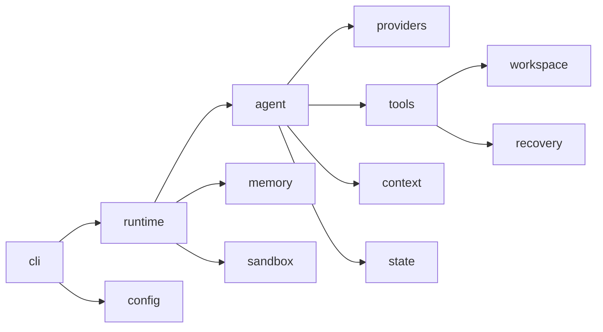

# Pony 维护上下文

本文定义 Pony 1.0 的通用语言和模块所有权。实现流向见[架构](architecture.md)，操作和发布见
[验证](verification.md)。

## 核心领域语言

| 术语 | 精确定义 | 不应混用 |
| --- | --- | --- |
| Source Root | 用户拥有、Host 工具直接操作的受信仓库 | Project State Root |
| Execution Root | 当前模型可见工具共享的工作区；当前等于 Source Root | Project State Root |
| Project State Root | `.pony/` 下的 Session、Run、Memory 与 legacy artifact | Workspace 文件 |
| Legacy Sandbox Binding | 仅用于拒绝旧 Sandbox-bound Session 的只读 sidecar 事实 | Active execution mode |
| Project Environment | lexical repository root 下唯一读取的 `.env` | shell 全局环境注入 |
| Provider | 用户选择或 Pony 在发送真实任务前解析出的服务家族 | 内部 Transport |
| API Variant | Provider 家族内的 wire API，例如 `responses` 或 `chat_completions` | Provider 品牌 |
| Transport | `anthropic_messages`、`openai_responses`、`openai_chat_completions`、`ollama_chat` | Provider 品牌 |
| Capability Profile | strict tools、parallel control、prompt cache、reasoning replay 等可选 wire 能力 | 必需 tool contract |
| Resolved Provider Target | 当前 endpoint/model 最终绑定的 Provider、Transport、认证和保守能力集合 | 自动 fallback |
| Provider Resolution | 发送用户任务前，以显式值、known origin、Session binding 或 bounded synthetic probe 产生 Target | 重放用户任务 |
| Model Request | Pony 构造的 provider-neutral 请求视图 | 原始 HTTP payload |
| Model Attempt | Agent Loop 为得到一个 Action 发起的逻辑尝试 | Transport Attempt |
| Transport Attempt | Provider client 的一次真实 HTTP request | Tool step |
| Action | 一个 Tool、Final 或 Retry 决策 | 任意模型文本 |
| Canonical Messages | Session Tree 中唯一的对话 transcript | Provider 私有 history |
| Session Tree | append-only JSONL 分支树；rewind/fork 追加而非覆写 | Git history |
| Permission Mode | Session v4 active path 上的交互授权模式；公开值为六个 Claude 风格名称 | approval 结果或 execution plane |
| Permission Rule | Session 内按完整 tool name 匹配的 `allow|ask|deny` 覆盖项 | glob、shell pattern 或硬安全边界 |
| Plan Artifact | Session v4 中 bounded、带 revision 的完整 Markdown 计划 | Task checkpoint、Todo Store 或普通消息 |
| Pre-Plan Mode | 进入 `plan` 前的 canonical Permission Mode，用于批准 Plan 后恢复 | Provider 或配置默认值 |
| Compaction | 用 summary + recent tail 重建 active request | 删除 Session 历史 |
| Legacy Recovery Record | 旧 Checkpoint Record 或 Tool Change Record；只读检查 | Session task checkpoint |
| Host Mutation Lock | approval 后覆盖 runner 与 effect observation 的 workspace lock | Recovery writer |

## Provider 配置合同

Model API Configuration 最多由四个通用变量组成；`PONY_PROVIDER` 可缺失、为空或为 `auto`：

```text
PONY_PROVIDER
PONY_API_BASE
PONY_API_KEY
PONY_MODEL
```

项目 `.env` 高于进程环境。运行时不读取厂商变量，也不兼容 `PONY_DEEPSEEK_API_KEY`。强制 Provider 静态决定协议；
missing/auto 与 OpenAI family 可在发送用户任务前执行 fixed synthetic resolution。普通 config/status/doctor 零网络，
`doctor --check-api` 只读，真实用户任务失败后不切换 Transport。协议、模型、URL、认证和 resolution source 必须可观察。

Model Session Binding 固化 `protocol_family`、`model` 与 `endpoint_hash`。绑定变化时拒绝恢复，尤其不能把 OpenAI
reasoning state 或 Anthropic thinking block 跨协议重放。

## Permission 与 Plan 合同

- 六个公开 Permission Mode 是 `manual`、`acceptEdits`、`auto`、`bypassPermissions`、`dontAsk` 与 `plan`；
  `manual` 规范化为唯一内部值 `default`，新 Runtime Session 默认 `auto`。
- Pony `auto` 使用本地 deterministic classifier；它不复刻或声称等同 Claude Code 的模型分类器。
- `--allow-dangerously-skip-permissions` 是本进程的 transient capability：它本身不切换 mode，但允许 picker 选择或
  resume 已持久化的 `bypassPermissions`。`--dangerously-skip-permissions` 直接选择 bypass。普通 resume 必须重新授权；
  显式改为其他 mode 不需要 dangerous flag。Capability 只进入 RuntimeOptions、不持久化；构造、resume、mode setter
  与 Executor 都会检查。Bypass 不跳过 trust、ask/deny、schema、path/secret、memory、可信 executable、mutation lock 或
  effect observation。
- Permission Rule 只接受 legal tool 的完整名称。`deny` 优先；Plan mutation floor 不能被 `allow` 降低；其余
  `allow|ask` 先于 mode 默认值，`dontAsk` 把 ASK 转为 DENY。
- Plan Artifact 只有一条受锁的 canonical persistence 路径，并统一执行 12 KiB UTF-8 上限与已知 secret gate。
  模型的 `write_plan` 与用户显式 `/plan open` 共用该路径；后者还绑定 expected revision。成功写入 append-only
  `plan_artifact {text, revision}`；`read_plan` 只读当前 projection。
- `exit_plan_mode` 对 exact text/revision 请求批准并在执行前做 CAS-style 重校验；拒绝或变化均保留 `plan`，成功则恢复
  `pre_plan_mode` 并在同一 top-level request 刷新模型可见 schemas。

## Agent 与状态不变量

- 一个 attempt 只产生一个 Action；多个 tool calls 全部拒绝，不做部分执行。
- Provider client 每个 Model Attempt 至多一个 Transport Attempt。
- retry 与 tool follow-up 复用同一 top-level turn 的 immutable InjectionSnapshot。
- Canonical Messages 是唯一 transcript；Provider adapter 不拥有第二套可变历史。
- Permission Mode 与模型可见 tool schemas 在 top-level turn 开始时冻结；批准 `exit_plan_mode` 是唯一可在同一 turn
  刷新 mode/schema 的路径。
- schema 与硬安全边界先于 permission prompt；Executor 不信任 schema hiding，仍对不可见 mutation 做二次 gate。
- Session v4 permission/Plan 状态只能由 `permission_mode_change`、`plan_artifact` 或 bounded `session_info` rule update
  投影；Run、trace、checkpoint 与 UI 不成为 writer。
- Session、Run 与 legacy Checkpoint/Tool Change 分别有独立格式与 reader，不以 release version 代替 format version。
- v1-v3 Session inspection 零写；只有显式 resume 可在 lock、backup、candidate、identity 与 digest 复验后迁移到 v4。
- Compaction 不删除 append-only 历史，不授予 Memory 写权限，也不恢复 workspace。
- `memory_save` 只看当前 top-level user request 的明确授权；delegate 永远不能写 Durable Memory。
- primary failure 不能被 cleanup、observer 或 finalizer 的次生异常覆盖。

## Workspace 与 Host 执行不变量

- 所有文件 I/O 锚定可信 root，拒绝 symlink、hardlink、special file、越界路径和身份漂移。
- Host 不是 OS sandbox，文档和输出不得暗示隔离保证。
- mutation 工具在 approval/参数复核后获取 `.workspace-mutation.lock`，持锁覆盖 runner 与 before/after observation。
- `--sandbox`、`pony sandbox`、Source Apply、Checkpoint mutation 与 workspace rewind 不属于公开产品。
- legacy Sandbox-bound Session 只允许 inspection；resume 精确拒绝且不 fallback Host。
- 任一 root identity、trusted executable、lock 或 observer 事实不明时 fail closed。

## 模块所有权

| 包 | 唯一责任 |
| --- | --- |
| `pony.agent` | Action、Agent Loop、Canonical Messages、compaction、模型预算与观测 |
| `pony.cli` | 显式命令、参数解析、人类/JSON 输出、inspection、doctor 与 REPL |
| `pony.context` | Context sources、chunk、escaping、render 与 digest |
| `pony.memory` | User/Agent Notes、recall、retrieval、RepoMap 与 memory service |
| `pony.providers` | wire adapter、Provider-neutral Response、factory 与 API probe |
| `pony.recovery` | command policy、legacy reader/migration 与待删除旧 writer |
| `pony.sandbox` | legacy Sandbox binding/inspection；不在 active runtime |
| `pony.state` | Session/Run/Checkpoint store、TaskState 与 file lock |
| `pony.tools` | Tool schema、policy/approval、Host mutation/effect observation 与受限 subprocess |
| `pony.workspace` | root discovery、workspace view、snapshot 与 observer |
| `pony.config` | `.env`、`pony.toml`、Provider 解析和私有 secret 写入 |
| `pony.runtime` | 跨领域对象装配和 Pony 公共运行时 |
| `pony.security` | 共享 no-follow、private-file、redaction 与安全原语 |

## 依赖方向



Provider factory 位于 `pony.providers.factory`；adapter 之间不得互相选择。Package `__init__.py` 保持薄，新的内部实现
应从所属模块导入，而不是扩大 facade。

## 变更纪律

- 优先做满足需求的最小改动，不为假设中的未来 Provider、分布式 Sandbox 或旧变量添加抽象。
- 行为变化必须有聚焦测试；结构变化必须同时验证 import、distribution archive 和 clean install。
- 不移动不相关代码，不在同一变更中做无关格式化。
- 外部输入和安全边界的错误码应稳定、可测试、无敏感值。
- 文档中的路径、命令、Provider 表和支持矩阵必须与当前代码一致。
- 发布证据只对 exact HEAD 有效；真实 API 测试不能用旧 SHA 的结果替代。
