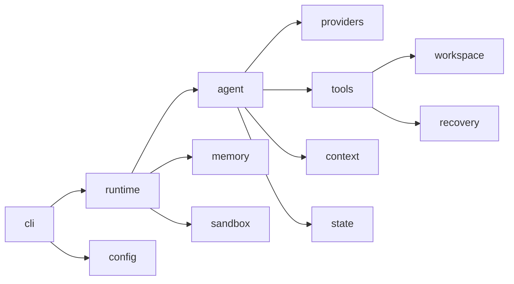

# Pony 维护上下文

本文定义 Pony 1.0 的通用语言和模块所有权。实现流向见[架构](architecture.md)，操作和发布见
[验证](verification.md)。

## 核心领域语言

| 术语 | 精确定义 | 不应混用 |
| --- | --- | --- |
| Source Root | 用户拥有的规范仓库；Sandbox 只能通过 Source Apply 修改 | Execution Root |
| Execution Root | 当前模型可见工具共享的工作区；Host 为 Source Root，Sandbox 为 staging | Project State Root |
| Project State Root | `.pony/` 下的 Session、Run、Checkpoint 与 Memory 状态 | Workspace 文件 |
| Sandbox State Root | Sandbox capture、diff、apply journal 与恢复证据 | Project State Root |
| Project Environment | lexical repository root 下唯一读取的 `.env` | shell 全局环境注入 |
| Provider | 用户在 `.env` 中选择的 `anthropic`、`openai` 或 `ollama` | 内部 Transport |
| API Variant | Provider 内显式选择的 wire API，例如 `responses` | 自动探测或 fallback |
| Transport | `anthropic_messages`、`openai_responses`、`openai_chat_completions`、`ollama_chat` | Provider 品牌 |
| Model Request | Pony 构造的 provider-neutral 请求视图 | 原始 HTTP payload |
| Model Attempt | Agent Loop 为得到一个 Action 发起的逻辑尝试 | Transport Attempt |
| Transport Attempt | Provider client 的一次真实 HTTP request | Tool step |
| Action | 一个 Tool、Final 或 Retry 决策 | 任意模型文本 |
| Canonical Messages | Session Tree 中唯一的对话 transcript | Provider 私有 history |
| Session Tree | append-only JSONL 分支树；rewind/fork 追加而非覆写 | Git history |
| WorkflowMode | Session active path 上的 `plan|act|review` 能力上限 | approval policy 或 execution plane |
| Active Plan | Session v3 中 bounded、完整替换的 goal/items 投影 | Task checkpoint 或 Todo Store |
| Compaction | 用 summary + recent tail 重建 active request | 删除 Session 历史 |
| Recovery Record | Checkpoint Record 或 Tool Change Record | Session task checkpoint |
| Source Apply | 将已审查 exact diff 写回 Source Root 的独立事务 | Sandbox tool approval |

## Provider 配置合同

Model API Configuration 仅由四个通用变量组成：

```text
PONY_PROVIDER
PONY_API_BASE
PONY_API_KEY
PONY_MODEL
```

项目 `.env` 高于进程环境。运行时不读取厂商变量，也不兼容 `PONY_DEEPSEEK_API_KEY`。Provider 与 API Base 静态
决定协议与认证，不联网探测。协议、模型、URL 或认证变更都必须能在 `pony config show` 与 `pony doctor` 中被观察。

Model Session Binding 固化 `protocol_family`、`model` 与 `endpoint_hash`。绑定变化时拒绝恢复，尤其不能把 OpenAI
reasoning state 或 Anthropic thinking block 跨协议重放。

## Agent 与状态不变量

- 一个 attempt 只产生一个 Action；多个 tool calls 全部拒绝，不做部分执行。
- Provider client 每个 Model Attempt 至多一个 Transport Attempt。
- retry 与 tool follow-up 复用同一 top-level turn 的 immutable InjectionSnapshot。
- Canonical Messages 是唯一 transcript；Provider adapter 不拥有第二套可变历史。
- Mode、Plan 与模型可见 tool schemas 在 top-level turn 开始时冻结；Mode ceiling 在 approval 前执行且只能收窄能力。
- Active Plan 只从显式 control entry 或成功的原子 `update_plan` tool exchange 投影；Run、trace、checkpoint 与 UI 不成为 writer。
- Session、Run、Checkpoint 和 Tool Change 分别有独立格式与 reader，不以 release version 代替 format version。
- Compaction 不删除 append-only 历史，不授予 Memory 写权限，也不恢复 workspace。
- `memory_save` 只看当前 top-level user request 的明确授权；delegate 永远不能写 Durable Memory。
- primary failure 不能被 cleanup、observer 或 finalizer 的次生异常覆盖。

## Workspace 与 Sandbox 不变量

- 所有文件 I/O 锚定可信 root，拒绝 symlink、hardlink、special file、越界路径和身份漂移。
- Host 模式不是 OS sandbox，文档和输出不得暗示隔离保证。
- Sandbox 中所有模型可见文件能力只面向 Execution Root；Source Root 不挂载到容器。
- `sandbox status`、`prepare` 和只读 inspection 不联网、不 pull/build/repair，也不创建隐式 product state。
- 公开 Sandbox runtime 只接受 sealed local authorization；1.0 不存在 candidate 或 distributed product enablement。
- Source Apply 必须绑定刚审查的 immutable diff digest，并在独立 lock、journal、CAS 与 recovery 边界内执行。
- 任一 identity、readiness、capture 或 apply 事实不明时 fail closed，不回退 Host。

## 模块所有权

| 包 | 唯一责任 |
| --- | --- |
| `pony.agent` | Action、Agent Loop、Canonical Messages、compaction、模型预算与观测 |
| `pony.cli` | 显式命令、参数解析、人类/JSON 输出、inspection、doctor 与 REPL |
| `pony.context` | Context sources、chunk、escaping、render 与 digest |
| `pony.memory` | User/Agent Notes、recall、retrieval、RepoMap 与 memory service |
| `pony.providers` | wire adapter、Provider-neutral Response、factory 与 API probe |
| `pony.recovery` | 恢复模型、policy、migration、writer 与 manager |
| `pony.sandbox` | Docker local runtime、identity、隔离策略、staging、diff/apply 与资源 |
| `pony.state` | Session/Run/Checkpoint store、TaskState 与 file lock |
| `pony.tools` | Tool schema、policy/approval 协调、effect recorder 与受限 subprocess |
| `pony.workspace` | root discovery、workspace view、snapshot 与 observer |
| `pony.config` | `.env`、`pony.toml`、Provider 解析和私有 secret 写入 |
| `pony.runtime` | 跨领域对象装配和 Pony 公共运行时 |
| `pony.security` | 共享 no-follow、private-file、redaction 与安全原语 |

## 依赖方向



Provider factory 位于 `pony.providers.factory`；adapter 之间不得互相选择。Package `__init__.py` 保持薄，新的内部实现
应从所属模块导入，而不是扩大 facade。

## 变更纪律

- 优先做满足需求的最小改动，不为假设中的未来 Provider、分布式 Sandbox 或旧变量添加抽象。
- 行为变化必须有聚焦测试；结构变化必须同时验证 import、distribution archive 和 clean install。
- 不移动不相关代码，不在同一变更中做无关格式化。
- 外部输入和安全边界的错误码应稳定、可测试、无敏感值。
- 文档中的路径、命令、Provider 表和支持矩阵必须与当前代码一致。
- 发布证据只对 exact HEAD 有效；真实 API 或 Docker 测试不能用旧 SHA 的结果替代。
