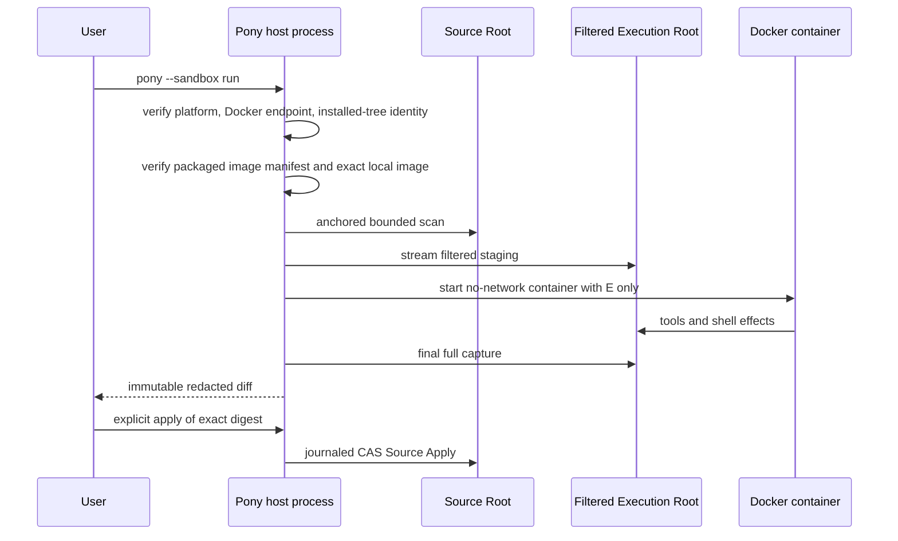

# Pony 1.0 Docker Sandbox：本地执行与验收

本文是 1.0 本地 Sandbox 的产品边界与维护入口。设计理由见
[ADR-0040](adr/0040-docker-filtered-staging.md)和[ADR-0042](adr/0042-sealed-local-authorization.md)。

## 支持矩阵

| 项目 | 1.0 状态 |
| --- | --- |
| macOS arm64 + Docker Desktop | 支持 |
| already-present exact `linux/arm64` image | 必需 |
| Host mode | 支持，但不是 OS sandbox |
| Linux host / amd64 | 不支持公开 Sandbox runtime |
| remote Docker endpoint | 不支持 |
| 自动 pull/build/repair | 不支持 |
| registry/KMS/distributed enablement | 不存在于 1.0 产品 |
| hostile multi-tenant / microVM | 不保证 |

## Runtime 路径



任一 identity/readiness/staging/capture 失败都会终止 Sandbox，不发送模型请求或启动 target，也不切换到 Host。

## 用户命令

```bash
pony sandbox status
pony sandbox prepare
pony sandbox list
pony sandbox inspect <sandbox-id>
pony sandbox diff <sandbox-id>
pony sandbox apply <sandbox-id>
pony sandbox prune --dry-run
```

`status` 与 `prepare` 必须保持零网络、零隐式修复。`prepare` 只检查 already-present image。Inspection 不得改变 artifact
mtime/ctime 或创建 session state。

## 本地镜像维护

构建与验证脚本是仓库维护入口，不是公开 runtime 的自动安装器：

```bash
uv run python scripts/sandbox/build_image.py --help
uv run python scripts/sandbox/verify_runtime.py --help
```

Builder 只接受锁定输入和 `linux/arm64` 本地开发目标。最终 package manifest 的 image identity、Docker config 和安装树
identity 必须由测试与 distribution smoke 一起验证。

运行时 image manifest 使用 local-only format v3。顶层只保存 policy digest、用户、工作目录、环境、工具路径与平台映射；
每个平台只保存本地 image digest 和 image ID。registry reference、candidate/base manifest、SBOM 与 provenance 不属于
运行时 schema；格式版本或字段不匹配时直接拒绝，不兼容读取旧 manifest。

## 必须保持的边界

- Container 只 bind Execution Root；不得挂载 Source Root、Project/Sandbox State、HOME 或 Docker socket。
- 模型可见 Context、RepoMap、read/write/patch/list/search 和 shell 只操作 Execution Root。
- Source `.git` 不复制；synthetic `.git` 不用于发现 source root 或分支事实。
- Container network disabled；资源、进程、文件、输出与 timeout 有界。
- shell 结束后无条件 final measure；快速命令不能绕过容量或特殊文件检查。
- Final diff 使用完整 capture，不依赖调用期增量 cache。
- Source Apply 使用刚审查的 exact digest，冲突时 fail closed。

## 离线验收

```bash
uv run pytest -q \
  tests/test_sandbox_identity.py \
  tests/test_docker_sandbox_runtime.py \
  tests/test_docker_sandbox_session.py \
  tests/test_docker_sandbox_runner.py \
  tests/test_docker_sandbox_cli.py \
  tests/test_sandbox_staging_streaming.py \
  tests/test_sandbox_process_tree.py \
  tests/test_sandbox_apply.py

uv run python scripts/evaluation/evaluate.py --suite sandbox-contract
uv run python -m benchmarks.perf.bench_sandbox
```

这些测试可证明合同、身份、失败语义和 report-only performance，不证明用户机器上的 Docker daemon 与 exact image 已就绪。

## 实机验收

实机测试可能启动/删除容器并占用本地资源，应在目标 macOS arm64 机器上显式执行：

```bash
uv run python scripts/sandbox/verify_runtime.py --require-ready
```

验收至少确认：

1. status/prepare 不联网、不改变 HOME state；
2. exact image identity 与 package manifest 一致；
3. Source Root 在 Apply 前完全不变；
4. container 不可见 host secret/state/socket；
5. timeout、进程树、特殊文件和容量限制生效；
6. final diff 完整、脱敏、digest 稳定；
7. apply 冲突不产生未记录部分写入；
8. container、staging 和 journal cleanup 无未知残留。

实机结果只对 exact HEAD、当前 package 和当前 Docker/image identity 有效。缺少受支持平台、Docker daemon 或 exact image
时应记录为环境未就绪，不能把离线 contract 结果描述成实机通过。
