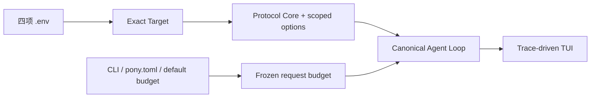

# Model Target、预算与对话体验设计

- 状态：Implemented baseline
- 日期：2026-08-13
- 决策记录：[ADR-0051](adr/0051-model-compatibility-contract.md)

## 1. 主线问题

用户看到的 `unknown model ... conservative fallback 128000 / 16384` 并不证明模型只有这个窗口。根因是旧 runtime 用一个
单型号 tuple 同时表达型号识别、Pony 请求策略与 warning。model id 本应是 endpoint 的不透明路由值；一旦本地表没有更新，
正常的新型号就被错误描述为“unknown”。

本轮把问题拆为四条互不混淆的主线：

1. **Target 身份**：请求发往哪个 protocol、endpoint 与 model；
2. **Wire 合同**：该 protocol 如何编码消息、tool call/result 与 opaque state；
3. **Request Budget**：Pony 为 context、output 和 compaction 留多少空间；
4. **Conversation UX**：用户能否看出正在聊天、当前阶段和是否真的取消。



## 2. 任意 model id 零登记

Target identity 是：

```text
protocol_family + model + endpoint_hash
```

model id 只做现有长度、换行、secret 与结构校验。runtime 不维护 known/unknown 分类，不要求 Python registration，也不会
因为未命中型号表而 warning 或发起网络探测。显式 protocol 直接构造对应 adapter；只有 `auto`/OpenAI family 的协议不明确
时，才在用户任务前执行 bounded synthetic resolution。

零登记不等于“任意私有 API 自动兼容”。Target 仍必须实现所选 protocol 的文本、native tool call、JSON object arguments、
tool-result continuation 和有效终态。text-only 模型或私有 schema 需要独立 adapter，不能在真实任务失败后试另一个协议。

`doctor --check-api` 验证 exact Target 当时的最小 tool loop，只投影 bounded 证据。它不写内置表，不认证长期稳定性、最大窗口
或 coding quality。

## 3. OpenAI family 的合并边界

可以共享：

- bearer/HTTP transport 原语与 User-Agent；
- canonical system blocks 的校验与拼接；
- function schema normalization、strict nullable encoding 与 optional-null cleanup。

strict encoding 必须递归覆盖每层 object（含 array item 与 `anyOf`/`oneOf`/`allOf`），每层关闭
`additionalProperties`，并把 optional 字段编码为 nullable + required。响应解析按记录的嵌套路径仅删除这类 synthetic null，
不能删除用户明确传入的其他值。

必须独立：

| 边界 | Responses | Chat Completions |
| --- | --- | --- |
| endpoint | `/responses` | `/chat/completions` |
| history | input/items | messages |
| tool continuation | function call/output items | assistant tool_calls + tool message |
| opaque state | reasoning items/replay | chat reasoning compatibility |
| streaming | typed semantic SSE events | chat-completion chunk sequence |

因此 `openai_wire.py` 是小型共享原语模块，不是统一 adapter。future/unknown model 默认只得 Protocol Core；strict tools、
parallel control 或 reasoning replay 只能在有合同的 exact Target 上启用，不能因 endpoint 是官方域名就向所有未来型号放大。

## 4. Context 与输出窗口

本轮否决 128K/16K 到 32K/8K 的静默迁移。字段优先级为：

```text
CLI explicit > pony.toml explicit > default 128000 / 16384
```

128K/16K 是 Pony 的统一请求策略，不是模型物理事实。它适用于所有未显式配置的 Target，也因此没有 unknown 分支。用户知道
deployment 限制时应显式降低；需要更大窗口时可显式使用完整 profile，例如：

```toml
[model]
context_window = 256000
output_limit = 32768
```

`reserve = max(configured reserve, output)`，因此 256K/32K 会得到 32K reserve 与 223,232 input limit，不会只扩大 output
却忘记预留空间。完整 `pony.toml` snapshot 会联合校验 context/output/reserve；不能留下至少 16,384 input token 的组合在
构造 `Pony` 前将 model context/output 与 reserve 回到默认并给稳定 warning，其他合法 compaction 设置保持不变。配置来源按
字段投影为 `cli|config|default|mixed`；delegate/worktree child
继承父级原始 runtime override 和 project config，不把计算后的有效值重新标成 CLI。

32K context / 16K output 是合法的最小 profile。自动 compaction 的保留 tail 同时受配置和实际 input limit 约束，并在
`CompactionNoProgress` 后继续尝试更小目标；其他 compaction error 仍 fail closed。该行为避免默认 20K keep-recent 在 16K
input limit 下第一次 no-progress 就直接失败。summary/split-summary hard cap 也按 input limit 缩放到 4,096/2,048，避免
summary 自身挤满小窗口；默认和更大窗口仍保持 13,107/8,192。

当前 token counting 仍采用 provider usage 或估算，不能把本地数字描述成远端 enforcement。generic compatible Chat 保守使用
`max_tokens`；官方 Chat endpoint 按当前协议使用 `max_completion_tokens`。字段属于 endpoint-scoped wire option，不从 model
name 推断；strict、parallel 与 reasoning 等型号能力仍只授予有证据的 exact Target。

## 5. TUI 对话闭环

旧界面只有低对比用户块和 `Working…`，用户难以判断输入区、对话双方和运行阶段。本轮改为：

- 80/111 列稳定拒绝，112+ 保留冻结的完整马形 Logo/块状字标，不提供 compact 替代版；
- 输入区固定显示 `Message Pony`；用户消息为无标签低对比块，Assistant 使用 `PONY` 锚点和安全 Markdown renderer；
- Ready、Preparing、Waiting for model、Retrying、Compacting、Using tool、approval、Completed、Interrupted、Failed 来自
  durable trace 后的 UI 副本，而非定时器猜测；
- footer 复用已有 `context_breakdown` 投影 context 百分比，并显示 queue、permission 与具体 protocol/model；不重算 token，
  不显示绝对路径、Session ID、API Base 或 checkpoint ID；
- success Tool 只留一条语义摘要，failure/interruption 可见，checkpoint 不污染对话；approval UI 异常默认拒绝；
- busy Ctrl+C 只清除 queued next-turn input，明确显示 request cancellation unavailable，不能冒充取消当前请求。

## 6. 延期项

本轮不局部伪造 streaming/cancel。当前 transport 是 blocking request + full body read；真实 cancel 需要 InputQueue、Agent Loop、
四个 adapter、HTTP read loop、tool subprocess 与 terminal state 的统一 cancellation token 和生命周期。

未来 streaming 必须满足：Responses/Chat parser 独立；delta 只用于瞬态 UI；完整响应成功解码后才写 Canonical Messages；partial
stream 不执行 Tool；取消后 durable terminal state 与费用边界如实可观察。主题系统、全屏 transcript、动态 Provider registry、
在线型号 catalog 和请求级跨模型 router 都不在 Pony 1.0 范围。

## 7. 验收矩阵

| 行为 | 必要证据 |
| --- | --- |
| unseen model | 零 warning，默认 128K/16K，`/model` 可切换 |
| 显式大窗口 | 256K/32K、reserve/input 派生与 compaction 不变量 |
| 最小窗口 | 32K/16K 在超预算历史下自动缩小 compaction tail 并完成真实 turn |
| 非法预算组合 | `pony.toml` snapshot 在 `Pony` 构造前稳定 warning 并回到默认 |
| OpenAI future model | Protocol Core + 已证明的 endpoint 字段；不获得未证明的型号增强 |
| OpenAI family resolution | Responses 首选；protocol mismatch 后 Chat；auth/transient stop |
| codec 边界 | 共享模块不含 endpoint/history/continuation/state |
| strict tools | 嵌套 object/array/组合 schema nullable-required 与递归 null cleanup |
| Chat output | generic compatible endpoint 使用 `max_tokens`；官方 Chat endpoint 使用 `max_completion_tokens` |
| TUI | 80/111 拒绝、112/120 完整资产、无标签用户块、PONY、Message Pony、真实状态和 context footer |
| cancel 语义 | queue clear/Ctrl+C 明确 current turn continues |
| live | exact configured Target 的收费 tool-loop；不得用 offline contract 代替 |
