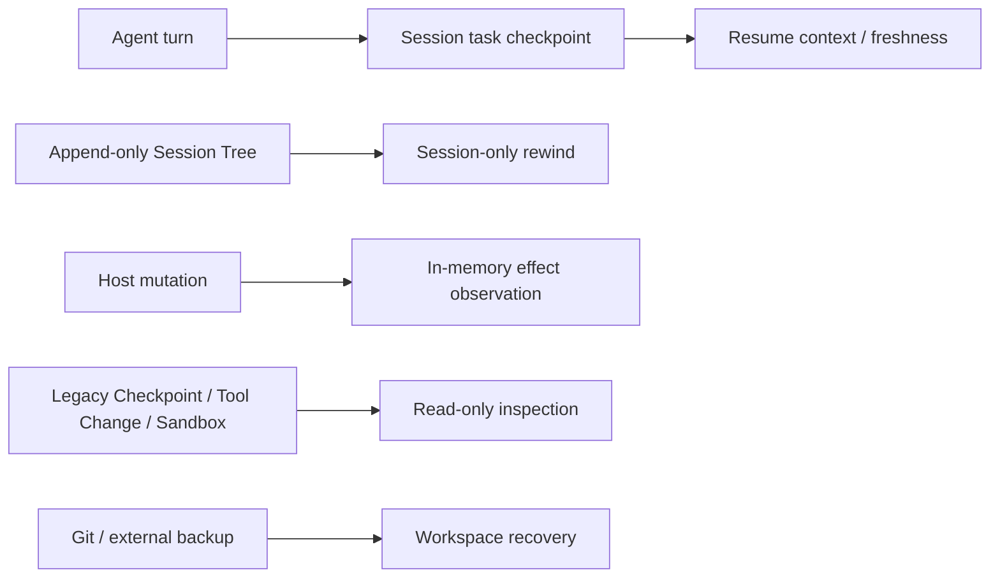

# Pony 会话与旧 artifact

Pony 不提供 workspace restore。Session 恢复、Session rewind、Host effect observation 与旧 artifact 检查是不同边界；Git 或外部备份才是恢复仓库内容的机制。



## Active state

Session v5 is the active writer. Bounded task checkpoints live in its append-only JSONL tree and preserve task goal, freshness and next-step context; they do not retain file blobs or provide workspace rollback. `/rewind <entry-id>` and `pony session rewind <session-id> <entry-id>` create a new Session branch only. `--workspace` and `--yes` are removed.

Host mutations run under `.pony/.workspace-mutation.lock`. The observer records real before/after effects; changed files after a command failure become `partial_success`. This evidence appears only in the current Tool metadata, low-sensitivity trace summaries, and Report v4 counts. It does not create a Tool Change or Recovery writer.

## Legacy inspection

Upgrades never delete `.pony/checkpoints`, historic Tool Change records, restore journals, or Sandbox sidecars. The only Checkpoint commands are read-only:

```bash
pony checkpoints list
pony checkpoints show <checkpoint-id>
pony checkpoints pending
```

`pony.state.legacy_artifacts.LegacyCheckpointReader` accepts only bounded owner-private directories and regular single-link JSON files. It projects a small safe field set, rejects malformed, linked, oversized, or unsafe records, and never chmods, quarantines, repairs, or writes the old store. `preview-restore`, `restore`, `resolve-pending`, `prune`, `pony sandbox`, and `/rewind --workspace` are removed.

`pony migrate status|apply|abort|recover` now applies only the explicit observability migration for legacy Run artifacts. It never restores workspace files.

## Legacy Sandbox-bound Sessions

Before a resume, Pony boundedly checks an old project Sandbox sidecar. An exact binding returns `legacy_sandbox_session_unsupported`; malformed, linked, or oversized sidecar state returns `sandbox_state_invalid`. Both failures occur before Provider resolution and Host tool construction, and neither falls back to Host execution.

For failed session resume, inspect the Session first. For a legacy Checkpoint pending item, keep `.pony/` as evidence and use Git or an external backup for files. When any identity, lock, observer, or legacy reader fact is unknown, Pony fails closed.
