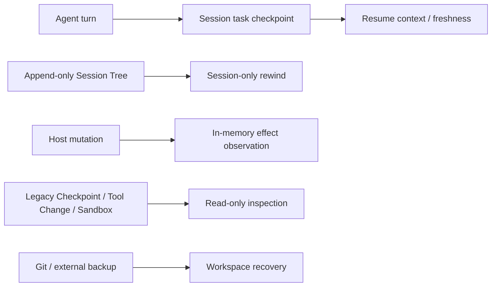

# Pony 恢复与历史检查

Pony 当前不提供 workspace restore。Session 恢复、Session rewind、Host effect observation 与旧恢复 artifact 检查是四个
不同边界；不要把它们理解成文件回滚系统。Git 或外部备份仍是恢复仓库内容的机制。

## 当前模型



### Session task checkpoint

AgentLoop 在 Session Tree 中保存 bounded task checkpoint，用于长会话 resume、freshness 与下一步提示。它不保存文件 blob，
也不是独立 Workspace Recovery Record。Compaction 不删除历史 entry，也不会恢复文件。

### Session rewind

`/rewind <entry-id>` 和 `pony session rewind <session-id> <entry-id>` 从目标 entry 创建新的 active branch。可选
`--summary[=focus]` 通过当前模型生成 branch summary。rewind 不修改 Source Root；`--workspace` 与 `--yes` 已删除。

### Host effect observation

workspace/memory mutation 在 permission 与参数复核后获取 `.pony/.workspace-mutation.lock`。Workspace observer 在同一锁内
比较 before/after；非零退出或异常后若发现文件变化，Tool 结果为 `partial_success`。这些 effect 只进入当前 Tool metadata、
trace 的低敏摘要和 Run report 计数，不创建 Tool Change 或 Recovery Checkpoint writer。

### Legacy artifact inspection

升级不会自动删除 `.pony/checkpoints`、旧 Tool Change、restore journal 或 Sandbox sidecar。当前公开 Checkpoint CLI 只有：

```bash
pony checkpoints list
pony checkpoints show <checkpoint-id>
pony checkpoints pending
```

所有命令都以 `CheckpointStore(read_only=True)` 打开旧 store，拒绝未知 type/version、duplicate key、symlink、hardlink、
special file、越界 blob/reference 和不安全目录 identity。它们不 chmod、不 quarantine、不 resolve、不 prune，也不修改记录。

下列旧命令已删除：

```text
pony checkpoints preview-restore ...
pony checkpoints restore ...
pony checkpoints resolve-pending ...
pony checkpoints prune ...
pony sandbox ...
/rewind ... --workspace
```

需要恢复旧 workspace 时，先备份 `.pony/`，再使用 Git 或外部备份人工处理；不要直接编辑 legacy JSON。

## Session 与格式

Session v4 是 active writer。v1 JSON、v2/v3 JSONL inspection 零写；只有显式 resume 在 Session lock 下复验 source、backup、
candidate identity 与 exact bytes 后原子迁移。普通 writer 对旧 Session 返回 `session_migration_required`。

Run/trace/report 保持独立格式。当前 report v3 仍保留固定的 inactive `sandbox`/`recovery` section，以便旧 reader 在本次
Phase 4A 不发生格式升级；它们不能被解释为 active Sandbox 或 Workspace Recovery 证据。后续 schema 收口必须单独设计
format migration。

OBS/Tool Change 的显式格式迁移仍通过：

```bash
pony migrate status
pony migrate apply
pony migrate recover
```

该命令只处理已定义的 artifact format transaction，不恢复 workspace，也不是通用数据迁移平台。

## Legacy Sandbox-bound Session

`--sandbox` 与 `pony sandbox` 已删除。resume 前仍会 bounded、no-follow 地检查旧 project sidecar：

- 找到与 Session 精确绑定的旧 Sandbox 时返回 `legacy_sandbox_session_unsupported`；
- sidecar/manifest identity 不可信时返回 `sandbox_state_invalid`；
- 两种情况都在 Provider resolution 和 Host tool 构造前终止，不 fallback 到 Host。

内部 `pony/sandbox` 与 Recovery writer 暂作为 legacy reader/Phase 4B 删除对象保留，不属于当前产品功能。

## 故障处理

1. Session resume 失败：先运行 `pony session inspect <id>`，不要直接改 Session artifact。
2. `pony checkpoints pending` 显示旧 pending/invalid 数据：备份 `.pony/`，保持只读，用 Git/外部备份恢复文件。
3. Host Tool 返回 `partial_success`：检查实际 Git diff 和命令输出，再决定保留或撤销。
4. 旧 Sandbox-bound Session 被拒绝：创建新的 Host Session；旧 Session 仅用于 inspection。
5. identity、lock、observer 或 legacy reader 事实不明：保持 fail closed，不猜测、不自动清理。

安全文件与 exception-order 不变量见[安全](security.md)，验证命令见[验证](verification.md)。
