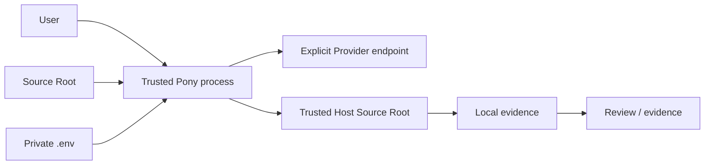
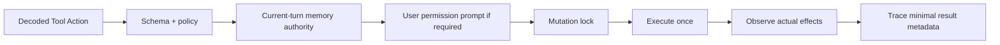

# Pony 1.0 安全边界

Pony 的目标是让模型发起的仓库操作可约束、可审批、可审查、可恢复。它不是通用恶意代码隔离器。Host 模式可以执行
本地进程且不是 OS sandbox。当前产品只提供 Host 执行，不是 hostile workload、multi-tenant 或 kernel isolation 边界。

## 信任模型

需要信任：当前安装的 Pony、Python 解释器、冻结的 Git/RG executable、用户选择的 Provider endpoint、目标仓库和
Host 中实际运行的命令/依赖。模型输出、仓库内容、`.env` 文本、Provider 响应和 legacy artifact 都按不可信输入处理。

## Root 与文件身份

- lexical repository root 是配置和状态锚点；不向父仓库、兄弟 worktree 或外部目录搜索。
- `.env` 与 `pony.toml` 从可信 root no-follow 读取，拒绝 symlink、hardlink、FIFO、device、directory、root/parent
  replacement 和超限文件。
- `.pony/` 与 `~/.pony/` 私有目录使用 owner-only 权限；私有文件读写前后复验 identity、mode 与 link count。
- 文件工具逐层锚定 root descriptor，只接受普通 single-link 文件；路径 traversal 和 root escape fail closed。
- write/patch 使用同目录 private temp、fsync、atomic replace；patch 以读取 digest 做 CAS。
- 目录、文件、字节、结果、进程输出和 timeout 都有上限，避免不受控资源消耗。

Repository discovery 只把 Git marker 当作结构元数据使用，不读取或信任其中的 config 或 index。发现 root 后仍会对
marker、root 与目标文件做 identity/类型后置验证；这些检查降低路径替换风险，但不能把校验后并发修改描述成绝对
不可能。当前 anchored dirfd、no-follow、link-count、mode、fsync 和 atomic-replace 保证以 POSIX/macOS 原语为
实现基础，所需安全原语不可用时 fail closed。Windows 等价机制留待后续设计，不能用普通路径检查冒充同等保证。
发布 metadata 因此只声明已由 CI 验证的 macOS 与 Linux，不声明 OS Independent。

## Provider 凭证与目标绑定

唯一通用凭证变量是 `PONY_API_KEY`。运行时从项目 `.env` 或进程环境读取，不回退到厂商变量或旧版
`PONY_DEEPSEEK_API_KEY`。项目值优先。

Provider、model、API URL、Variant 与 auth mode 在同一次 resolution 中产生。Key 只发送到用户配置的同一 origin；
auto resolution 仅在该 origin 的 OpenAI Chat/Responses 固定 adapter 路径上尝试有限协议候选，但不携带用户任务、
仓库或 Memory 内容。Anthropic-compatible gateway 必须显式选择 `anthropic`。
Probe client 不接收真实任务；识别成功后使用 exact target 和用户请求 timeout 新建 production client，避免把 detection 的
短 timeout 或 synthetic 状态带入真实任务。
URL 规则：

- 除 loopback 外必须使用 HTTPS；
- 禁止 userinfo、query、fragment 和 URL 内凭证；
- adapter 只追加其固定资源路径、不跟随 HTTP redirect；resolution 不尝试未知路径；
- 云 Provider 即使显式选择 `auth_mode=none` 也必须配置通用 Key；只有 Ollama `auth_mode=none` 允许空 Key。

`pony config show` 和 `doctor` 只显示 Key 是否存在、来源和变量名，从不显示值或认证 header。
普通 config/status/doctor 零网络；`doctor --check-api` 可产生 bounded 请求但始终零写。只有 `pony init` 在完整 probe
通过后写 resolved Provider。run/repl 的 auto resolution 不写 `.env`。真实用户请求失败后不通过其他 Transport 重放。
Detection 的 durable trace 只保留 resolution source、protocol、candidate count、probe call count 和 usage status；
普通 request metadata/report 也不保留 endpoint origin；Session 只绑定不可逆 endpoint hash。上述 artifact 都不保留
synthetic messages、raw response、reasoning、Key、header 或完整 endpoint。

## Secret 脱敏

Pony 构造运行时时冻结 redaction snapshot。已知 secret 在写入 Session、Run、trace、report、error metadata 或人类输出
前脱敏；legacy Checkpoint/Tool Change inspection 也使用同一类 redactor。用户可通过 `--secret-env-name` 增加额外变量名。

自动识别不等于绝对数据防泄漏：未知、编码后、模型生成或工具新产生的 secret 可能进入仓库、命令输出或本地 artifact。
不要声称 Pony 能发现所有 secret，或 Host 执行能隔离恶意命令。

## Injection 与 Memory

`InjectionSnapshot` 由结构化 source blocks 构建，仓库文本中的伪 marker 不能改变边界。同一 top-level turn 的 retry 和
tool follow-up 复用同一 snapshot，避免模型 payload 与审计 metadata 漂移。

Memory recall 会进入模型请求；远程 Provider 能看到被召回的文本。Agent Notes、Session、Run 和其他本地 artifact
可能保留副本，因此删除一条 note 不等于清除历史。`memory_save` 只接受当前用户请求中的明确授权；
否定句、引用、历史授权和 delegate 都不能授权 Durable Memory 写入。

## Tool、shell 与 permission

未知工具或 effect metadata 不合法时按高风险写操作拒绝。用户确认后仍重新校验原参数。Shell runner 只调用一次；
effect observer 比较真实 workspace 状态，不只相信工具声明。Primary failure 不被 cleanup/finalizer 的次生错误覆盖。

Permission rule 按 deny、ask、allow 的优先级投影到当前 Tool。`manual` 对 mutation 逐次询问；`acceptEdits` 只自动允许
内置 `write_file`/`patch_file`；`auto` 只允许内置 edit、显式授权的 Memory 写和静态证明为 allow 的 shell；`dontAsk`
把需要询问的动作直接拒绝。`bypassPermissions` 只有本进程显式获得 dangerous capability 才可选择或恢复；普通 resume
必须重新授权，显式改为其他 mode 可不带 dangerous flag。Capability 只在冻结 RuntimeOptions 中存在，不持久化；
Runtime 构造、resume、mode setter 和 Executor 都会 fail closed。Bypass 仍不能绕过 project trust、ask/deny rule、
schema/path/secret 校验、可信 executable、mutation lock 或真实 effect observation。
通用 `write_file`/`patch_file` 在 permission 前拒绝任何 `.git/**` 与 `.pony/**` 控制面路径；Durable Memory 只能通过
带当前请求授权检查的 `memory_save` 写入。

`plan` 只向模型展示 read-only 工具和 `read_plan`/`write_plan`/`exit_plan_mode`，不展示 shell。`write_plan` 只能更新
bounded Plan artifact；`exit_plan_mode` 必须展示同一 plan text/revision 并获得一次性批准，批准期间任一参数、revision 或
文本变化都拒绝且保持 Plan mode。Executor 仍按当前 trust、rule 和 mode 复核隐藏或伪造调用。
`RuntimeOptions.read_only` 更强：隐藏并拒绝 shell、Plan、Memory 与 workspace 写入。

`delegate` 只启动串行、命名的只读 child。child model client 必须由 factory 新建，Session/Run 必须落在独立 root，
不得共享 parent 的可变 client 或 store；它固定 `dontAsk`，无 Plan、Durable Memory、workspace 写或二次 delegate 能力。
parent 只接收限长 final result。

`delegate_worktrees` 是独立的 mutation capability，不改变上述 delegate。它要求 parent clean，从 exact HEAD 为每项新建
`.pony/worktree-agents/<id>/worktree` 与唯一 `codex/pony-agent-*` branch；每项有独立 client、Session、Run 和 mutation
lock，并发硬上限为 4。readonly child 固定 `dontAsk`；write child 固定 `acceptEdits`，线程内 approval 一律拒绝，因此
不会把 batch approval 扩大为任意 Host shell 权限。private atomic manifest 记录 terminal/diff/test 状态并封存 exact child
commit；模型工具从不 merge。`pony agents merge` 与有序 batch 的 `merge-all` 要求 project trust，只接受 sealed revision，
拒绝 completion 后修改、sensitive path、symlink、hardlink、base drift 与 dirty parent；`merge-all` 在任何 parent 写入前预检
完整顺序，Git 不可表示的 special file 不会进入 merge。实际 merge 失败会 abort。`cleanup` 只删除已合入且 clean 的 child
worktree/branch；放弃未合入 terminal child 需显式
`--discard`。

Plan artifact 在任何脱敏前执行 strict/bounded validation；如果已知 secret 会被 redactor 改写，整次操作以
`sensitive_content_block` 拒绝，不能把 `<redacted>` 当作成功 Plan。Session v1-v4 inspection 不硬化或改写 artifact；
迁移只在显式 resume 下进行，并在原子发布前复验 source、backup 与 candidate 的 identity、single-link 和 exact bytes。

## Host execution boundary

Pony 在 Source Root 中直接运行 Host 工具。写操作经过 schema、path/secret、permission 与批准后参数复核，并在独立
`.pony/.workspace-mutation.lock` 内执行；before/after observer 与 runner 共享同一锁。非零退出或异常后若观察到文件变化，
结果标记为 `partial_success`；observer 或锁事实不明时 fail closed。Primary runner failure 不被 observer/lock cleanup
错误覆盖。

Shell 只使用启动时冻结的 trusted executable。每个工具调用使用 immutable approval snapshot；Git 通过 hardened runner 拒绝危险 config override、worktree escape、
remote helper、upload-pack/ssh command 和 repository hook 路径。上述约束降低意外和输入注入风险，但不能隔离已获准运行
的恶意二进制、测试插件或依赖。
Host、Git 与 RG 共用 4 MiB stdout/stderr 聚合捕获上限；超限返回 `process_output_limit_exceeded`，并以 TERM/KILL
终止和回收整个子进程组，不能通过 pipe 输出无限占用内存。

Repository Skills are not executable extensions. The only accepted layout is Source Root
`.claude/skills/<name>/SKILL.md`; HOME, plugin, marketplace, and `.agents/skills` are never searched. Catalog discovery uses
anchored no-follow bounded reads and rejects symlink, hardlink, special-file, root-identity, size/count, UTF-8, strict
frontmatter, and known-secret failures as an all-or-nothing catalog. The optional `resources` field names at most eight
comma-separated relative UTF-8 files inside that same Skill directory; each uses the same anchored reader, a 16 KiB cap, and no
glob or recursive discovery. `/name` supplies one validated document and its explicit resources as ephemeral model context only,
below user and applicable project rules. It cannot register tools, alter permission, run a script, or escape existing Host
path/secret/trust checks. Rejection diagnostics expose stable reason/remediation only, never rejected content or paths.

公开产品已删除 `--sandbox`、`pony sandbox`、Source Apply 与 workspace restore。旧 Sandbox sidecar 仅用于 resume
binding 检查：匹配旧 Sandbox 的 Session 返回 `legacy_sandbox_session_unsupported`，损坏 binding 返回
`sandbox_state_invalid`；两者都不会静默进入 Host。

## Persistence 与 legacy inspection

Session 与 Run 是 active writer。旧 Checkpoint、Tool Change 和 Sandbox artifact 使用独立 legacy reader；reader 拒绝未知
record type/version、损坏、linked、oversized 或不安全记录。Checkpoint CLI 只提供 `list/show/pending`，正常启动不回滚
workspace，也不通过 `resolve-pending`、restore、prune 或 Source Apply 修改旧 store。需要恢复 Source Root 时使用 Git 或外部备份。

Session Model Binding 固化协议、模型与 endpoint hash。resume 仍拒绝 protocol/endpoint 漂移；model 只允许通过专用
writer 在相同 protocol/endpoint 下替换，并在 Session lock 内比较 client 构造前捕获的 expected binding 与 exact leaf。
Provider 请求同样绑定请求开始时的 exact leaf/binding；并发 `/model` 或其他 Session 写入后，旧响应不能追加。含 opaque
Provider state 的 Session 拒绝模型切换并返回 `model_session_mismatch`；相同 binding 的 OpenAI Responses 与 Anthropic
state 可恢复，opaque state 不跨模型、协议或 endpoint 重放，也不渲染到普通日志。

## 明确不保证

- Host 模式不隔离恶意命令或恶意依赖。
- Pony 不提供 Docker/VM/microVM 隔离，也不把旧 Sandbox 实现作为安全 fallback。
- Pony 不管理 Provider 账户权限、账单、数据保留或服务端训练政策。
- Pony 不自动删除 `.pony/` 中所有历史敏感副本。
- Host 工具获得 permission 后可直接修改受信仓库；Git/外部备份仍是 workspace 恢复机制。

发现安全问题时应停止发布，保留最小脱敏证据，并通过项目的 GitHub Issues 或维护者渠道报告；不要在公开报告中粘贴
真实 Key、完整请求/响应或私有仓库内容。
