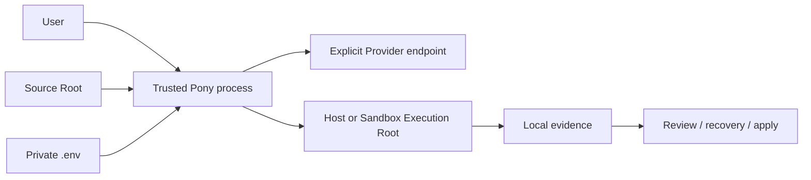
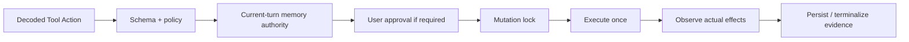

# Pony 1.0 安全边界

Pony 的目标是让模型发起的仓库操作可约束、可审批、可审查、可恢复。它不是通用恶意代码隔离器。Host 模式可以执行
本地进程且不是 OS sandbox；Docker Sandbox 是严格的本机 staging 边界，不是 hostile multi-tenant 或 microVM 边界。

## 信任模型

需要信任：当前安装的 Pony、Python 解释器、冻结的 Git/RG executable、用户选择的 Provider endpoint，以及 Host
模式中执行的本地环境。模型输出、仓库内容、`.env` 文本、Provider 响应、恢复 artifact 和 Sandbox 文件都按不可信输入处理。

## Root 与文件身份

- lexical repository root 是配置和状态锚点；不向父仓库、兄弟 worktree 或外部目录搜索。
- `.env` 与 `pony.toml` 从可信 root no-follow 读取，拒绝 symlink、hardlink、FIFO、device、directory、root/parent
  replacement 和超限文件。
- `.pony/` 与 `~/.pony/` 私有目录使用 owner-only 权限；私有文件读写前后复验 identity、mode 与 link count。
- 文件工具逐层锚定 root descriptor，只接受普通 single-link 文件；路径 traversal 和 root escape fail closed。
- write/patch 使用同目录 private temp、fsync、atomic replace；patch 以读取 digest 做 CAS。
- 目录、文件、字节、结果、进程输出和 timeout 都有上限，避免不受控资源消耗。

Repository discovery 只把 Git marker 当作结构元数据使用，不读取或信任其中的 config 或 index。发现 root 后仍会对
marker、root 与目标文件做 identity/类型后置验证；这些检查降低路径替换风险，但不能把校验后并发修改描述成绝对
不可能。当前 anchored dirfd、no-follow、link-count、mode、fsync 和 atomic-replace 保证以 POSIX/macOS 原语为
实现基础，所需安全原语不可用时 fail closed。Windows 等价机制留待后续设计，不能用普通路径检查冒充同等保证。

## Provider 凭证与目标绑定

唯一通用凭证变量是 `PONY_API_KEY`。运行时从项目 `.env` 或进程环境读取，不回退到厂商变量或旧版
`PONY_DEEPSEEK_API_KEY`。项目值优先。

Provider、model、API URL、Variant 与 auth mode 在同一次解析中产生；Key 只发送给该解析结果构造的 endpoint。
URL 规则：

- 除 loopback 外必须使用 HTTPS；
- 禁止 userinfo、query、fragment 和 URL 内凭证；
- adapter 不补版本前缀、不跟随 HTTP redirect、不探测候选路径；
- 云 Provider 即使显式选择 `auth_mode=none` 也必须配置通用 Key；只有 Ollama `auth_mode=none` 允许空 Key。

`pony config show` 和 `doctor` 只显示 Key 是否存在、来源和变量名，从不显示值或认证 header。

## Secret 脱敏

Pony 构造运行时时冻结 redaction snapshot。已知 secret 在写入 Session、Run、trace、report、Checkpoint、Tool Change、
error metadata 或人类输出前脱敏。用户可通过 `--secret-env-name` 增加额外变量名。

自动识别不等于绝对数据防泄漏：未知、编码后、模型生成或工具新产生的 secret 可能进入 Execution Root 或本地 artifact。
Sandbox 仍要求 immutable redacted diff 和人工 Source Apply review；不要声称“所有 secret 永远不会进入 staging”。

## Injection 与 Memory

`InjectionSnapshot` 由结构化 source blocks 构建，仓库文本中的伪 marker 不能改变边界。同一 top-level turn 的 retry 和
tool follow-up 复用同一 snapshot，避免模型 payload 与审计 metadata 漂移。

Memory recall 会进入模型请求；远程 Provider 能看到被召回的文本。Agent Notes、Tool Change、Checkpoint、recovery 和
其他本地 artifact 可能保留副本，因此删除一条 note 不等于清除历史。`memory_save` 只接受当前用户请求中的明确授权；
否定句、引用、历史授权和 delegate 都不能授权 Durable Memory 写入。

## Tool、shell 与 approval

未知工具或 effect metadata 不合法时按高风险写操作拒绝。Approval 后仍重新校验原参数。Shell runner 只调用一次；
effect observer 比较真实 workspace 状态，不只相信工具声明。Primary failure 不被 cleanup/finalizer 的次生错误覆盖。

## Docker Sandbox

1.0 公开 Sandbox 只接受：

- macOS arm64；
- Docker Desktop 的受信本地 endpoint；
- package manifest 中 already-present、identity 完全匹配的 exact `linux/arm64` image；
- 当前安装树重算得到的 sealed local authorization。

Container 的唯一 host bind 是 filtered Execution Root。Source Root、Project State Root、Sandbox State Root、host HOME、
Docker socket 与凭证不挂载。Container 网络关闭；container 内 loopback/IPC 仍可能存在。Source `.git` 不复制，synthetic
`.git` 不作为 source 事实。

`status` 和 `prepare` 不联网、不 pull/build/repair、不写远程 release cache。1.0 已删除未发布的 distributed authority、
candidate、product enablement 和远程下载链路。身份或 readiness 不确定时在 Provider request / target 前拒绝，也不回退 Host。

## Staging、diff 与 Source Apply

Staging 从 source dirfd 以 bounded streaming 复制，同时计算 digest、大小和已知 secret 命中；发布前后复验路径 identity、
mode 和 digest。失败时删除临时文件和未完成目标。

模型可见的 Context、RepoMap、Memory injection、文件工具、search 和 shell 全部锚定 Execution Root。Session 结束后完整
capture 生成 immutable diff。Source Apply 必须：

1. 加载同一 Sandbox Session 的 diff；
2. 在确认前展示 source、变更分类、数量、字节、高风险摘要和 exact digest；
3. 将刚展示的 digest 绑定到授权；
4. 在独立 control lock、source mutation lock、journal、CAS 和 recovery guard 内执行；
5. 任一冲突或事实不明时停止，不产生未记录的部分成功。

`--yes` 只能跳过交互输入，不能跳过 artifact 加载、digest 绑定或 CAS。

## Persistence 与恢复

Session、Run、Checkpoint 和 Tool Change 使用不同格式与存储边界。Reader 拒绝未知 record type/version、损坏 entry、
unsafe blob 和越界引用。恢复先 preview，用户确认后 apply；正常启动不静默回滚 workspace。

Session Model Binding 固化协议、模型与 endpoint hash；配置变化时返回 `model_session_mismatch`。Provider opaque state 只在
同一绑定内重放，不渲染到普通日志。

## 明确不保证

- Host 模式不隔离恶意命令或恶意依赖。
- Docker Sandbox 不是多租户、远程不可信工作负载或 kernel exploit 边界。
- Pony 不管理 Provider 账户权限、账单、数据保留或服务端训练政策。
- Pony 不自动删除 `.pony/` 中所有历史敏感副本。
- 通过审查并批准 Source Apply 后，用户明确允许仓库发生对应变化。

发现安全问题时应停止发布，保留最小脱敏证据，并通过项目的 GitHub Issues 或维护者渠道报告；不要在公开报告中粘贴
真实 Key、完整请求/响应或私有仓库内容。
