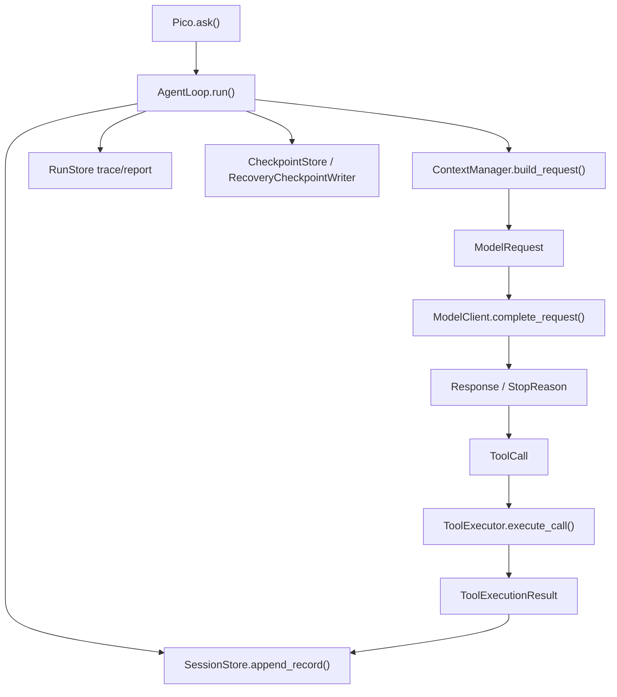

# Pico Ideal AgentLoop Kernel — Design Spec

Date: 2026-07-07
Status: Draft — revised after naming and compatibility review

---

## 1. Summary

Pico should perform a **hard internal upgrade** toward the ideal kernel shape,
but the kernel should use Pico's existing language:

```text
Pico.ask()
  -> AgentLoop.run()
    -> SessionStore.append_record(...)
    -> ContextManager.build_request(...) -> ModelRequest
    -> model_client.complete_request(ModelRequest) -> Response
    -> ToolCall
    -> ToolExecutor.execute_call(ToolCall) -> ToolExecutionResult
    -> SessionStore.append_record(...)
    -> RunStore / CheckpointStore / RecoveryCheckpointWriter
```

The important design correction is:

> Do not build a new "kernel" vocabulary beside Pico. Make `AgentLoop` the
> kernel, make `SessionRecord` the single session truth, and remove long-lived
> compatibility fields instead of carrying them forever.

This is an internal breaking migration. It should introduce `schema_version = 3`
for sessions and move the runtime from `history/messages` persistence to
`records` persistence.

---

## 2. Review Findings

### Finding 1: The Previous Design Preserved Too Much

The previous spec tried to protect the current implementation by keeping
`history`, `messages`, `build_v2`, `complete_v2`, and event shadow writes alive
for too long. That creates exactly the wrong pressure: the new kernel would
become a wrapper around old state, and every future change would need to reason
about two or three sources of truth.

The revised design allows only a short migration bridge:

- old session files can be read and converted once;
- old request/response tests can guide parity;
- old runtime fields are not written by the new main path.

### Finding 2: The Naming Was Not Pico-native Enough

Names such as `RuntimeKernel`, `SessionEvent`, and `ToolInvocation` describe the
ideal shape, but they do not match Pico's current codebase. Pico already has
clear names:

- `AgentLoop`
- `ContextManager`
- `SessionStore`
- `RunStore`
- `CheckpointStore`
- `ToolExecutor`
- `ToolExecutionResult`
- `Response`
- `StopReason`

The revised design keeps those names and introduces only the missing concepts:

- `ModelRequest`
- `ToolCall`
- `SessionRecord`

### Finding 3: Events Should Not Be "Shadow" Forever

Shadow logging is useful for low-risk migration, but this project is explicitly
choosing a larger architecture jump. In that model, `SessionRecord` must become
the only persisted session transcript in schema v3.

`messages` and `history` become projections, not stored facts.

### Finding 4: Context Parity Still Matters

Hard cutover does not mean losing Pico's existing strengths. The new
`ContextManager.build_request()` must still preserve what `build()` already
does well:

- stable prefix and project rules;
- memory guidance and memory index;
- project structure;
- workspace volatile state;
- checkpoint/resume text;
- compressed transcript;
- current user request preservation;
- prompt/cache/report metadata.

This is not compatibility clutter. It is Pico's current product value.

---

## 3. Target Architecture



### Core Ownership

- `AgentLoop` is the kernel. It owns turn orchestration.
- `ContextManager` builds `ModelRequest`.
- model clients return `Response`.
- `ToolExecutor` executes `ToolCall` and returns `ToolExecutionResult`.
- `SessionStore` persists `SessionRecord`.
- `RunStore` remains the per-run audit store.
- `CheckpointStore` and `RecoveryCheckpointWriter` remain the side-effect
  recovery stores.

No standalone gateway is introduced.

---

## 4. Session Schema v3

### 4.1 New Shape

```python
session = {
    "id": "...",
    "schema_version": 3,
    "records": [...],
    "recovery": {...},
    "working_memory": {...},
    "recently_recalled": [...],
}
```

### 4.2 Removed Stored Fields

The new runtime must not persist these fields:

- `session["history"]`
- `session["messages"]`

They may appear only inside tests, migration code, or local variables created by
projection.

### 4.3 SessionRecord

```python
class SessionRecord:
    id: str
    kind: str
    content: dict
    created_at: str
    run_id: str | None
    task_id: str | None
    meta: dict
```

Initial `kind` values:

- `user`
- `assistant`
- `tool_call`
- `tool_result`
- `model_error`
- `runtime_notice`
- `checkpoint`
- `recovery_checkpoint`
- `verification`
- `context_reduction`

### 4.4 Projection Rules

`records` is the only stored transcript. Other views are generated:

- `records -> model messages` for provider requests;
- `records -> legacy history view` only where old report/CLI code still needs a
  temporary view during the same migration;
- `records -> run report sections`;
- `records -> resume summary input`.

The implementation plan should include deletion tasks for any temporary legacy
projection use.

---

## 5. ModelRequest

### 5.1 Shape

```python
class ModelRequest:
    system: list[dict]
    tools: list[dict]
    messages: list[dict]
    cache_control_breakpoints: list[int]
    metadata: dict
```

This is the successor to the current `build_v2()` dict. It should be returned
by:

```python
ContextManager.build_request(user_message, records) -> ModelRequest
```

### 5.2 Context Requirements

`build_request()` must include all context classes Pico currently depends on:

- stable prompt prefix;
- memory guidance;
- project structure;
- memory index;
- workspace volatile state;
- checkpoint/resume text;
- transcript projection from `SessionRecord`;
- current user request;
- budget reduction metadata;
- prompt/cache metadata.

### 5.3 Old Method Deletion Point

`ContextManager.build_v2()` is a migration predecessor, not a permanent API.

The implementation plan should remove `AgentLoop` usage of `build_v2()` and
then remove or deprecate the method in the same feature branch. The main runtime
should call only `build_request()`.

---

## 6. Model Client Boundary

### 6.1 New Runtime Interface

All model clients used by `AgentLoop` should expose:

```python
complete_request(request: ModelRequest, *, max_tokens: int) -> Response
```

### 6.2 Existing Response Stays

Keep the current names:

- `Response`
- `StopReason`

Do not rename `Response` to `ModelResponse`. It adds churn without improving
Pico's vocabulary.

### 6.3 Provider Translation

Provider-specific clients translate `ModelRequest` internally:

- Anthropic-compatible clients map to Messages API.
- OpenAI-compatible clients may flatten or map to Responses API as needed.
- Ollama may flatten into a prompt string.

The key rule:

> `AgentLoop` never unpacks provider-specific payloads and never calls
> `complete_v2(system=..., tools=..., messages=...)`.

### 6.4 Old Method Deletion Point

`complete_v2(...)` should not remain the runtime interface. It may exist only as
an internal helper during the implementation branch. After all clients support
`complete_request()`, remove `AgentLoop` dependence on `complete_v2()`.

---

## 7. Tool Path

### 7.1 ToolCall

```python
class ToolCall:
    id: str
    name: str
    input: dict
    source_record_id: str
    run_id: str
    task_id: str
```

`ToolCall` is created from a `Response` tool-use block and stored as a
`SessionRecord(kind="tool_call")`.

### 7.2 ToolExecutionResult

Keep the existing result type:

```python
class ToolExecutionResult:
    content: str
    metadata: dict
```

The result metadata continues to carry:

- `tool_status`
- `tool_error_code`
- `read_only`
- `affected_paths`
- `workspace_changed`
- `diff_summary`
- `tool_change_id`
- `file_entries`
- `shell_side_effects`

### 7.3 ToolExecutor Interface

New main path:

```python
ToolExecutor.execute_call(call: ToolCall) -> ToolExecutionResult
```

The current `execute(name, args)` may be removed or kept only as a small private
helper after the main path migrates.

### 7.4 Single Tool Policy

Phase 1 supports one tool call per model turn. If a provider returns multiple
tool calls, Pico records the first one and records a runtime notice for the
ignored count. Multi-tool concurrency is outside this design.

---

## 8. AgentLoop as Kernel

`AgentLoop.run()` becomes the ideal kernel loop:

```text
append user SessionRecord
build ModelRequest from records
call model_client.complete_request()
append assistant/tool/runtime SessionRecord
execute ToolCall when needed
append ToolExecutionResult as SessionRecord
update TaskState, RunStore, CheckpointStore
repeat or finish
```

### AgentLoop Must Own

- run/turn orchestration;
- retry and step limits;
- stop reason handling;
- `TaskState` transitions;
- trace emission;
- checkpoint/recovery integration;
- session record appends.

### AgentLoop Must Not Own

- provider payload construction;
- context retrieval internals;
- path safety internals;
- checkpoint storage internals;
- report rendering internals.

---

## 9. Migration Policy

### 9.1 Allowed Compatibility

Only these compatibility mechanisms are allowed:

- one-way `schema_version 1/2 -> 3` session migration;
- backup of old session file before migration;
- temporary tests that prove old behavior is represented in new records;
- temporary helper functions used inside the feature branch.

### 9.2 Disallowed Compatibility

The new runtime must not:

- write both `records` and `history`;
- write both `records` and `messages`;
- keep `build_v2()` as a permanent runtime API;
- keep `complete_v2()` as a permanent runtime API;
- keep `FallbackAdapter` as the central provider abstraction;
- add a second "kernel" layer beside `AgentLoop`.

### 9.3 Deletion Gates

The implementation plan must include explicit cleanup tasks:

1. remove runtime writes to `history`;
2. remove runtime writes to `messages`;
3. remove `AgentLoop` calls to `build_v2()`;
4. remove `AgentLoop` calls to `complete_v2()`;
5. update tests that assert persisted `history/messages`;
6. update report/resume code to read projections from `records`;
7. delete temporary projection helpers that are no longer used.

---

## 10. Existing Pico Content That Must Be Preserved

This upgrade is intentionally breaking at the internal schema level, but it
must preserve Pico's product behavior:

- tool approval policy;
- read-only mode;
- path escape protection;
- command risk classification;
- workspace delta detection;
- tool-change records;
- recovery checkpoints;
- verification evidence;
- prompt budget reduction;
- current request preservation;
- memory index and project structure injection;
- checkpoint freshness/workspace mismatch signals;
- run trace and report output.

The design is not successful if the new architecture is cleaner but these
capabilities regress.

---

## 11. Testing Strategy

### 11.1 Session Migration Tests

- v1/v2 sessions migrate to schema v3 records.
- migrated sessions do not persist `history` or `messages`.
- backup files are written before migration.
- migrated records project to the same model transcript shape.

### 11.2 Context Tests

- `build_request()` includes workspace state and checkpoint text.
- `build_request()` preserves current request under budget pressure.
- `build_request()` emits metadata required by trace/report.
- memory index and project structure remain present.

### 11.3 Provider Tests

- each runtime provider supports `complete_request()`.
- Anthropic-compatible provider sends native messages/tools.
- prompt-string providers flatten `ModelRequest` internally.
- `AgentLoop` tests do not call `complete_v2()`.

### 11.4 Tool / Recovery Tests

- `ToolCall` is recorded before execution.
- `ToolExecutionResult` is recorded after execution.
- mutating tools still create tool-change records.
- verification evidence still attaches to recovery checkpoints.
- interrupted/error tool paths finalize pending tool-change records.

### 11.5 Runtime Tests

- user -> final answer creates records only.
- user -> tool call -> tool result -> final answer creates records only.
- retry/no-action response creates runtime notice records.
- step and retry limits still stop correctly.
- reports and traces still contain expected events.

### 11.6 Final Gate

Before implementation is considered complete:

- focused kernel/session/context/provider/tool tests must pass;
- the repository's canonical check script must pass.

---

## 12. Risks

### Risk: Breaking Existing Sessions

Mitigation:

- one-way migrator with backup;
- clear schema version bump;
- migration tests for v1 and v2 shapes.

### Risk: Losing Prompt Context

Mitigation:

- `ContextManager.build_request()` parity tests;
- explicit required context list in this spec.

### Risk: Recovery Regression

Mitigation:

- keep `ToolExecutionResult`, `CheckpointStore`, `ToolChangeRecorder`, and
  `RecoveryCheckpointWriter` as the core recovery path;
- do not replace recovery storage while changing session transcript storage.

### Risk: Naming Drift

Mitigation:

- use Pico-native names only;
- avoid introducing `RuntimeKernel`, `SessionEvent`, or `ToolInvocation` in
  implementation names.

### Risk: Too Large For One Implementation Plan

Mitigation:

- write one implementation plan with clear phases and checkpoint tests;
- each phase must end with a runnable Pico state;
- cleanup tasks are mandatory, not optional.

---

## 13. Final Design Verdict

This is a stronger design than the previous compatibility-heavy version.

The new design accepts that Pico is doing an internal breaking upgrade. In
return, it gets a cleaner architecture:

- `AgentLoop` becomes the real kernel.
- `SessionRecord` becomes the only persisted transcript.
- `ModelRequest` becomes the only model input.
- `Response` stays the model output.
- `ToolCall` and `ToolExecutionResult` define the tool boundary.
- `RunStore` and `CheckpointStore` keep audit and recovery responsibility.

This matches the ideal kernel diagram while staying faithful to Pico's own
module names and design style.

---

## 14. Approval Gate

After this spec is approved, the next step is a detailed implementation plan.
No code should be changed from this design document alone.
