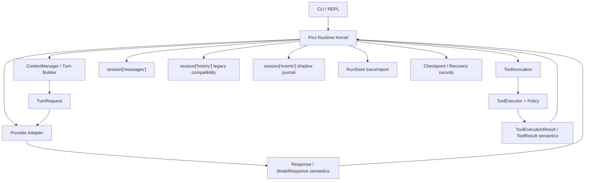

# Pico Minimal Runtime Kernel — Design Spec

Date: 2026-07-07
Status: Draft v2 — revised after implementation-grounded review

---

## 1. Summary

Pico should evolve toward a **Pi-style minimal runtime kernel**, not a
standalone gateway.

The design direction remains:

> Minimal Runtime Kernel + Thin Provider Adapters + Session Event Journal,
> with gateway/server mode deferred until there is a real multi-client need.

The v2 revision makes the design stricter about current-code fit:

1. **Context parity first**: the new turn request path must preserve the useful
   context currently produced by `ContextManager.build()`.
2. **Adapter shim, not interface jump**: keep `complete_v2(...)` during
   migration; introduce object-based calls behind a compatibility seam.
3. **Event journal starts as shadow log**: do not make events the source of truth
   until projection parity is proven.
4. **Reuse existing tool result semantics**: the proposed `ToolResult` is the
   target meaning of the current `ToolExecutionResult`, not a parallel object to
   add blindly.
5. **Single tool-use policy in phase 1**: the runtime handles one tool call per
   model turn until multi-tool behavior is explicitly designed.

This keeps Pico's architecture upgrade incremental: it clarifies protocol
boundaries without destabilizing memory, context, recovery, trace, or reports.

---

## 2. Current Implementation Anchors

This design is grounded in the current Pico shape:

- `pico.runtime.Pico` is the runtime facade.
- `pico.agent_loop.AgentLoop` owns the model/tool/final-answer loop.
- `pico.context_manager.ContextManager.build()` is the legacy prompt assembly
  path.
- `ContextManager.build_v2()` currently returns a dict with `system`, `tools`,
  `messages`, and `cache_control_breakpoints`.
- provider clients can expose `complete_v2(...)`.
- `pico.providers.response.Response` and `StopReason` normalize model output.
- `FallbackAdapter` lets legacy prompt/string providers participate in the v2
  path.
- `SessionStore` currently persists JSON sessions with `messages` and legacy
  `history` compatibility.
- `ToolExecutor.execute(...)` returns `ToolExecutionResult(content, metadata)`.
- checkpoint/recovery state currently flows through tool-change records,
  turn checkpoints, resume checkpoints, task state, trace, and reports.

The design must respect these facts. A kernel refactor that loses context,
breaks provider compatibility, or splits recovery metadata away from the
existing tool execution path is not acceptable.

---

## 3. Design Decision

### 3.1 Do Not Build a Gateway Now

A gateway would usually own:

- multi-client access;
- session routing;
- provider routing;
- event streaming;
- auth or permission boundaries;
- agent runtime selection;
- channel integrations.

That shape is useful for systems like multi-channel coding-agent platforms. It
is not Pico's current primary path. Pico is still a local coding-agent harness:
one CLI/REPL, one workspace, one runtime loop, local state, local recovery
artifacts.

Building a gateway now would move complexity outward before the internal turn
protocol is stable.

### 3.2 Keep Gateway-Readiness Internally

Pico should keep a future gateway possible by stabilizing internal contracts:

- model input is a `TurnRequest`;
- provider output is a normalized `Response`;
- tool execution goes through a normalized invocation/result boundary;
- durable runtime activity can be shadow-logged as session events;
- runtime state transitions are traceable.

If Pico later needs a gateway, it should wrap the runtime:

```text
Gateway/API wrapper -> Pico Runtime Kernel -> Session/Event/Recovery stores
```

It should not become the place where agent semantics live.

---

## 4. Goals

1. Make the model-facing turn shape explicit and provider-agnostic.
2. Preserve context quality from the current legacy prompt path.
3. Keep provider adapters thin and translation-only.
4. Keep tool policy, approval, recovery, and verification outside provider
   adapters.
5. Introduce session events incrementally as an audit/projection layer.
6. Avoid a broad rewrite of memory, checkpoint, recovery, trace, or reports.
7. Keep Pico local-first and inspectable.
8. Leave gateway/server mode as a future wrapper, not a near-term subsystem.

---

## 5. Non-Goals

- Do not build a standalone gateway process.
- Do not introduce WebSocket, HTTP server, auth, multi-client sessions, or
  remote routing in this phase.
- Do not build a full plugin platform in the first kernel migration.
- Do not add subagent routing as part of this design.
- Do not add vector search, embeddings, or an external database.
- Do not replace `messages` and `history` with events in the first phase.
- Do not rename every existing type just to match the design vocabulary.
- Do not make current non-native providers implement native tool APIs.

---

## 6. Architecture



The runtime kernel coordinates one turn:

1. append the user's message to current session state;
2. build a model-facing `TurnRequest`;
3. call a provider through the adapter boundary;
4. interpret the normalized `Response`;
5. either finish with assistant text or create one tool invocation;
6. execute the tool through `ToolExecutor`;
7. append tool result to model-facing transcript;
8. update trace, task state, recovery, and shadow events;
9. repeat until final answer, model error, retry limit, or step limit.

The important change from the first draft: `session["events"]` is not the first
source of truth. It starts as a shadow journal until projections are proven.

---

## 7. Core Invariants

### 7.1 Context Parity Invariant

The v2 turn request path must not silently drop context that the legacy prompt
path currently gives to the model.

The current legacy path includes:

- stable prefix and behavioral rules;
- memory guidance;
- project structure and memory index;
- workspace volatile state;
- checkpoint/resume text;
- compressed history;
- current user request;
- budget metadata and prompt cache metadata.

The target `build_turn(...)` must explicitly account for each of these. A field
may move from flat prompt text into `system`, `messages`, a system-reminder
block, or metadata, but it must not disappear.

Acceptance rule:

> A test should compare the legacy prompt sections with the v2 `TurnRequest`
> and assert that each required context class is represented.

### 7.2 Provider Adapter Boundary Invariant

Provider adapters translate. They do not own runtime policy.

Adapters may:

- convert `TurnRequest` to provider payload;
- send the request;
- convert provider response to Pico `Response`;
- expose usage, cache, and provider metadata.

Adapters must not:

- write sessions;
- execute tools;
- decide approvals;
- create recovery checkpoints;
- assemble memory;
- own runtime retry behavior.

### 7.3 Tool Policy Boundary Invariant

All tool safety and side-effect policy remains in runtime/tool execution:

- tool allowlist;
- read-only mode;
- approval policy;
- path safety;
- shell command risk;
- workspace delta detection;
- recovery tool-change records;
- verification evidence.

### 7.4 Event Journal Migration Invariant

Session events are introduced as a shadow log first.

During the first event phase:

- runtime continues writing `session["messages"]`;
- runtime continues writing legacy `session["history"]` while compatibility
  needs it;
- reports and resume behavior do not depend on `session["events"]`;
- events are checked against current outputs through projection tests.

Only after parity is proven can events become the source for messages, reports,
or checkpoint summaries.

### 7.5 Single Tool-Use Invariant

In phase 1, Pico supports one executable tool call per model turn.

If a provider returns multiple `tool_use` blocks, runtime behavior must be
explicit. Recommended behavior:

- execute the first tool call;
- emit trace metadata that multiple tool calls were returned;
- preserve the unexecuted count in metadata;
- leave full multi-tool semantics for a future design.

This matches the current loop, which executes the first tool block.

---

## 8. Protocols and Boundaries

### 8.1 TurnRequest

`TurnRequest` is Pico's internal model request.

Initial implementation may be a typed dict or small dataclass. It should wrap
the existing `build_v2` shape rather than forcing a broad call-site rewrite.

```python
class TurnRequest:
    system: list[dict]
    tools: list[dict]
    messages: list[dict]
    cache_control_breakpoints: list[int]
    metadata: dict
```

Target meaning:

- `system`: stable runtime/system content.
- `tools`: model-available tools for this turn.
- `messages`: model-facing transcript projection.
- `cache_control_breakpoints`: cache hints independent from a specific provider.
- `metadata`: context/report/debug information.

Design refinement:

- The current `tools` field may remain provider-shaped during migration.
- The target internal concept should be `ToolSpec`, not Anthropic `input_schema`.
- Provider adapters should eventually translate `ToolSpec` into Anthropic,
  OpenAI-compatible, or fallback prompt formats.

Recommended `ToolSpec` target:

```python
class ToolSpec:
    name: str
    description: str
    input_schema: dict
    effect_class: str
    approval_hint: str
```

`effect_class` and `approval_hint` are runtime semantics. Native provider
payloads can receive them as description text when no first-class field exists.

### 8.2 Response / ModelResponse Semantics

Keep the existing `Response` type initially.

The design term `ModelResponse` describes semantics, not an immediate rename.
Renaming `Response` now would add churn without making the kernel safer.

Current response fields are enough for phase 1:

```python
class Response:
    stop_reason: StopReason
    content: list[dict]
    usage: dict
```

Allowed first-phase content blocks:

- `{"type": "text", "text": "..."}`
- `{"type": "tool_use", "id": "...", "name": "...", "input": {...}}`

Phase-1 stop reasons:

- `end_turn`
- `tool_use`
- `max_tokens`
- `stop_sequence`

Future extension:

- provider metadata can be added later if `usage` and
  `last_completion_metadata` are not enough.

### 8.3 Provider Adapter Interface

Current interface:

```python
complete_v2(*, system, tools, messages, max_tokens, cache_breakpoints=None)
```

Target interface:

```python
complete_turn(request: TurnRequest, *, max_tokens: int) -> Response
```

Migration rule:

Do not replace `complete_v2(...)` in one jump.

Recommended seam:

1. Add a small runtime helper or adapter method that accepts `TurnRequest`.
2. It delegates to `complete_v2(...)` for current providers.
3. New providers may implement object-based calls later.
4. Once all call sites are object-based, `complete_v2(...)` can become an
   adapter compatibility method.

This preserves the current automatic `FallbackAdapter` wrapping behavior.

### 8.4 ToolInvocation

`ToolInvocation` is the runtime's accepted tool request.

It can start as an internal helper object, not necessarily a persisted schema.

```python
class ToolInvocation:
    id: str
    name: str
    input: dict
    source_response_index: int
    source_turn_id: str
```

Rules:

- created from one accepted `tool_use` block;
- validated by runtime/tool policy;
- connected to `ToolExecutionResult` metadata;
- not created by provider adapters.

### 8.5 ToolExecutionResult / ToolResult Semantics

Pico already has:

```python
@dataclass(frozen=True)
class ToolExecutionResult:
    content: str
    metadata: dict
```

The design term `ToolResult` should mean the target semantics of this existing
object. Do not create a second parallel result type unless the implementation
plan proves that the current type cannot carry the needed fields.

Target metadata semantics:

- `tool_status`;
- `tool_error_code`;
- `read_only`;
- `affected_paths`;
- `workspace_changed`;
- `diff_summary`;
- `tool_change_id`;
- `file_entries`;
- `shell_side_effects`;
- verification evidence reference when applicable.

If later a stronger type is needed, introduce it as a small wrapper around
`ToolExecutionResult`, not as a replacement that bypasses existing recovery
logic.

### 8.6 SessionEvent

`SessionEvent` is the target audit/projection event shape.

It starts as shadow state:

```python
class SessionEvent:
    id: str
    run_id: str | None
    turn_id: str | None
    type: str
    payload: dict
    created_at: str
```

Initial event types:

- `user_message`;
- `assistant_text`;
- `assistant_tool_use`;
- `tool_result`;
- `model_error`;
- `checkpoint_created`;
- `recovery_checkpoint_created`;
- `verification_evidence`;
- `context_reduced`.

Do not add `parent_id` in the first implementation unless branch/session-tree
behavior is also being built. It can be added later without changing the core
event concept.

---

## 9. Data Flow

### 9.1 First Model Call in a Turn

```text
user input
  -> append session["messages"] user turn
  -> append legacy session["history"] user record
  -> append shadow SessionEvent(user_message)
  -> build TurnRequest with context parity
  -> provider adapter
  -> Response
```

### 9.2 Tool Use

```text
Response(tool_use)
  -> choose one tool_use block
  -> ToolInvocation
  -> ToolExecutor.execute(name, input)
  -> ToolExecutionResult(content, metadata)
  -> append assistant tool_use message
  -> append user tool_result message
  -> append legacy history tool record
  -> append shadow events
  -> update trace/task state/recovery
  -> next model call
```

### 9.3 Final Answer

```text
Response(text)
  -> append assistant message
  -> append legacy history assistant record
  -> append shadow SessionEvent(assistant_text)
  -> finish task state
  -> finalize recovery checkpoint if needed
  -> write report
```

### 9.4 Retry / Malformed Output

```text
Response(stop_sequence or no actionable content)
  -> record retry notice in legacy history/trace
  -> do not append invalid assistant content to model-facing messages
  -> retry until retry limit
```

This preserves the current behavior that avoids illegal consecutive assistant
messages in the v2 transcript.

---

## 10. Migration Plan

### Phase 0: Context Parity Gate

Goal: ensure the v2 turn request does not reduce agent quality.

Actions:

- map every legacy prompt section to a v2 destination;
- ensure workspace volatile state and checkpoint text reach the model;
- preserve current-request protection under budget pressure;
- preserve prompt/cache metadata needed by trace and reports;
- add tests that compare context classes from `build()` and `build_v2` /
  `build_turn()`.

Exit criteria:

- v2 request includes all required context classes;
- existing context-manager tests still pass;
- model-facing request no longer depends on calling legacy build only for side
  effects and metadata.

### Phase 1: Protocol Naming Without Behavior Churn

Goal: make existing v2 shapes explicit with minimal code motion.

Actions:

- introduce `TurnRequest` as a small dataclass or typed dict wrapper;
- keep current `Response` name;
- keep current `complete_v2(...)`;
- document `Response` as Pico's model-response protocol;
- keep `messages` as the model-facing transcript.

Exit criteria:

- tests can assert protocol shape directly;
- no provider behavior changes are required.

### Phase 2: Adapter Object-Call Shim

Goal: let runtime call providers with a request object without breaking current
providers.

Actions:

- add a shim such as `complete_turn(request, max_tokens=...)`;
- implement it by delegating to `complete_v2(...)`;
- keep runtime fallback wrapping for non-v2 providers;
- add tests proving the shim does not mutate requests.

Exit criteria:

- agent loop no longer needs to unpack `system/tools/messages` itself;
- existing provider tests remain valid.

### Phase 3: Tool Boundary Tightening

Goal: align the design's `ToolResult` semantics with current
`ToolExecutionResult`.

Actions:

- define a small helper for converting a tool_use block into a tool invocation;
- make single-tool behavior explicit;
- ensure `ToolExecutionResult.metadata` carries recovery and verification
  fields consistently;
- keep current recovery checkpoint writer path.

Exit criteria:

- tool execution tests remain green;
- runtime trace clearly records chosen tool id and unexecuted extra tool count,
  if any.

### Phase 4: Shadow Session Event Journal

Goal: add events without changing runtime truth.

Actions:

- add `session["events"]`;
- append events beside current `messages/history` writes;
- redact events with the same artifact redaction path;
- do not read events for prompt/report/resume yet.

Exit criteria:

- events are persisted;
- events do not affect model behavior;
- session migration remains backward compatible.

### Phase 5: Projection Parity

Goal: prove events can reproduce existing views.

Actions:

- implement event-to-messages projection tests;
- implement event-to-report projection tests;
- compare projected messages with current `session["messages"]`;
- compare report-relevant fields with current report data.

Exit criteria:

- projections match current behavior for text, tool use, tool result, errors,
  checkpoint events, and verification evidence;
- only then decide whether events should become source of truth.

### Future Work: Hooks and Gateway

Hooks and gateway mode are not part of the first implementation plan.

Future hooks may include:

- `before_turn`;
- `before_model`;
- `after_model`;
- `before_tool`;
- `after_tool`;
- `before_compact`.

Future gateway mode should only be considered after real needs appear:

- multiple clients sharing one session;
- IDE/desktop/CLI connection to the same runtime;
- long-running headless service;
- multi-agent routing.

---

## 11. Testing Strategy

### Context Parity Tests

- legacy context classes are represented in `TurnRequest`;
- workspace volatile state reaches the model-facing request;
- checkpoint/resume text reaches the model-facing request;
- current user request is preserved under budget pressure;
- prompt/cache metadata remains available for trace/report.

### Protocol Tests

- `TurnRequest` contains system, tools, messages, cache hints, and metadata;
- `Response` supports text and tool_use blocks;
- stop reason handling is provider-agnostic;
- multi-tool response behavior is explicit.

### Provider Adapter Tests

- object-call shim delegates to `complete_v2(...)`;
- Anthropic-compatible adapter maps request fields correctly;
- `FallbackAdapter` flattens request fields without mutation;
- adapter does not write session, execute tools, or create recovery records.

### Runtime Loop Tests

- text response appends assistant message and finishes;
- tool response creates one invocation, executes it, appends result, and
  continues;
- retry/no-action response does not corrupt `messages`;
- step and retry limits remain enforced.

### Tool / Recovery Tests

- `ToolExecutionResult.metadata` carries tool status and recovery fields;
- mutating tools continue creating tool-change records;
- verification command evidence still attaches to recovery checkpoints;
- trace includes tool id and recovery ids.

### Shadow Event Tests

- events are written beside current session fields;
- event writes are redacted;
- events do not alter prompt/report/resume behavior;
- event-to-message projection matches current `messages` in covered cases.

### Regression Gate

Use focused tests during phases. Before the implementation is complete, run the
repo's canonical check script.

---

## 12. Risks and Mitigations

### Risk: Context Quality Regression

Mitigation:

- context parity is Phase 0;
- no event or adapter cleanup proceeds until the model-facing request carries
  current required context.

### Risk: Event Journal Becomes a Premature Rewrite

Mitigation:

- events start as shadow writes;
- no prompt/report/resume reads from events until projection parity passes.

### Risk: Provider Adapter Gets Too Smart

Mitigation:

- adapter tests assert no session/tool/recovery side effects;
- runtime owns stop-reason behavior;
- tool executor owns safety and side effects.

### Risk: Too Many New Types

Mitigation:

- keep `Response` initially;
- treat `ToolResult` as semantics of existing `ToolExecutionResult`;
- introduce `TurnRequest` first because it removes real scattered-argument
  coupling.

### Risk: Gateway Pressure Returns Too Early

Mitigation:

- document gateway triggers;
- keep gateway/server code out of the first implementation plan;
- keep runtime callable as a local library.

---

## 13. Revised Review Verdict

The original direction is sound:

- no standalone gateway now;
- make Pico's internal turn protocol explicit;
- keep provider adapters thin;
- move toward event-backed session semantics.

The upgraded design changes the execution emphasis:

1. **Preserve existing context behavior before abstracting.**
2. **Wrap current types before renaming them.**
3. **Shadow-write events before trusting them.**
4. **Use current recovery/tool result paths instead of replacing them.**
5. **Move hooks and gateway to future work.**

This is the version that fits Pico's current codebase best.

---

## 14. Open Questions for User Review

Recommended answers are included so the implementation plan can proceed without
turning into another broad architecture debate.

1. Should `Response` be renamed to `ModelResponse` now?
   - Recommendation: no. Keep `Response` and clarify semantics.
2. Should `TurnRequest` be a dataclass immediately?
   - Recommendation: yes, if the change is small; otherwise use a typed dict
     first and keep the same contract.
3. Should `session["events"]` become source of truth immediately?
   - Recommendation: no. Start as a shadow journal.
4. Should `parent_id` for branch/tree history be added now?
   - Recommendation: no. Add it when branch/resume-tree behavior is real.
5. Should hooks be in the first implementation plan?
   - Recommendation: no. Keep them as future work.

---

## 15. References

- Pi: minimal runtime, provider-agnostic agent/session layering, and
  tree-shaped history ideas: <https://pi.dev/> and
  <https://pt-act-pi-mono.mintlify.app/concepts/architecture>
- OpenCode: server/client separation, provider abstraction, agent modes, and
  permission boundaries: <https://opencode.ai/docs/server>,
  <https://opencode.ai/docs/providers/>, and
  <https://opencode.ai/docs/agents/>
- OpenClaw: gateway/control-plane boundary and multi-channel/multi-agent
  architecture: <https://docs.openclaw.ai/concepts/architecture>

---

## 16. Approval Gate

This spec is intentionally limited to design.

After user review and approval, the next step is to write an implementation plan
that breaks the work into small, testable phases. No runtime code should be
changed from this spec alone.
