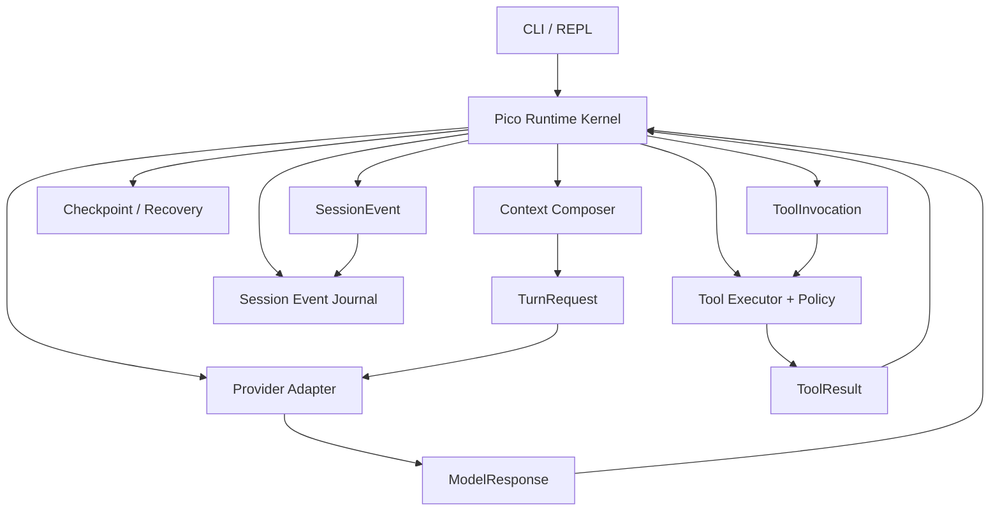

# Pico Minimal Runtime Kernel — Design Spec

Date: 2026-07-07
Status: Draft — awaiting user review before implementation planning

---

## 1. Summary

Pico should evolve toward a **Pi-style minimal agent runtime kernel**, not a
standalone gateway.

The kernel is a small set of stable internal protocols and runtime boundaries:

- `TurnRequest`: what the model sees for one turn.
- `ModelResponse`: what the provider returns after normalization.
- `SessionEvent`: the append-only source of truth for user/model/tool/recovery
  activity.
- `ToolInvocation`: a model-requested tool action after runtime validation.
- `ToolResult`: the normalized result of a tool execution, including recovery
  and verification metadata.

This design keeps Pico local, small, inspectable, and provider-agnostic. It also
keeps a future gateway possible: if Pico later needs a server, IDE client,
desktop client, or multi-agent control plane, that layer can wrap the runtime
kernel instead of becoming the runtime itself.

---

## 2. Background

Pico is already more than a thin CLI wrapper. The current runtime has:

- a CLI / REPL surface;
- an `AgentLoop` control loop;
- bounded context assembly;
- provider clients;
- tool execution and approval policy;
- memory layers;
- checkpoints and recovery records;
- trace, report, and evaluation scaffolding.

Recent work has already moved in the correct direction:

- `ContextManager.build_v2()` emits a structured request with `system`, `tools`,
  `messages`, and `cache_control_breakpoints`.
- provider clients can expose `complete_v2(...)`.
- `Response` and `StopReason` normalize provider output.
- `FallbackAdapter` lets old prompt/string providers participate in the v2
  runtime path.
- `AgentLoop` is shifting from parsing XML text to handling normalized response
  blocks.

The next design step should not be another broad subsystem rewrite. It should
be a boundary clarification: make the internal protocol explicit, then let
context, provider adapters, tools, session storage, report generation, and
recovery all project around that protocol.

---

## 3. Product Direction

### 3.1 Primary Archetype: Pi-style Minimal Runtime

Pi's useful idea for Pico is not a feature checklist. It is a shape:

- small core;
- provider-agnostic runtime;
- session history as a first-class primitive;
- extension points that are simple and composable;
- UI surfaces as clients of the runtime, not owners of the runtime.

This matches Pico's current direction: local-first, stdlib-heavy, inspectable,
and focused on a single workspace coding-agent loop.

### 3.2 Secondary Inspiration: OpenCode / OpenClaw Boundaries

OpenCode and OpenClaw are still useful references, but mainly for boundaries:

- server/client separation can be useful later;
- permissions should remain a runtime/tool policy concern;
- provider differences should be behind adapters;
- multi-agent and multi-channel routing should not leak into the core loop.

Pico should absorb these boundary lessons without copying their platform shape.

### 3.3 Main Decision

Do **not** design a standalone gateway now.

Design:

> Pico Minimal Runtime Kernel + Session Event Journal + Thin Provider Adapters

Future gateway:

> HTTP/WebSocket/API wrapper around the runtime kernel, only if multi-client or
> long-running server use cases become real.

---

## 4. Goals

1. Make the model-facing turn shape provider-agnostic.
2. Keep provider adapters thin and translation-only.
3. Make session history an append-only event journal, not only a provider
   `messages` array.
4. Treat `messages` as a projection from session events.
5. Keep tool policy, approval, recovery, and verification outside provider
   adapters.
6. Preserve Pico's local-first simplicity.
7. Leave a clear future path to gateway/server mode without building it now.
8. Migrate incrementally from today's v2 request/response path.

---

## 5. Non-Goals

- Do not build a standalone gateway process.
- Do not introduce WebSocket, HTTP server, auth, multi-client sessions, or
  remote routing in this phase.
- Do not build a full plugin marketplace or OpenClaw-style capability platform.
- Do not add subagent routing as part of this kernel design.
- Do not add a vector database or embedding memory.
- Do not rewrite checkpoint/recovery/reporting wholesale.
- Do not make provider adapters responsible for runtime policy.
- Do not force all current providers to become native-tool providers at once.

---

## 6. Architecture



The runtime kernel owns the control loop. It does not own every subsystem's
internal logic. Its job is to coordinate one turn:

1. accept user input;
2. append a user event;
3. ask the context composer for a `TurnRequest`;
4. send the request through the provider adapter;
5. receive a normalized `ModelResponse`;
6. append assistant text or tool-use events;
7. execute tools through the tool executor;
8. append tool result and recovery events;
9. repeat until final answer, error, retry limit, or step limit.

---

## 7. Core Protocols

The names below are design-level names. Implementation can introduce them as
dataclasses or typed dicts, depending on the local style.

### 7.1 TurnRequest

`TurnRequest` is Pico's internal model request. It should not be described as
"Anthropic shape", even if Anthropic is the first native implementation.

```python
class TurnRequest:
    system: list[dict]
    tools: list[dict]
    messages: list[dict]
    cache_control_breakpoints: list[int]
    metadata: dict
```

Fields:

- `system`: stable runtime/system content for the current session.
- `tools`: normalized tool schemas available this turn.
- `messages`: model-facing transcript projection.
- `cache_control_breakpoints`: provider-agnostic cache hints.
- `metadata`: prompt cache key, resume status, budget reductions, context
  sources, workspace state, and debug counters.

Rules:

- Runtime consumes `TurnRequest`, not provider-specific request payloads.
- Provider adapters translate `TurnRequest` into concrete provider payloads.
- `metadata` is observable/debuggable, but should not drive provider-specific
  control flow outside adapters.

### 7.2 ModelResponse

`ModelResponse` is the provider-normalized model output.

```python
class ModelResponse:
    stop_reason: StopReason
    content: list[dict]
    usage: dict
    provider_metadata: dict
```

Allowed first-phase content blocks:

- `{"type": "text", "text": "..."}`
- `{"type": "tool_use", "id": "...", "name": "...", "input": {...}}`

First-phase stop reasons:

- `end_turn`
- `tool_use`
- `max_tokens`
- `stop_sequence`

Rules:

- Runtime decides what to do with `stop_reason`.
- Provider-specific raw JSON should not leak past the adapter.
- Existing `Response` can be kept as the first implementation of this concept;
  renaming to `ModelResponse` is optional and can happen later.

### 7.3 SessionEvent

`SessionEvent` is the durable source of truth.

```python
class SessionEvent:
    id: str
    parent_id: str | None
    run_id: str | None
    turn_id: str | None
    type: str
    payload: dict
    created_at: str
```

Initial event types:

- `user_message`
- `assistant_text`
- `assistant_tool_use`
- `tool_result`
- `model_error`
- `checkpoint_created`
- `recovery_detected`
- `verification_evidence`
- `context_reduced`
- `memory_written`

Rules:

- The journal is append-only.
- `messages` is a projection from events, not the only session truth.
- Reports, replay, resume, and checkpoint summaries should prefer events as
  their source.
- Branching/tree history is not required in phase 1, but `parent_id` keeps the
  door open.

### 7.4 ToolInvocation

`ToolInvocation` is created after the runtime accepts a model's tool request.

```python
class ToolInvocation:
    id: str
    name: str
    input: dict
    source_event_id: str
    approval_context: dict
```

Rules:

- Tool invocation IDs should connect model response, session event, tool result,
  and recovery metadata.
- Runtime/tool policy validates the invocation before execution.
- Provider adapters do not decide whether a tool is allowed.

### 7.5 ToolResult

`ToolResult` is the normalized output of tool execution.

```python
class ToolResult:
    invocation_id: str
    status: str
    content: str
    metadata: dict
    workspace_delta: dict | None
    recovery_checkpoint_id: str | None
    verification_evidence: list[dict]
```

Rules:

- `status` should distinguish success, rejection, error, and interrupted states.
- Recovery metadata belongs here, not in provider adapters.
- Verification evidence belongs here when the tool was a verification command.
- The model-facing `tool_result` message is a projection from this object.

---

## 8. Module Boundaries

### 8.1 Runtime Kernel

Owns:

- turn loop;
- max step / retry handling;
- transition from model response to tool execution;
- appending session events;
- finish conditions;
- trace/report notifications.

Does not own:

- provider-specific payload construction;
- context retrieval internals;
- tool-specific execution logic;
- checkpoint storage internals;
- memory retrieval algorithms.

### 8.2 Context Composer

Current anchor: `ContextManager.build_v2(...)`.

Desired boundary:

```python
ContextComposer.build_turn(user_input, session, workspace) -> TurnRequest
```

Responsibilities:

- stable system content;
- normalized tools list;
- event-to-message projection;
- memory and workspace context injection;
- resume/checkpoint context injection;
- budget enforcement;
- cache breakpoint selection;
- metadata for trace/report/debug.

Non-responsibilities:

- calling providers;
- executing tools;
- writing session events;
- deciding approval policy.

Important design choice:

Do not turn context into an enterprise-style pipeline with many public
components. Keep one public method and small internal helpers.

### 8.3 Provider Adapter

Current anchors:

- `complete_v2(...)`
- `Response`
- `StopReason`
- `FallbackAdapter`

Desired boundary:

```python
ProviderAdapter.complete(request: TurnRequest) -> ModelResponse
```

Responsibilities:

- translate Pico request to provider payload;
- send request;
- translate provider response to `ModelResponse`;
- expose usage/cache/request metadata.

Non-responsibilities:

- no session writes;
- no memory assembly;
- no tool approval;
- no recovery checkpointing;
- no retry policy, except provider transport retries if explicitly local to the
  provider client;
- no runtime-specific parsing beyond provider normalization.

`FallbackAdapter` remains important, but as a compatibility bridge:

- input: `TurnRequest`;
- behavior: flatten system/tools/messages into the legacy prompt format;
- output: `ModelResponse`;
- long-term role: compatibility for non-native-tool providers, not the center of
  the architecture.

### 8.4 Session Store

Desired boundary:

```python
SessionStore.append_event(event: SessionEvent) -> None
SessionStore.load_events(session_id) -> list[SessionEvent]
SessionProjector.to_messages(events) -> list[dict]
SessionProjector.to_report(events) -> dict
```

Responsibilities:

- durable event journal;
- compatibility with existing `history` / `messages` during migration;
- event projection helpers;
- future branch support via `parent_id`.

Non-responsibilities:

- provider API formatting;
- tool execution;
- memory retrieval;
- context budget policy.

### 8.5 Tool Executor + Policy

Current anchor: `ToolExecutor.execute(...)`.

Responsibilities:

- validate tool name and input;
- enforce read-only mode;
- enforce approvals;
- enforce path/workspace safety;
- detect repeated or suspicious tool calls;
- execute tool;
- attach workspace delta;
- attach recovery checkpoint metadata;
- attach verification evidence.

Non-responsibilities:

- provider request formatting;
- model response parsing;
- context retrieval;
- final answer generation.

### 8.6 Recovery / Checkpoint

Recovery should remain a separate concern, but it should attach to events and
tool results more cleanly.

Desired relationship:

- tool execution creates `ToolResult`;
- if workspace changes happen, recovery metadata is attached to `ToolResult`;
- runtime appends `tool_result` and `checkpoint_created` events;
- reports and resume derive from those events.

This avoids making checkpoint state a parallel hidden transcript.

---

## 9. Gateway Position

### 9.1 What a Gateway Would Mean

In this domain, a gateway usually means a long-running process that owns:

- multi-client access;
- session routing;
- provider routing;
- event streaming;
- auth/permissions;
- agent runtime selection;
- channel integrations.

That is valuable for systems like multi-client IDE/desktop/web agents or
OpenClaw-style multi-channel orchestration.

### 9.2 Why Pico Should Not Build It Now

Pico's current primary path is local:

- one CLI/REPL session;
- one workspace;
- one runtime loop;
- local session and recovery artifacts;
- local provider configuration.

Adding a gateway now would turn a runtime-boundary problem into a distributed
systems problem before the internal protocols are stable.

### 9.3 What Pico Should Keep

Pico should keep gateway-readiness through internal contracts:

- every turn is a `TurnRequest`;
- every provider output is a `ModelResponse`;
- every durable action is a `SessionEvent`;
- tool execution is normalized through `ToolInvocation` and `ToolResult`;
- runtime state transitions are observable.

If a gateway is needed later, it wraps this kernel:

```text
Gateway API -> Runtime Kernel -> Session Event Journal
```

It should not become the place where agent semantics live.

---

## 10. Extension Model

Pico should not build a full plugin platform in this phase.

Instead, define small extension primitives that can later support skills,
plugins, or hooks.

Initial hook points:

- `before_turn`
- `before_model`
- `after_model`
- `before_tool`
- `after_tool`
- `before_compact`

Allowed hook outputs:

- `ContextPatch`
- `PolicyDecision`
- `MemoryWriteIntent`
- `TraceAnnotation`

Rules:

- hooks cannot mutate arbitrary runtime internals;
- hooks return small typed outputs;
- runtime applies those outputs;
- hook failures should be visible and recoverable;
- first implementation can be internal-only, with no public plugin API.

This gives Pico Pi-style extensibility without platform complexity.

---

## 11. Migration Strategy

### Phase 1: Name and Stabilize the Protocol

Goal: make the existing v2 path explicit.

Actions:

- introduce or document `TurnRequest` around the existing
  `system/tools/messages/cache_control_breakpoints` shape;
- treat current `Response` as the first `ModelResponse`;
- document adapter responsibilities;
- keep existing fallback behavior.

Expected result:

- no broad behavior change;
- cleaner code references;
- runtime has a clearer contract with context and providers.

### Phase 2: Runtime Loop Consumes Protocol Objects

Goal: reduce loose dict / scattered-argument coupling.

Actions:

- context composer returns a named request object or typed dict;
- provider adapter accepts that request object;
- agent loop uses protocol fields instead of provider-shaped assumptions;
- trace/report record protocol metadata.

Expected result:

- provider-specific shape no longer leaks into the runtime loop;
- tests can mock `TurnRequest -> ModelResponse` directly.

### Phase 3: Session Event Journal

Goal: make event journal the source of truth.

Actions:

- append events for user, assistant text, assistant tool use, tool result, model
  errors, context reduction, checkpoint, and verification evidence;
- keep writing current `messages` / `history` during migration;
- add projectors from events to model messages and reports.

Expected result:

- replay/resume/report can rely on one event stream;
- `messages` becomes a model-facing projection;
- legacy session fields remain until migration is complete.

### Phase 4: Tool Result and Recovery Attachment

Goal: attach workspace/recovery/verification metadata to normalized tool
results.

Actions:

- normalize tool executor output into `ToolResult`;
- include recovery checkpoint IDs and workspace deltas;
- project `ToolResult` into provider `tool_result` blocks;
- derive report/checkpoint sections from events.

Expected result:

- fewer hidden side channels;
- clearer recovery and report semantics.

### Phase 5: Internal Hook Primitives

Goal: add small extension points without a plugin platform.

Actions:

- define internal hook call sites;
- define return objects;
- start with no external registration API;
- use hooks only where current code already has a natural boundary.

Expected result:

- future skills/extensions have a path;
- current kernel remains small.

---

## 12. Testing Strategy

### Protocol Tests

- `TurnRequest` contains system/tools/messages/cache hints and metadata.
- `ModelResponse` supports text and tool_use blocks.
- stop reason mapping is provider-agnostic.

### Provider Adapter Tests

- Anthropic-compatible adapter maps `TurnRequest` to native messages API.
- OpenAI-compatible adapter can later map the same request without runtime
  changes.
- `FallbackAdapter` flattens requests without mutating input.
- adapter does not write session or execute tools.

### Runtime Loop Tests

- user input appends a user event.
- text model response appends assistant text and finishes.
- tool_use model response creates a tool invocation, executes it, appends tool
  result, and continues.
- malformed/no-action response triggers retry handling.
- max step and retry limits remain enforced.

### Session Projection Tests

- event journal projects to provider messages.
- event journal projects to report sections.
- tool_result projection preserves `tool_use_id`.
- legacy `history` / `messages` compatibility remains during migration.

### Recovery Tests

- mutating tool result records workspace delta and checkpoint metadata.
- verification command attaches evidence.
- recovery/checkpoint events can be found from the session journal.

### Regression Gate

Use the existing narrow tests during early protocol work. Before implementation
is considered complete, run the repository's canonical check script.

---

## 13. Risks and Mitigations

### Risk: Over-abstracting the Kernel

Mitigation:

- start with typed dicts or small dataclasses only;
- no generic event bus;
- no plugin registry;
- no server.

### Risk: Event Journal Duplicates Existing Messages/History

Mitigation:

- keep dual-write only during migration;
- define projectors early;
- retire legacy fields only after tests prove parity.

### Risk: Provider Adapter Becomes Too Smart

Mitigation:

- adapter tests should assert no session/tool/policy side effects;
- runtime owns stop-reason behavior;
- tool policy remains in tool executor.

### Risk: Gateway Pressure Returns Too Early

Mitigation:

- document explicit gateway triggers;
- require real multi-client/server use case before adding gateway code;
- keep runtime callable as a library first.

### Risk: Naming Drift

Mitigation:

- pick protocol names once;
- update docs and tests together;
- avoid `v2` in long-lived names except as migration markers.

---

## 14. Open Questions for Review

1. Should the implementation rename current `Response` to `ModelResponse`, or
   keep `Response` and only clarify semantics in docs/tests?
2. Should `TurnRequest` be introduced as a dataclass immediately, or should the
   current dict shape remain while tests define the contract?
3. Should the first event journal live beside existing session fields, or inside
   `session["events"]` as the migration bridge?
4. Should event branching fields (`parent_id`) be added now, or delayed until a
   real branch/resume workflow exists?

Recommended answers:

1. Keep `Response` initially; rename later only if the old name causes
   confusion.
2. Use a small dataclass if it does not force large call-site churn; otherwise
   stabilize the typed dict first.
3. Use `session["events"]` first to keep migration local.
4. Add `parent_id` as optional metadata now, but do not build branching behavior.

---

## 15. References

- Pi: minimal runtime, provider-agnostic agent/session layering, and
  tree-shaped history ideas: <https://pi.dev/> and
  <https://pt-act-pi-mono.mintlify.app/concepts/architecture>
- OpenCode: server/client separation, provider abstraction, agent modes, and
  permission boundaries: <https://opencode.ai/docs/server>,
  <https://opencode.ai/docs/providers/>, and
  <https://opencode.ai/docs/agents/>
- OpenClaw: gateway/control-plane boundary and multi-channel/multi-agent
  architecture: <https://docs.openclaw.ai/concepts/architecture>

---

## 16. Approval Gate

This spec is intentionally limited to design.

After user review and approval, the next step is to write an implementation plan
that breaks the work into small, testable phases. No runtime code should be
changed from this spec alone.
