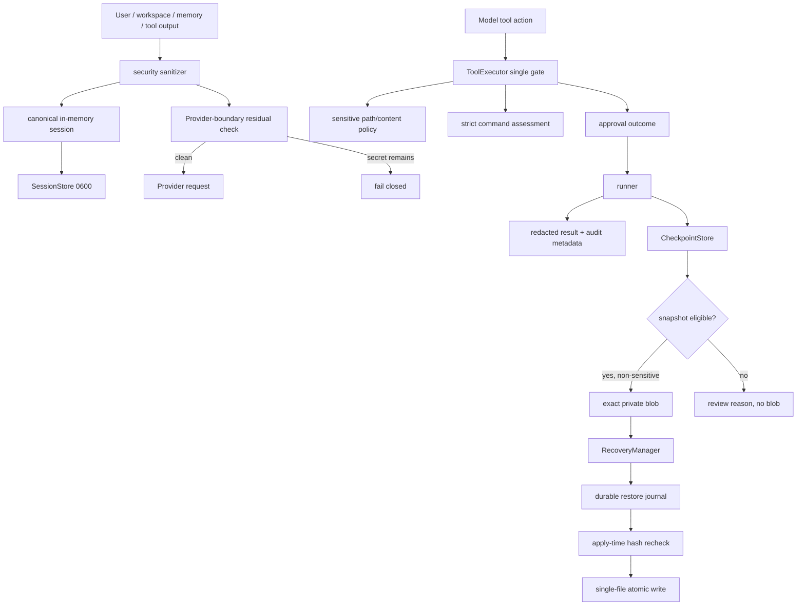

# Pico A 阶段：安全与可信基线设计

- 日期：2026-07-10
- 状态：设计草案完成，待独立自审与委托批准记录
- 基线分支：`codex/action-kernel-messages-v3`
- 基线提交：`6a6ee2f`
- 前置阶段：C 阶段 Action Kernel / messages v3 已完成并通过全量验证
- 范围：A 阶段——敏感数据、Shell 执行、Checkpoint / Restore、跨进程 pending 与本地 secret 配置

## 1. 摘要

Pico 的 C 阶段已经把 Provider response、Action、canonical messages、ToolExecutionResult 和 terminal lifecycle 收敛为一条主链。A 阶段不再增加产品功能，而是把这条主链的信任边界补完整。

当前风险不是“完全没有安全措施”：路径逃逸、shell 环境白名单、工具审批、trace/report 脱敏、单文件原子 restore 都已经存在。真正的问题是这些措施没有形成闭环：

1. 首次 resume load、Provider 出站、raw tool result、CheckpointStore、verification、approval prompt 和 CLI inspection 之间存在脱敏旁路。
2. `Pico.tool_*()` 公开 runner 可以绕过 ToolExecutor；未知 shell、解释器、系统命令和伪装成已知命令的可执行文件可能进入自动执行通道。
3. 敏感文件仍可由 read/search/write/patch 读取或修改，并可作为原始恢复 blob 落盘。
4. turn checkpoint 对同一路径的 A→B→C 变更不合并，restore 可能只回到 B；apply 在 preview 后没有最后一刻复核。
5. 多文件 restore 只有单文件原子性，却没有 durable journal；异常时可能发生“磁盘已部分改变、审计记录还没写”的窗口。
6. 跨进程遗留的非空 owner pending Tool Change 永久悬挂，运行时既不提示也不要求 review。
7. `.env` 可以通过 argv 接收 API key，写入非原子、权限依赖 umask，并且项目 `.env` 可以覆盖 `PATH/HOME/SHELL` 等执行环境。

本设计选择一个最小但完整的纵向方案：

```text
security.py 中的小型纯函数
  ├─ secret material redaction / detection
  ├─ sensitive path classification
  └─ private file permission helpers

Provider-boundary sanitizer
  └─ system + canonical/request messages 的最终出站闸口

ToolExecutor（唯一 Pico 工具执行入口）
  ├─ sensitive path/content policy
  ├─ strict shell assessment + approval outcome
  └─ redacted result / metadata

CheckpointStore + RecoveryManager
  ├─ validated ids / blobs / workspace / symlinks
  ├─ one net entry per path
  ├─ shared Pico workspace-write lock
  └─ preflight + apply-time recheck + durable restore journal
```

不引入 OS sandbox、容器、secret vault、策略 DSL、第三方 shell parser 或跨文件系统事务框架。

## 2. 已确认约束与授权

### 2.1 用户决策

- 优化顺序为先 C、后 A。
- 项目暂不发布给他人使用；A 的目标是本地安全与可信基线，不是发布、托管或多人权限系统。
- Provider registry、发布能力和额外产品面不纳入本阶段。
- C 阶段 legacy 路径已直接移除，A 不恢复兼容双轨。
- 验证标准沿用“本地全量 + 一次真实 Anthropic-compatible / DeepSeek E2E”。
- 用户将 A 阶段的分析、取舍、书面批准和实现决策全部委托给执行者，不参与中间实现。

### 2.2 A 阶段必须完成

来自 C 阶段权威规范 §11.2 的九项承诺全部纳入：

1. raw tool result、checkpoint、approval、verification 全链 redaction。
2. 敏感文件读取策略。
3. snapshot eligibility 排除 secret basename / extension。
4. shell command risk fail-closed。
5. workspace 外 redirect、解释器执行、sudo/system command 分类。
6. 同一路径 A→B→C checkpoint entry 合并。
7. restore apply 前 hash 复验与半恢复记录。
8. 跨进程 pending Tool Change Recovery Review。
9. `.env` 原子写、0600 权限和安全的 CLI secret 输入。

源码审计另发现四项若不同时处理会直接绕过上述承诺的根因，因此也属于 A：

- 删除或封闭 `Pico.tool_*()` raw runner 直通路径，确保 ToolExecutor 是唯一 Pico 执行闸口。
- 校验 checkpoint/tool-change/blob id、blob 摘要、workspace identity 和 symlink 路径。
- 在 SessionStore 首次 load 前完成 redactor 装配，并在 Provider 请求边界做最终净化与残留检查。
- 项目 `.env` 只允许 Pico/provider 配置项进入进程环境，不能覆盖 `PATH/HOME/SHELL` 等执行控制变量。

### 2.3 明确不做

- 不声称提供 OS 级 sandbox、network namespace、seccomp、Landlock、Seatbelt 或容器隔离。
- 不把 `cwd`、审批或 workspace observer 描述成 sandbox。
- 不做 keychain / KMS / Vault 集成，不加密磁盘工件。
- 不自动删除旧 session backup 或旧 checkpoint blob；旧数据只降级为不可自动恢复并收紧权限。
- 不实现 hunk restore、三方合并或真正的多文件文件系统事务。
- 不新增配置策略语言、插件式 policy registry 或第三方依赖。
- 不扩展 Provider matrix、streaming、并行工具或发布流程。

## 3. 现状证据与问题分级

### 3.1 敏感数据 P0

| 缺口 | 当前证据 | 后果 |
| --- | --- | --- |
| resume 首次 load 早于 redactor wiring | `cli.py` 先构造 identity `SessionStore`；`Pico.from_session()` 先 `load()`，`Pico.__init__()` 后 `set_redactor()` | 旧 transcript 可直接进入第一次 Provider 请求 |
| in-memory 与 disk session 语义不同 | `_commit_session()` 只把新 messages 脱敏，保存后把包含其他 raw state 的 candidate 放回内存 | working memory / injection 可继续携带原值 |
| raw tool result 先落盘 | `_prepare_tool_result()` 对原始 content digest/hash/write，之后才由 session commit 处理 | `.pico/runs/*/tool_results` 保留明文 |
| CheckpointStore 无 redactor | tool input summary、error、verification command/stdout/stderr 原样写 JSON | 恢复与审计面成为旁路 |
| approval prompt 打印完整 args | `approve()` 直接 `json.dumps(args)` | write content / shell secret 出现在终端记录 |
| 高置信 token 模式只检测不替换 | `looks_secret_shaped_text()` 不参与 `redact_text()` | 非当前 env 的 GitHub/AWS/Slack 等 token 不会被遮蔽 |

### 3.2 Shell P0

| 缺口 | 当前证据 | 后果 |
| --- | --- | --- |
| 公开 runner 绕过 | `Pico.tool_run_shell()` 直接调用 raw runner | 无审批、无 trace、无 recovery |
| 未知默认 workspace_write/allow | classifier fallback + approval allow | `sudo`、system、interpreter、script、wrapper 可自动执行 |
| basename 伪装 | `Path(tokens[0]).name` | `./ls`、`/tmp/ls` 冒充 read-only binary |
| 只看 git/find 头部 | git subcommand 与 find 部分 action 的启发式 | `git config --global`、`git diff --output`、`find -fprint` 漏判 |
| 解析失败后 text.split | shlex error fail-open | 畸形 shell 仍可能进入 allow |
| `.env` 覆盖任意环境 | `load_project_env(..., override=True)` | 项目可用伪造 PATH 劫持“已知命令” |
| verification 只找 marker | `is_verification_command()` 不验证执行形状/runner outcome | `pytest || true` 可伪造 passed，拒绝命令也可能产证据 |

### 3.3 Recovery P0

| 缺口 | 当前证据 | 后果 |
| --- | --- | --- |
| 同路径 entry 平铺 | turn writer 直接 extend | A→B→C 可能只恢复到 B |
| preview/apply TOCTOU | apply 复用开头 plan，不在 mutation 前重算 | 用户在 preview 后的变更可能被覆盖 |
| 多文件无 journal | 完成循环后才写 restore checkpoint | 中途异常存在未记录的半恢复 |
| owner pending 永久悬挂 | startup 只处理 owner 为空的 legacy pending | 崩溃记录不可见、不可闭环 |
| symlink 检查顺序错误 | path 先 `.resolve()`，后 `is_symlink()` | workspace 内 symlink 被当普通文件 |
| id/ref 未校验 | store 直接拼路径 | tampered blob ref / id 可能路径穿越 |
| blob 读取不复算 hash | restore 对读取到的 bytes 重新生成“预期” | 被篡改 blob 仍可能写回 |
| workspace identity 未校验 | source record root 不参与 plan | record 可能在错误 workspace 应用 |

### 3.4 权限与 CLI P1

- `trace.jsonl`、raw tool result、session backup 和部分 lock 默认权限依赖 umask，实际可见 0644。
- `pico init --api-key VALUE` 将 secret 放进 argv / shell history / process list。
- `.env` 通过 `Path.write_text()` 覆盖，既非原子，也不保证 0600。
- `sessions/checkpoints/runs show` 对旧工件原样打印，可能重新暴露历史秘密。

## 4. 方案比较

### 4.1 方案一：继续在各调用点补正则和黑名单

做法：为 shell 增加更多 command names，为每个 store 单独加 redaction，在几个工具上加 `.env` 判断。

优点：改动初看最小。

缺点：

- 不能消除首次 resume、raw runner、Provider 出站和 CLI inspection 等结构性旁路。
- shell 黑名单会继续被 wrapper、路径伪装、动态扩展和未知语法绕过。
- redaction 与 snapshot policy 会在不同模块漂移。
- recovery 的 TOCTOU 与半恢复仍没有可验证状态。

结论：拒绝。它修的是样本，不是信任边界。

### 4.2 方案二：小型共享安全谓词 + 现有 owner 边界收紧（采用）

做法：

- `security.py` 只增加可复用的纯函数，不创建 policy class hierarchy。
- redaction 在 Provider、session/run、checkpoint、CLI inspection 四个边界各有最后一道保障。
- ToolExecutor 成为唯一 Pico tool gate；shell 自动通道只接受可完整证明的简单 argv。
- CheckpointStore 继续拥有存储，RecoveryManager 继续拥有 plan/apply；增加校验、共享锁与 journal，不创建 recovery framework。
- `.env` 写入继续使用当前 CLI/config owner，但改成 getpass/stdin + private atomic write。

优点：

- 对应全部已知根因，同时保留现有模块职责。
- stdlib-only，变更可用确定性测试验证。
- 自动通道是 allow-by-proof，未知输入不会因漏进黑名单而放行。
- recovery 不伪装跨文件原子，而是把部分状态做成 durable、可枚举、可撤销的事实。

代价：某些过去在 `--approval auto` 下运行的复杂 shell 会改为拒绝并要求 `ask`；这是 fail-closed 的预期兼容变化。

结论：采用。

### 4.3 方案三：OS sandbox + secret vault + 全事务恢复

做法：引入平台沙箱、网络隔离、keychain/Vault 和 filesystem transaction layer。

优点：隔离强度上限更高。

缺点：跨平台复杂、依赖和运维面显著增加，也超出“本地第一阶段 harness”的承诺。真正的多文件原子恢复在普通文件系统上仍需专门 journal/rollback 设计，不能靠命名解决。

结论：作为未来 B/发布前阶段候选，不进入 A。

## 5. 目标不变式与信任边界

### 5.1 安全不变式

| ID | 不变式 |
| --- | --- |
| S1 | Provider 可见的 system/messages 在发送前一定经过统一 sanitizer；检测到残留高置信 secret 时不调用 Provider。 |
| S2 | runtime 内存 session 与磁盘 session 使用同一份已处理 payload，不维持 raw/safe 双真源。 |
| S3 | 所有可显示/持久化 free text 在 owner 边界脱敏；精确 restore blob 永不写入 `<redacted>` 替代内容。 |
| S4 | 敏感路径或高置信敏感内容不进入自动 snapshot blob。 |
| S5 | 模型工具不能 read/search/write/patch 敏感路径；memory_save 不能持久化高置信 secret。 |
| T1 | 所有通过 `Pico` 发起的工具执行都经过 ToolExecutor。 |
| T2 | shell 自动执行只接受语法、binary、参数和路径都可完整证明的简单命令。 |
| T3 | unknown、parse error、wrapper、interpreter、system/package/service、动态 expansion 和控制结构不进入 auto allow。 |
| T4 | verification 只来自 runner 实际执行的精确 verification argv，不从拒绝或 composite shell 推断。 |
| R1 | 一个 turn checkpoint 中每个 normalized path 至多一个净状态 entry。 |
| R2 | restore 在任何 mutation 前验证 schema/id/workspace/path/blob/plan，并在每个 mutation 前重新验证当前 hash。 |
| R3 | 单文件使用 temp+hash+replace；多文件不声称原子，但第一次 mutation 前已有 durable journal。 |
| R4 | 任何 partial/applying restore 和 foreign pending Tool Change 都能通过 CLI 枚举；foreign pending 未 review 前阻止新的 Pico workspace write。 |
| F1 | `.env` 与 `.pico` 敏感工件文件为 0600、目录为 0700；旧 raw backup 只以 private recovery evidence 保留。 |

### 5.2 数据流



## 6. 敏感数据模型

### 6.1 `security.py` 继续作为单一真源

保留函数式设计，增加以下能力：

- `is_sensitive_path(path) -> bool`
- `sensitive_path_reason(path) -> str`
- `contains_secret_material(text, env=None, secret_env_names=None) -> bool`
- 强化后的 `redact_text()` / `redact_artifact()`
- `sanitize_provider_payload(system, messages, ...)`
- `ensure_private_dir(path)` / `ensure_private_file(path)`

不创建 `SecurityManager`、factory、registry 或只有一个实现的接口。

### 6.2 高置信 secret material

自动替换/阻断只使用高置信证据：

1. 当前环境或显式 `secret_env_names` 中的非空值。
2. dict/object 中 secret-shaped key 对应的 value。
3. 已知 token prefix：OpenAI/Anthropic 风格 `sk-*`、GitHub PAT、GitLab PAT、Slack token、Hugging Face token、AWS access key、Google API key。
4. `Authorization: Bearer/Basic ...`。
5. `api_key/token/secret/password/credential = value` 与同类 CLI flag 后的实际 value。
6. URL userinfo 或 secret-shaped query parameter。
7. PEM private-key header/body。

普通词语不是 secret material：

- `token budget`
- `password policy`
- `credential rotation design`
- `input_tokens`

常见模板值也不按真实 secret 处理：`example`、`dummy`、`changeme`、`replace-me`、`your-api-key`、`${VAR}`、`<placeholder>`。`.env.example/.sample/.template` 的路径也明确允许。

已知环境 secret 长度达到 8 时按任意位置替换，不再保留“嵌在 identifier 中就不替换”的旁路；短 secret 仅在完整 value 或 secret-key assignment 中替换，避免把普通短子串全部抹掉。

### 6.3 敏感路径

路径比较使用 normalized、case-folded POSIX 相对路径。第一版稳定规则：

- `.env`、`.env.*`、`.envrc`，但允许 `.env.example`、`.env.sample`、`.env.template`。
- `.netrc`、`.npmrc`、`.pypirc`、`.git-credentials`、`credentials.json`、`auth.json`、`service-account*.json`、`secrets.{json,yaml,yml,toml}`。
- `.ssh/**`、`.gnupg/**`、`.aws/credentials`、`.docker/config.json`、`.kube/config`。
- private key / keystore 扩展：`.pem`、`.key`、`.p12`、`.pfx`、`.jks`、`.keystore`；`.pub` 和 `.crt` 不在此列。
- Pico 内部 transcript/recovery 工件：`.pico/sessions/**`、`.pico/runs/**`、`.pico/checkpoints/**`。这些只能通过已脱敏 CLI inspection 查看，不能由模型通用文件工具直接读取。

basename/extension 规则是保守边界，不尝试判断文件“看起来是否真的有 key”。内容规则是第二道独立检查。

### 6.4 Provider 出站

`ContextManager.build_v2()` 构造 request view 后、计算最终 metadata/cache key 前：

1. 对 system text 和 messages 做 schema-aware deep-copy sanitizer。
2. 不修改 tools schema；tools 是本地固定定义，不包含运行时 secret。
3. 对净化后的 Provider-visible text 做 residual high-confidence scan。
4. 发现残留时抛稳定 `SensitiveDataBlockedError`，记录不含原文的 security event，不调用 Provider。
5. token count、cache key 和 trace metadata都基于实际发送的 sanitized payload。

这是最后一道保障，不取代上游边界。上游仍须让 in-memory session、working memory 和 artifacts 保持 safe。

### 6.5 Session、run、checkpoint 与 CLI inspection

- CLI 在首次 `SessionStore.load()` 前把 redactor 注入 store。
- `Pico.from_session()` 也独立保证 programmatic caller 在 load 前完成 wiring。
- v3 session load 后先 sanitize/validate；若内容改变，保留 0600 原始 backup，再原子写回 safe v3。
- `_commit_session()` 对完整 candidate 生成 safe copy，保存成功后把同一个 safe candidate 设为内存真源。
- `_prepare_tool_result()` 只接收/生成已脱敏 content；source hash 和 raw pointer都对应 safe body。
- `RunStore`、`CheckpointStore` 在 write boundary 再调用 redactor，形成 defense-in-depth。
- recovery blob 不做 redaction；敏感 path/content 直接 `snapshot_eligible=false`，避免未来把 `<redacted>` 恢复进用户文件。
- `sessions show`、`runs show`、`checkpoints show/list/pending` 在 render 前做 read-time redaction，保护旧工件。
- exception/log 只记录稳定 error code、exception type 和已脱敏限长信息；不记录 raw exception repr。

### 6.6 Memory

- user-written memory 可以保留在本地，但 recall/index/tool result 在进入 Provider 前统一脱敏。
- `memory_save`、`/save` 和 BlockStore 写边界拒绝高置信 secret material，错误只说明 `sensitive_content`，不回显原文。
- memory search/read 的 model-visible content 经过 ToolExecutor sanitizer。
- 仅出现 `password policy` 等普通安全术语不影响保存与检索。

## 7. 敏感文件工具策略

### 7.1 通用文件工具

在 runner 前的 validation 中：

- `read_file`：目标 path 或最终 workspace-relative target 敏感时拒绝。
- `search`：若目标是敏感文件则拒绝；若目标是目录，rg 与 Python fallback 都排除敏感路径。
- `write_file` / `patch_file`：敏感路径拒绝；新增/替换内容含高置信 secret 时也拒绝。
- `list_files`：可以显示文件名，但不读取内容；敏感条目可标注 `[sensitive]`，不输出 metadata/content。
- `.env.example/.sample/.template` 与普通源码维持可读写。

拒绝使用稳定 metadata：

- `tool_status=rejected`
- `tool_error_code=sensitive_path_block | sensitive_content_block`
- `security_event_type=sensitive_access_block`
- 不创建 workspace mutation 或 recovery blob。

### 7.2 Snapshot eligibility

`snapshot_eligibility()` 依次验证：

1. lexical path 合法且 workspace identity 正确。
2. existing path chain 不包含 symlink。
3. 非敏感 basename/component/extension。
4. 非目录、非 binary、未超 size cap。
5. 完整候选 bytes 不含高置信 secret material。

失败理由稳定为：

- `sensitive_path`
- `sensitive_content`
- `symlink`
- `binary_file`
- `file_too_large`
- `read_failed`
- `invalid_path`

`git show HEAD:path` fallback 在 `write_blob()` 前执行同一 path/content 检查，不能绕过 eligibility。

`workspace_snapshot.capture_workspace_snapshot()` 也跳过敏感路径；它不需要读取或 hash secret 文件来证明 workspace 状态。

## 8. Shell 执行策略

### 8.1 单一执行闸口

- 删除 `Pico.tool_list_files/read_file/search/run_shell/write_file/patch_file/delegate` 这些 raw proxy；生产调用只暴露 `execute_tool()` / `run_tool()`。
- tool registry 内部仍持有 module-level raw runner，但它们是 ToolExecutor 的被调用实现，不是 Pico public bypass。
- 所有 ToolExecutionResult 在返回 AgentLoop 或 programmatic caller 前完成 content/metadata redaction。

### 8.2 `assess_command()` 合同

新增：

```text
assess_command(command, workspace_root) -> {
  risk_class: read_only | workspace_write | external_effect | destructive,
  decision: allow | ask | reject,
  reason: stable_reason_code,
  argv: [...],             # 仅简单、可证明命令存在
  execution_mode: argv | shell
}
```

`command_risk_class()` 保留为兼容 wrapper，只返回 `risk_class`；ToolExecutor 必须使用完整 assessment。

仍保留四个领域 risk class，不为“解析失败”伪造第五类。无法证明的输入统一归 `external_effect + ask`，reason 保留精确信息。

### 8.3 可自动执行的形状

自动通道采用 allow-by-proof：

- 必须是一个完整、简单、可由 `shlex.split()` 无歧义解析的 argv。
- executable 必须是 bare allowlisted name；`./ls`、`/tmp/ls`、任意 script path 不继承 basename 权限。
- 不允许 shell expansion、命令替换、backtick、变量赋值、control keyword、subshell、wrapper、heredoc、background 或 composite operator。
- 所有 command-specific path operand 必须解析为 workspace 内非敏感、非 symlink path。
- 任何无法识别的 option/action 进入 ask，不猜测为 read-only。

自动 read-only allowlist 只包括可严格约束参数形状的本地检查命令，例如 `pwd/ls/head/tail/wc/rg/grep/stat/file/diff/which/date` 和严格只读 Git 子命令。

以下即使看起来常见，也默认 `external_effect + ask`：

- 未知 binary、`./script`、absolute executable。
- `python/node/ruby/perl/php` 等解释器及 `-c/-e/-m` 变体。
- `sudo/doas/pkexec`。
- `systemctl/service/launchctl/shutdown/reboot/kill/mount/chown/chmod`。
- package/build/network/cloud/container 命令。
- `sh/bash/zsh -c`、`env/command/exec/xargs` 等 wrapper。
- 项目测试或脚本执行；它们可以加载项目代码并产生外部副作用，不能在无 sandbox 时冒充纯 read-only。

Git 只自动接受精确只读形状：

- `status/log/show/rev-parse/ls-files/ls-tree/blame/shortlog/describe`
- `diff` 禁止 `--output`、external diff/helper 和 workspace 外 path
- `branch` 仅 list/show-current
- `remote` 仅 `-v`
- `worktree` 仅 `list`
- `tag` 仅 list
- 任意 `-C`、`--git-dir`、`--work-tree`、config mutation 或未知 global option进入 ask

`find` 只在 path/predicate 可证明无 action 时允许；`-delete/-exec/-ok/-fprint/-fprintf/-fls` 等全部进入 ask。

### 8.4 redirect 与执行方式

- quote-aware scanner 发现 redirect 时记录专用 reason。
- workspace 外、敏感、symlink 或动态 target：`destructive`；显式敏感 target 可直接 `reject`。
- workspace 内 redirect 仍进入 `ask`；A 不为 shell redirect 建第二套文件写权限系统，模型应优先使用 `write_file/patch_file`。
- 自动 allow 的简单命令使用 `subprocess.run(argv, shell=False)`。
- 只有 `approval=ask` 且用户明确批准的复杂命令才使用现有 `shell=True` escape hatch。

因此 `--approval auto` 不会执行任何依赖 shell expansion/redirect/control syntax 的命令。

### 8.5 审批模式

| runtime mode | 行为 |
| --- | --- |
| `read_only=True` | 所有 shell 在 runner 前 `read_only_block`。 |
| `approval=never` | 所有 shell 不提示并拒绝，`approval_denied`。 |
| `approval=auto` | 仅 assessment=`allow` 的简单 argv 执行；ask/reject 都不执行。 |
| `approval=ask` | 每条 shell 最多提示一次；yes 执行，no/EOF 拒绝。敏感 path 的 hard reject 不可通过普通 yes 覆盖。 |

approval prompt 使用已脱敏 args，绝不打印 write content 或 raw secret。

每个 run_shell metadata 固定包含：

```text
command_risk_class
command_approval = {
  decision,
  reason,
  mode,
  outcome,          # allowed | approved | denied | blocked
  runner_executed,
  execution_mode
}
```

early rejection 也必须有完整 metadata。已执行 shell 的 Tool Change 保存最终 outcome，不再只保存预判 `{decision: ask}`。

### 8.6 `.env` 与 shell 环境

`load_project_env()` 只把以下名字写入 Pico 进程环境：

- `PICO_*`
- Provider defaults 明确列出的 model/base-url/api-key legacy names
- `PICO_SECRET_ENV_NAMES` 显式列出的额外 secret names

其他应用变量可以由项目自己使用，但 Pico 不把它们注入自己的执行环境。`PATH/HOME/SHELL/PYTHONPATH/BASH_ENV/ENV/LD_*/DYLD_*` 等不能由项目 `.env` 覆盖。

shell allowlist 的 PATH 来自启动 Pico 前的可信父进程快照；项目 `.env` 不参与 executable resolution。

### 8.7 Verification Evidence

- ToolExecutor 在 shell runner 返回后把 `exit_code` 写入结构化 metadata。
- verification 仅接受：`runner_executed=true`、simple argv、精确 verification shape。
- `pytest || true`、pipeline、redirect、wrapper、拒绝/审批失败命令不产生 evidence。
- stdout/stderr 在进入 verification record 前脱敏并限长。
- status 使用结构化 exit_code，不再从已裁剪 tool text 猜测是否执行。

## 9. Checkpoint 与 Restore 安全

### 9.1 Store 信任边界

`CheckpointStore` 增加严格但兼容的 basename-safe 校验：

- checkpoint/tool-change id 只允许安全的字母数字、点、下划线、短横线组合，拒绝空值、`.`、`..`、slash 和反斜杠。
- blob ref 必须是 64 位小写 sha256 hex。
- blob path/parents 必须是普通 private path，不能是 symlink。
- `read_blob(ref)` 读完重新计算 sha256；不等于 ref 时抛 `blob_hash_mismatch`。
- JSON atomic write 与 read-modify-write 在同一 store lock 内完成。
- `prune` 获取 workspace-write lock 和 store lock，不能删除尚未关联完成的 blob。

Checkpoint free-text record 经 redactor；blob bytes 不经 redactor。

### 9.2 lexical path 与 symlink

恢复路径不先 `.resolve()` 再检查 symlink。新 helper：

1. 归一化相对 path，拒绝 traversal/absolute/drive path。
2. 从已 resolve 的 workspace root 开始逐组件 `lstat()`。
3. 任一 existing component/leaf 为 symlink则拒绝。
4. missing suffix 可以按 restore 语义处理，但 mutation 前再检查一次 parent chain。
5. 最终 lexical candidate 必须仍位于 root 下。

source checkpoint 的 `workspace_root` resolve 后必须等于当前 root，否则 plan=`invalid/workspace_mismatch`。

### 9.3 同路径净状态合并

turn writer 按 requested Tool Change 的时间/传入顺序处理，再按 normalized path 分组。

每条最终 entry 使用：

- 最早 entry 的 `before_exists/before_blob_ref/before_hash/before_mode`
- 最晚 entry 的 `after_exists/after_blob_ref/after_hash/after_mode/expected_current_hash`
- 所有来源 `source_tool_change_ids`

相邻 entry 必须连续：前一 `after_exists/hash` 与后一 `before_exists/hash` 一致。无法证明时：

- `snapshot_eligible=false`
- `ineligible_reason=discontinuous_history`
- preview 进入 review，不自动恢复

净 change kind：

| initial | final | net result |
| --- | --- | --- |
| absent | present | `created` |
| present | absent | `deleted` |
| present | present，hash 不同 | `modified` |
| absent | absent | 删除 entry（noop） |
| present | present，hash 相同 | 删除 entry（noop） |

RecoveryManager 在读取旧 checkpoint 时也在内存中执行同一合并，防止既有 A→B→C 记录错误恢复。旧记录缺少足够连续性证据时降级 `legacy_ambiguous_history`，不猜。

### 9.4 共享 Pico workspace-write lock

CheckpointStore 暴露 workspace lock：

- ToolExecutor 的 workspace before-capture → runner → after-capture → Tool Change finalize 全程持锁。
- RecoveryManager 的 plan refresh → journal → apply → final journal 全程持锁。
- prune 同样持锁。
- lock order 固定为 workspace lock → store lock。

这只序列化 Pico 进程，不阻止用户编辑器或外部进程；所以 apply-time hash recheck 仍是必需的。Windows 使用 stdlib 对应锁；无法提供真实跨进程锁的平台对 mutation fail closed，不再静默退化为无锁。

### 9.5 Restore plan

entry decision：

- `restore`
- `review`
- `conflict`
- `error`

plan status：

- `ready`
- `noop`
- `review_required`
- `conflicted`
- `invalid`

稳定原因至少覆盖：

- review：`sensitive_path`、`sensitive_content`、`binary_file`、`file_too_large`、`symlink`、`before_blob_unavailable`、`discontinuous_history`、`legacy_ambiguous_history`
- conflict：`hash_mismatch`、`file_missing`、`unexpected_file_present`、`type_mismatch`
- error：`invalid_path`、`workspace_mismatch`、`unsupported_schema`、`invalid_record_id`、`invalid_blob_ref`、`blob_missing`、`blob_hash_mismatch`、`io_error`

apply 在首次 mutation 前重建 plan 并验证所有 entry。plan 不是 `ready/noop` 时不做部分“能恢复多少算多少”，而是整体 blocked；这消除当前静默跳过 conflict/review 后仍改盘的行为。

### 9.6 Durable restore journal

普通文件系统无法提供多文件原子事务。本设计给出诚实保证：

1. workspace lock 内重建 plan。
2. 验证 source record digest、workspace、path、blob 与当前 hash。
3. 为所有待恢复 path 捕获 pre-restore bytes/hash/mode。
4. **第一次 mutation 前**写一份 `checkpoint_type=restore`、`status=applying` 的 restore checkpoint。
5. 对每一 entry，在 mutation 前再次读取 observed hash；不等则停止。
6. 单文件 write 走同目录 temp、temp hash、mode、atomic replace、reread hash；delete 也记录 before state。
7. 每完成一项就原子更新 journal outcome。
8. 最后写总体 status。

journal status：

- `applying`
- `applied`
- `blocked`
- `failed`
- `partial`
- `noop`

entry outcome：

- `pending`
- `applied`
- `not_attempted`
- `conflict_at_apply`
- `failed`
- `uncertain`

如果第二个文件失败而第一个已经成功，总体是 `partial`，CLI 返回非零，所有 path/outcome 都可枚举。若进程被 SIGKILL，预先存在的 `applying` journal 是恢复证据；下一次 inspection 不会把它显示为成功。

restore checkpoint 的 `file_entries` 描述实际已应用的净变更，因此已应用或 partial 的 subset 可以把该 restore checkpoint 作为“撤销恢复”的来源；未应用 entry 不写入其 file_entries。

restore 保留目标 pre-state mode，不能因 temp 默认 0600 把用户工作区文件 mode 永久改变。`.pico` 内部工件仍固定 0600。

### 9.7 Pending Tool Change Recovery Review

不通过 PID/时间猜测 foreign owner 是否已死，也不自动把其他 owner 的 pending 改成 interrupted。

运行时与 CLI 规则：

- `pending_recovery_reviews(exclude_owner=current_owner)` 每次从 store 读取最新 foreign/legacy pending。
- 顶层 Pico startup 把 count/ids 放入 status/report；不再调用 `mark_interrupted_pending(legacy_only=True)` 静默改变记录。
- 新的 workspace-write tool 在 start 前若存在 foreign workspace pending，则拒绝：`recovery_review_required`。
- read-only 工具仍可用于调查。
- `pico checkpoints pending` 同时列出 pending Tool Change 与 `applying/partial` restore journal。
- `pico checkpoints resolve-pending <id>` 默认只预览。
- `pico checkpoints resolve-pending <id> --apply` 才以原子 RMW 将其标记 `interrupted`，附 `reviewed_at/review_reason/reviewed_by=cli`；不自动改 workspace。

Tool Change lifecycle 同时收紧：

- `finalize()` 只能由 owner 把 `pending` 转成一个 terminal status；已经 terminal 的记录不能被后到进程覆盖。
- direct write/patch 在 runner 前把已知 affected path 和 before-state 写入 `prepared_file_entries`。
- shell 在 runner 前至少记录 assessment、command summary、workspace observer mode 与 git HEAD id；无法证明完整 before-state 时 pending review 明确说明“不可自动恢复”。
- finalize/read-modify-write 在一把 store lock 内完成。

这套设计把 pending 变成明确的人工决策点，而不是把“随机 owner 不等于当前 owner”误判为已死进程。

## 10. `.env` 与 CLI secret 输入

### 10.1 移除 argv secret

- 删除 `pico init --api-key VALUE` 与 `--api-key=VALUE`。
- 旧用法返回 usage error，不能“警告后继续”。
- `pico init` 在 TTY 且 key 缺失时继续使用 `getpass()`；非交互时不创建空 secret 覆盖已有值。

### 10.2 新命令

```text
pico-cli --cwd <repo> config set-secret <ENV_NAME>
pico-cli --cwd <repo> config set-secret <ENV_NAME> --stdin
```

- 默认 TTY 使用 `getpass()`。
- `--stdin` 是显式非交互通道；读取一个 value，移除单个尾换行，拒绝 NUL/内嵌换行。
- 不接受 value positional/flag。
- ENV_NAME 必须符合 env identifier 且 `is_secret_env_name()` 为真。
- 输出只含 name、env path、created/updated 和 permission，不含 value/digest/length。

### 10.3 原子 private write

`.env` 更新：

1. 获取 project config lock。
2. 读取当前 bytes/lines。
3. 保留注释、空行和无关 assignment。
4. 同名 assignment 只保留一个，避免 duplicate precedence 留下旧 secret。
5. value 用可逆的 quoted encoding；newline/NUL 拒绝。
6. 同目录 temp 以 0600 创建，flush + fsync。
7. atomic replace。
8. 最终 chmod 0600，并 fsync parent directory（平台支持时）。

`init` 和 `set-secret` 复用同一 atomic helper。Pico 在读取 `.env` 前验证/收紧为 0600；chmod 失败时含 secret 的 config fail closed。

## 11. 私有工件权限

POSIX 目标：

| 资源 | mode |
| --- | ---: |
| `.env` | 0600 |
| session/run/checkpoint/memory private file | 0600 |
| raw migration backup | 0600 |
| lock / blob / trace / raw tool result | 0600 |
| `.pico` 敏感 store directory | 0700 |

Store 初始化时收紧自己拥有的既有 subtree；不修改 workspace 普通源码权限。CLI inspection 在读取旧文件时仍做 redaction，权限与内容保护相互独立。

非 POSIX 平台执行可用的等价收紧并跳过无意义 mode assertion；但跨进程锁不可用时 mutation 必须报错，不能继续无锁写。

## 12. 错误与用户可见行为

| 场景 | 行为 | 是否调用 runner/provider |
| --- | --- | --- |
| 敏感 direct file path/content | `rejected/sensitive_*_block` | 否 |
| Provider 出站仍有 secret | terminal `sensitive_data_blocked` | Provider 否 |
| shell parse/unknown/interpreter，auto | `command_approval_required` | runner 否 |
| shell ask 被拒绝/EOF | `approval_denied` | runner 否 |
| foreign pending 存在 | `recovery_review_required` | workspace runner 否 |
| restore plan conflict/review/error | journal `blocked` 或只返回 preview | workspace 否 |
| apply-time hash 改变 | `blocked` 或 `partial`，逐条记录 | 后续 entry 否 |
| blob hash 不匹配 | `invalid/blob_hash_mismatch` | workspace 否 |
| `.env` temp/replace 失败 | 原文件 bytes 不变 | 不继续启动需要该 secret 的操作 |

所有错误消息不包含 raw secret、完整 command output 或未处理 exception value。

## 13. 兼容与迁移

### 13.1 Session v3

- schema 保持 v3。
- v1/v2 仍按 C 规则迁移；首次 safe load 的原始 backup 保留但为 0600。
- 已是 v3 但含历史 secret 的 session 会生成一次 private backup并原子重写；再次 load 幂等。
- 不保留 raw in-memory transcript。

### 13.2 Checkpoint v1

- 本阶段优先使用 additive fields，不为字段增加而制造平行 schema reader。
- 旧 checkpoint 继续可读，但 preview 时重新校验 workspace/path/blob/sensitive policy并做同路径合并。
- 无法证明连续性的旧重复 entry 进入 `legacy_ambiguous_history` review。
- 旧敏感 blob 不自动删除；自动 restore 禁用，prune 仍由用户预览/`--apply` 发起。

### 13.3 Shell 行为

- `command_risk_class()` 保留，外部只读调用不崩。
- `--approval auto` 的兼容变化是刻意的：过去 fallback allow 的 unknown/complex shell 现在拒绝。
- 默认 `ask` 用户仍可显式批准复杂命令；README 必须说明这不是 sandbox。

### 13.4 CLI

- `init --api-key` 是明确安全移除，不保留 hidden compatibility。
- 新 `config set-secret` 是唯一写入 secret 的 CLI surface。
- inspection JSON envelope 形状保持；data 在输出前脱敏。

## 14. 实现边界

预计直接修改：

| 模块 | 责任 |
| --- | --- |
| `pico/security.py` | redaction/detection、sensitive path、private permission pure helpers |
| `pico/config.py` | allowed project env、private atomic `.env` update |
| `pico/cli_commands.py` / `cli_diagnostics.py` | remove argv secret、set-secret、permission diagnostics |
| `pico/session_store.py` | pre-load redaction、safe rewrite、private backup |
| `pico/run_store.py` | private/redacted trace/report/task writes |
| `pico/context_manager.py` / context renderer | Provider-boundary sanitize/residual check |
| `pico/tools.py` / `tool_executor.py` / `runtime.py` | sensitive validation、single gate、safe results、approval metadata |
| `pico/recovery_policy.py` | strict command assessment、snapshot sensitive checks |
| `pico/recovery_paths.py` | lexical no-symlink resolver |
| `pico/checkpoint_store.py` | id/blob validation、hash verify、locks、atomic RMW/private modes |
| `pico/recovery_checkpoint_writer.py` | same-path coalescing |
| `pico/recovery_manager.py` | safe plan、apply-time recheck、journal/status/mode |
| `pico/tool_change_recorder.py` | owner-safe lifecycle、pending review |
| `pico/cli_recovery.py` | pending/review surface、restore exit status |
| `pico/verification.py` | exact executed argv evidence |
| `pico/workspace_snapshot.py` | sensitive path exclusion |
| `README.md` / CLI docs | real security semantics和限制 |

只有当共享逻辑被至少三个边界使用时才提取新模块；优先复用上述 owner，不拆新的 manager 层。

## 15. 测试设计

### 15.1 Redaction 与 Provider canary

- 已知 env secret 在任意字符串位置均被替换。
- 高置信 GitHub/AWS/Slack/Bearer/private-key/assignment 被替换。
- `token budget`、`password policy`、`input_tokens`、placeholder 不误报。
- legacy/v3 resume 在第一次 captured Provider request 前已经 safe。
- system、injection、working memory、tool result 与 final answer 都经过出站 sanitizer。
- 人为让 sanitizer 后仍有 secret 时，Provider fake client 调用数为 0。

### 15.2 全工件 canary

同一个 sentinel 依次经过：

- in-memory session
- session JSON
- task_state / trace / report
- raw tool result
- Tool Change / Checkpoint JSON
- verification stdout/stderr/command
- approval captured stdout
- CLI `sessions/runs/checkpoints show`

除明确的 0600 migration raw backup 外，任何观察面都不得出现原值。backup 测试同时断言 bytes 保真、0600、CLI 不原样输出。

### 15.3 敏感路径与 snapshot

- `.env`、`.pem/.key`、credential basename、`.ssh/**`、Pico transcript paths 的 read/search/write/patch 被拒绝。
- directory search 的 rg 与 fallback 都不返回敏感内容。
- `.env.example/.sample/.template` 与普通源码可用。
- known secret 位于普通源码中时 snapshot 为 `sensitive_content` 且不产生 blob。
- `git show HEAD:path` 同样不能绕过。
- workspace snapshot 不 hash 敏感文件。

### 15.4 Shell 对抗矩阵

表驱动覆盖：

- unknown、parse error、quote/escape
- `sudo/doas/pkexec`
- interpreter与 `-c/-e/-m`
- system/service/package/network/cloud/container
- `env/command/exec/xargs`
- `if/while/for`、subshell、command substitution、backtick
- pipe/`&&`/`||`/`;`/background/heredoc
- workspace内/外/sensitive/symlink redirect
- `./ls`、absolute `ls`
- Git global options与 mutation subcommands
- find action variants
- `.env` PATH 劫持

完成标准：所有预期 ask/reject 样本为零 auto allow；runner mock 零调用。

四种 approval/read-only mode 分别断言 status、error code、prompt count、runner count 和完整 `command_approval` metadata。

### 15.5 Recovery

- A→B→C 恢复到 A。
- create→modify、modify→delete、create→delete noop、内容改回原 hash noop。
- chain discontinuity/legacy ambiguous 进入 review。
- preview 后修改与 mutation 前修改均不被覆盖。
- 两文件第二项失败：第一项 outcome=applied、第二项=failed、总体=partial、journal 可见且 CLI 非零。
- journal 在首次 mutation 前存在；模拟中断后为 applying，不冒充 success。
- restore checkpoint 可撤销实际 applied subset。
- blob missing/tampered、ID/ref traversal、workspace mismatch、parent/leaf/dangling symlink 全部阻断。
- target mode 在 restore 后保留。
- prune 与 write/finalize 并发不误删新 blob。

### 15.6 Pending review

- foreign/legacy pending 在 startup 不被自动改写。
- foreign workspace pending 阻止新的 workspace tool，但不阻止 read-only tool。
- `checkpoints pending` 显示 tool change 与 applying/partial restore。
- resolve preview 不写，`--apply` 原子转 interrupted。
- active owner terminal record不能被 foreign resolution/finalize 覆盖。
- direct write pending 在 runner 前已有 prepared before-state。

### 15.7 `.env` 与权限

- `init --api-key` 失败且 secret 不进入 output。
- TTY getpass 与 `config set-secret --stdin` 成功；argv value 不存在。
- create/update `.env` 为 0600，无重复 assignment，注释/无关行保留。
- temp write/fsync/replace 模拟失败时原 bytes 不变。
- `.env PATH=...` 不改变 shell executable resolution。
- session/run/checkpoint/raw/backup/lock 为 0600，owner dirs 为 0700（POSIX 条件测试）。

### 15.8 回归与 live

本地验证：

1. 新增 focused tests。
2. recovery、安全、CLI、session、AgentLoop targeted suites。
3. Ruff。
4. `./scripts/check.sh` 全量。
5. 现有 deterministic harness / recovery ablation / performance guard。
6. 新的 secret canary artifact scan 和 shell bypass corpus，全部离线。

真实 E2E：

- 使用现有 Anthropic-compatible DeepSeek harness 运行一次最小 coding turn。
- 不把真实 API key放入 prompt、trace、checkpoint或测试输出。
- 断言 native action/tool pair、terminal success、Provider-boundary sanitizer、artifact canary scan和 messages v3 invariant。
- real E2E 只证明集成未回归；安全判断仍以确定性本地 adversarial tests 为真源。

## 16. 优化项、方法、收益与意义

| 优化项 | 怎样优化 | 优化后好在哪 | 意义 |
| --- | --- | --- | --- |
| Provider 出站 | 最终 schema-aware sanitize + residual block | 旧 session/memory/context 不再绕过 | 把“会脱敏”升级为可验证出站不变式 |
| raw/artifact 链 | store boundary redaction + private modes | trace/report/raw/checkpoint/CLI 语义一致 | 审计系统不再成为泄密系统 |
| 敏感文件 | path/content 双策略，工具硬拒绝，snapshot 不落 blob | agent 不会读写/备份 secret 文件 | 恢复能力不以复制凭据为代价 |
| 工具入口 | 删除 raw Pico proxy，统一 ToolExecutor | 审批、trace、recovery 不可旁路 | 建立真正的最小 TCB |
| Shell | allow-by-proof，unknown/complex ask，auto 用 shell=False | 黑名单漏项不再等于自动执行 | 在无 OS sandbox 前提下给出诚实安全边界 |
| Verification | 只认 executed simple argv + structured exit | 拒绝命令/composite 不能伪造证据 | “测试通过”重新成为可信事实 |
| Checkpoint 合并 | 每 path 一条净 entry，连续性验证 | A→B→C 正确恢复到 A | turn checkpoint 回到用户理解的事务语义 |
| Restore | 全量预检、apply recheck、durable journal | conflict 不静默覆盖，partial 可枚举/撤销 | 不再把单文件原子冒充多文件原子 |
| Pending review | foreign pending 显式列出并阻止新写，CLI resolve | 崩溃现场不会永久悬挂或被误自动清理 | Recovery Review 从词条变成真实决策点 |
| Store 信任 | id/path/blob/workspace/symlink/hash validation | tampered record 不可越界或恢复污染 bytes | checkpoint 从“本地 JSON”升级为不可信输入处理 |
| `.env` | 移除 argv secret，getpass/stdin，atomic 0600 | 不进 history/process list，失败不毁旧配置 | 本地凭据配置达到最低可依赖标准 |
| 权限 | 0600/0700 owner policy | 即使内容过滤遗漏也降低同机暴露 | 为未加密本地 harness 提供必要 defense-in-depth |

## 17. Definition of Done

A 阶段只有同时满足以下条件才完成：

1. C §11.2 九项承诺全部有实现与测试证据。
2. Pico 生产工具路径不存在绕过 ToolExecutor 的公开 raw runner。
3. 确定性 canary 证明 Provider 请求、内存 session、常规磁盘工件、approval、verification 和 CLI inspection 不含原值。
4. 敏感 path/content 不产生自动恢复 blob；旧敏感 checkpoint apply 不触碰 workspace。
5. shell bypass corpus 中所有 unknown/complex/system/interpreter/outside-path 样本零 auto allow。
6. 一个 turn 每 path 至多一个净 entry；A→B→C、noop 与 discontinuity 语义正确。
7. restore 每个 mutation 前复核 hash；任何 partial/applying 都有 durable、可枚举 journal。
8. foreign pending 必须进入 Recovery Review，未 review 前不得开始新的 Pico workspace write。
9. `.env` 无 argv secret 路径，写入原子且 0600；项目 `.env` 不能劫持 PATH/HOME/SHELL。
10. 所有 focused、全量、benchmark/perf guard 绿色。
11. 一次真实 DeepSeek/Anthropic-compatible E2E 通过，真实 secret 不出现在输出或工件。
12. README/CLI help 明确说明 approval、shell escape hatch、restore journal 与“无 OS sandbox”边界。

## 18. 后续阶段候选

A 完成后仍可另行设计，但不顺带实现：

- OS sandbox / network isolation。
- keychain/Vault secret provider。
- encrypted local artifact store。
- selective restore CLI path selector、hunk restore 或三方 merge。
- owner lease/liveness protocol；A 选择“不猜活性、显式 review”的更小语义。
- 发布前 threat model、multi-user permissions 和供应链签名。

